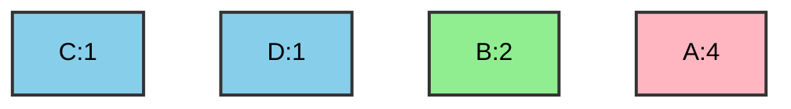
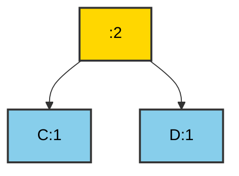
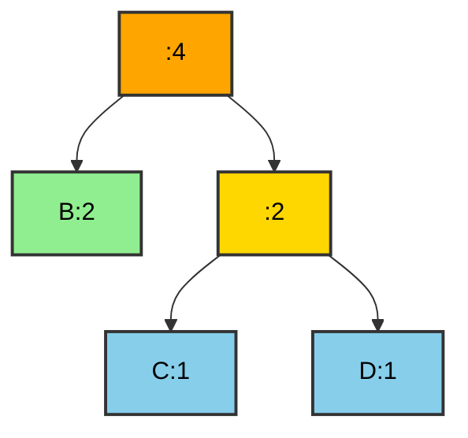
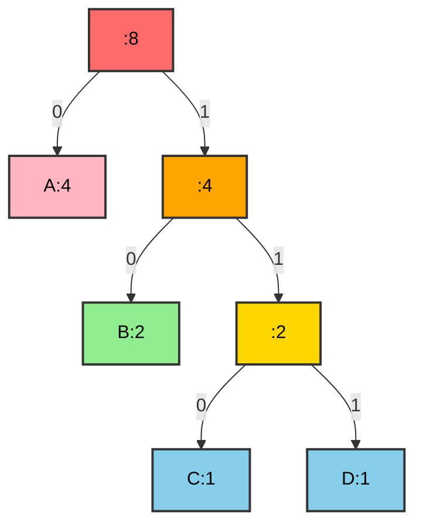
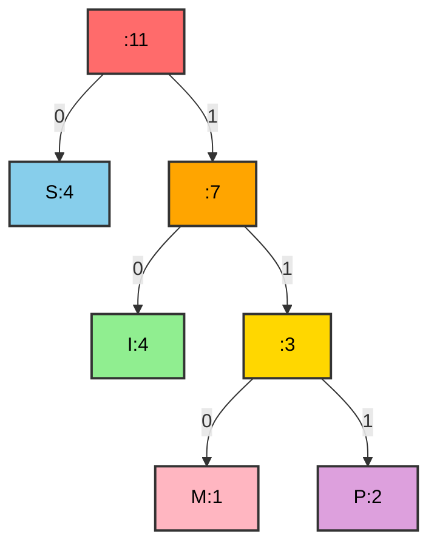
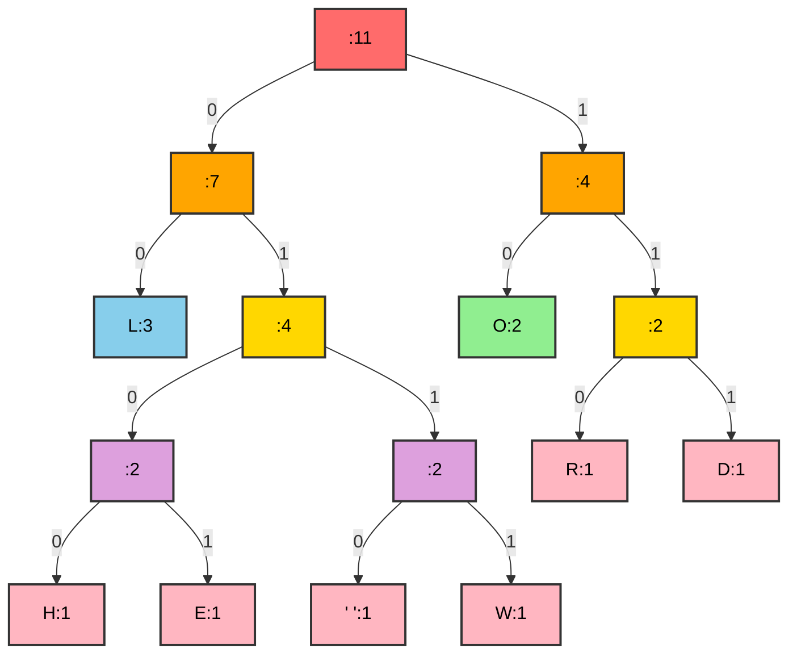

# Huffman Coding

## Contents
1. [Introduction](#introduction)
2. [Basic Concepts](#basic-concepts)
3. [Huffman Algorithm](#huffman-algorithm)
4. [Building the Huffman Tree](#building-the-huffman-tree)
5. [Encoding and Decoding](#encoding-and-decoding)
6. [C++ Implementation](#c-implementation)
7. [Examples with Solutions](#examples-with-solutions)
8. [Complexity](#complexity)

---

## Introduction

**Huffman Coding** is a **greedy algorithm** used for **lossless data compression**. It was created by David A. Huffman in 1952.

### Basic Idea
It uses **variable-length codes** for characters:
- Characters that appear **frequently** → **shorter codes**
- Characters that appear **rarely** → **longer codes**

### Characteristics
- **Optimal encoding**: Achieves the minimum average code length
- **Prefix codes**: No code is a prefix of another
- **Lossless**: Complete restoration of the original data

---

## Basic Concepts

### 1. Fixed-Length vs Variable-Length Encoding

#### Fixed-Length Encoding

Each character uses the **same number of bits**.

**Example:** For 4 characters we need 2 bits per character.

```
A → 00
B → 01
C → 10
D → 11
```

**Text:** `ABACABAD`  
**Encoding:** `00 01 00 10 00 01 00 11` = **16 bits**

#### Variable-Length Encoding

Characters have **different code lengths**.

```
A → 0
B → 10
C → 110
D → 111
```

**Text:** `ABACABAD`  
**Encoding:** `0 10 0 110 0 10 0 111` = **13 bits** (Savings: 18.75%)

### 2. Prefix Codes

A code is **prefix-free** when no code **is a prefix of another**.

**Good Code (Prefix-Free):**
```
A → 0
B → 10
C → 110
D → 111
```
 Unambiguous decoding

**Bad Code (Not Prefix-Free):**
```
A → 0
B → 01
C → 10
D → 11
```
 Ambiguity: `01` = `AB` or `B`?

### 3. Huffman Tree

The Huffman tree is a **binary tree** where:
- **Leaves**: Contain the characters
- **Right edge**: Bit `1`
- **Left edge**: Bit `0`
- **Path from root to leaf**: The character's code

---

## Huffman Algorithm

### Construction Steps

1. **Calculate Frequencies**
   - Count occurrences of each character

2. **Create Min-Heap**
   - Each node contains a character and frequency
   - Sorted by frequency

3. **Build the Tree**
   - Repeatedly:
     - Extract the 2 nodes with the smallest frequency
     - Create a new parent node
     - Parent frequency = Sum of children frequencies
     - Insert parent into the heap
   - Stop when 1 node remains (root)

4. **Generate Code Table**
   - Traverse the tree for each character
   - Store the codes

### Pseudocode

```
function buildHuffmanTree(characters, frequencies):
    // Create min-heap
    priority_queue = create_min_heap()
    
    for each character c with frequency f:
        node = create_node(c, f)
        priority_queue.insert(node)
    
    // Build tree
    while priority_queue.size() > 1:
        left = priority_queue.extract_min()
        right = priority_queue.extract_min()
        
        parent = create_node(null, left.freq + right.freq)
        parent.left = left
        parent.right = right
        
        priority_queue.insert(parent)
    
    return priority_queue.extract_min()  // Root
```

---

## Building the Huffman Tree

### Example: Text "ABACABAD"

#### Step 1: Calculate Frequencies

| Character | Frequency |
|-----------|-----------|
| A | 4 |
| B | 2 |
| C | 1 |
| D | 1 |

#### Step 2: Initialize Min-Heap



**Priority Queue:** `[C:1, D:1, B:2, A:4]`

#### Step 3: Merge C and D

Extract `C:1` and `D:1`, create a parent node with frequency `2`.



**Priority Queue:** `[B:2, :2, A:4]`

#### Step 4: Merge B and :2

Extract `B:2` and `:2`, create a parent node with frequency `4`.



**Priority Queue:** `[A:4, :4]`

#### Step 5: Merge A and :4 (Final Tree)



#### Step 6: Code Table

Traverse from root to each leaf:

| Character | Path | Code |
|-----------|------|------|
| A | Left | `0` |
| B | Right → Left | `10` |
| C | Right → Right → Left | `110` |
| D | Right → Right → Right | `111` |

---

## Encoding and Decoding

### Encoding

**Text:** `ABACABAD`

**Replace with codes:**
```
A → 0
B → 10
A → 0
C → 110
A → 0
B → 10
A → 0
D → 111
```

**Concatenation:** `0 10 0 110 0 10 0 111` = **01001100100111** (13 bits)

**Comparison:**
- **Fixed-length (2 bits/char):** 16 bits
- **Huffman:** 13 bits
- **Savings:** 18.75%

### Decoding

**Encoded message:** `01001100100111`

**Process:**
1. Start at the root
2. Read bit-by-bit:
   - `0` → Left
   - `1` → Right
3. When a leaf is reached → print the character, return to root

**Steps:**

| Bits | Path | Character | Decoded |
|------|------|-----------|---------|
| `0` | Left → A | A | A |
| `10` | Right → Left → B | B | AB |
| `0` | Left → A | A | ABA |
| `110` | Right → Right → Left → C | C | ABAC |
| `0` | Left → A | A | ABACA |
| `10` | Right → Left → B | B | ABACAB |
| `0` | Left → A | A | ABACABA |
| `111` | Right → Right → Right → D | D | ABACABAD |

**Result:** `ABACABAD` 

---

## C++ Implementation

### Node Structure

```cpp
/**
 * Node of the Huffman tree.
 * 
 * Contains the character, frequency, and pointers to children.
 */
struct HuffmanNode {
    char character;  // The character (for leaves)
    int frequency;  // The frequency of occurrence
    HuffmanNode* left_child;  // Left child
    HuffmanNode* right_child;  // Right child
    
    /**
     * Constructor for a node.
     * 
     * Args:
     *     c (char): The character.
     *     freq (int): The frequency.
     */
    HuffmanNode(char c, int freq) : character(c), frequency(freq), 
                                      left_child(nullptr), right_child(nullptr) {}
};
```

### Comparator for Min-Heap

```cpp
/**
 * Comparison functor for the priority queue.
 * 
 * Compares nodes based on frequency for min-heap.
 */
struct CompareNodes {
    /**
     * Comparison operator.
     * 
     * Args:
     *     left (HuffmanNode*): The first node.
     *     right (HuffmanNode*): The second node.
     * 
     * Returns:
     *     bool: True if the left node has a greater frequency.
     */
    bool operator()(HuffmanNode* left, HuffmanNode* right) {
        return left->frequency > right->frequency;
    }
};
```

### Building the Huffman Tree

```cpp
/**
 * Creates the Huffman tree from characters and frequencies.
 * 
 * Args:
 *     characters (std::vector<char>&): The characters.
 *     frequencies (std::vector<int>&): The frequencies.
 * 
 * Returns:
 *     HuffmanNode*: The root of the Huffman tree.
 */
HuffmanNode* buildHuffmanTree(std::vector<char>& characters, 
                               std::vector<int>& frequencies) {
    // Create priority queue (min-heap)
    std::priority_queue<HuffmanNode*, std::vector<HuffmanNode*>, 
                        CompareNodes> min_heap;
    
    // Insert all characters into the heap
    for (size_t i = 0; i < characters.size(); i++) {
        HuffmanNode* node = new HuffmanNode(characters[i], frequencies[i]);
        min_heap.push(node);
    }
    
    // Build tree
    while (min_heap.size() > 1) {
        // Extract the two nodes with the smallest frequency
        HuffmanNode* left = min_heap.top();
        min_heap.pop();
        
        HuffmanNode* right = min_heap.top();
        min_heap.pop();
        
        // Create a new internal node
        HuffmanNode* parent = new HuffmanNode('\0', 
                                                left->frequency + right->frequency);
        parent->left_child = left;
        parent->right_child = right;
        
        // Add to heap
        min_heap.push(parent);
    }
    
    // Return root
    return min_heap.top();
}
```

### Generating the Code Table

```cpp
/**
 * Generates the Huffman code table.
 * 
 * Args:
 *     root (HuffmanNode*): The root of the tree.
 *     code (std::string): The current code (initially "").
 *     huffman_codes (std::map<char, std::string>&): The code table.
 */
void generateCodes(HuffmanNode* root, std::string code, 
                   std::map<char, std::string>& huffman_codes) {
    if (root == nullptr) return;
    
    // If it is a leaf, store the code
    if (root->left_child == nullptr && root->right_child == nullptr) {
        huffman_codes[root->character] = code;
        return;
    }
    
    // Recurse for left and right subtrees
    generateCodes(root->left_child, code + "0", huffman_codes);
    generateCodes(root->right_child, code + "1", huffman_codes);
}
```

### Encoding

```cpp
/**
 * Encodes a text using the Huffman codes.
 * 
 * Args:
 *     text (std::string): The text to encode.
 *     huffman_codes (std::map<char, std::string>&): The Huffman codes.
 * 
 * Returns:
 *     std::string: The encoded text.
 */
std::string encode(std::string text, std::map<char, std::string>& huffman_codes) {
    std::string encoded_text = "";
    
    for (char c : text) {
        encoded_text += huffman_codes[c];
    }
    
    return encoded_text;
}
```

### Decoding

```cpp
/**
 * Decodes an encoded text.
 * 
 * Args:
 *     encoded_text (std::string): The encoded text.
 *     root (HuffmanNode*): The root of the Huffman tree.
 * 
 * Returns:
 *     std::string: The decoded text.
 */
std::string decode(std::string encoded_text, HuffmanNode* root) {
    std::string decoded_text = "";
    HuffmanNode* current = root;
    
    for (char bit : encoded_text) {
        // Navigate the tree based on the bit
        if (bit == '0') {
            current = current->left_child;
        } else {
            current = current->right_child;
        }
        
        // If a leaf is reached
        if (current->left_child == nullptr && current->right_child == nullptr) {
            decoded_text += current->character;
            current = root;  // Return to root
        }
    }
    
    return decoded_text;
}
```

---

## Examples with Solutions

### Example 1: Encoding "MISSISSIPPI"

#### Step 1: Calculate Frequencies

| Character | Frequency |
|-----------|-----------|
| I | 4 |
| S | 4 |
| P | 2 |
| M | 1 |

**Priority Queue:** `[M:1, P:2, I:4, S:4]`

#### Step 2: Build the Tree

**Iteration 1:** Merge M:1 and P:2
```
:3 (M+P)
Priority Queue: [:3, I:4, S:4]
```

**Iteration 2:** Merge :3 and I:4
```
:7 (MP+I)
Priority Queue: [S:4, :7]
```

**Iteration 3:** Merge S:4 and :7 (Final)



#### Step 3: Code Table

| Character | Code | Length |
|-----------|------|--------|
| S | `0` | 1 |
| I | `10` | 2 |
| M | `110` | 3 |
| P | `111` | 3 |

#### Step 4: Encoding

**Text:** `MISSISSIPPI`
```
M → 110
I → 10
S → 0
S → 0
I → 10
S → 0
S → 0
I → 10
P → 111
P → 111
I → 10
```

**Encoded:** `110100010001011111110` = **110100010001011111110**

**Lengths:**
- **Original (8 bits/char):** 11 × 8 = **88 bits**
- **Huffman:** **21 bits**
- **Savings:** 76.1% !

---

### Example 2: Text "HELLO WORLD"

#### Step 1: Frequencies

| Character | Frequency |
|-----------|-----------|
| L | 3 |
| O | 2 |
| H | 1 |
| E | 1 |
| (space) | 1 |
| W | 1 |
| R | 1 |
| D | 1 |

#### Step 2: Build the Tree (Summary)

**Merges:**
1. H:1 + E:1 → :2
2. (space):1 + W:1 → :2
3. R:1 + D:1 → :2
4. :2 (HE) + :2 (space+W) → :4
5. O:2 + :2 (RD) → :4
6. L:3 + :4 (HE+space+W) → :7
7. :4 (O+RD) + :7 → :11 (Root)



#### Step 3: Codes

| Character | Code |
|-----------|------|
| L | `00` |
| H | `0100` |
| E | `0101` |
| (space) | `0110` |
| W | `0111` |
| O | `10` |
| R | `110` |
| D | `111` |

#### Step 4: Encoding "HELLO WORLD"

```
H → 0100
E → 0101
L → 00
L → 00
O → 10
(space) → 0110
W → 0111
O → 10
R → 110
L → 00
D → 111
```

**Encoded:** `01000101000010011001111011000111`

**Length:** 35 bits (vs 88 bits for 8-bit ASCII)  
**Savings:** 60.2%

---

### Example 3: Decoding

**Tree:**
```mermaid
graph TD
    Root[""] -->|0| A["A"]
    Root -->|1| BC[""]
    BC -->|0| B["B"]
    BC -->|1| C["C"]
    
    style Root fill:#FF6B6B,stroke:#333,stroke-width:2px,color:black
    style A fill:#87CEEB,stroke:#333,stroke-width:2px,color:black
    style BC fill:#FFD700,stroke:#333,stroke-width:2px,color:black
    style B fill:#90EE90,stroke:#333,stroke-width:2px,color:black
    style C fill:#FFB6C1,stroke:#333,stroke-width:2px,color:black
```

**Codes:**
- A → `0`
- B → `10`
- C → `11`

**Encoded message:** `010110011`

**Decoding step-by-step:**

| Bits | Path | Character | Text |
|------|------|-----------|------|
| `0` | Left → A (Correct) | A | A |
| `1` | Right... |  |  |
| `10` | ...Left → B (Correct) | B | AB |
| `1` | Right... |  |  |
| `11` | ...Right → C (Correct) | C | ABC |
| `0` | Left → A (Correct) | A | ABCA |
| `1` | Right... |  |  |
| `11` | ...Right → C (Correct) | C | ABCAC |

**Result:** `ABCAC` (Correct)

---

## Complexity

### Time Complexity

| Operation | Complexity | Explanation |
|-----------|------------|-------------|
| Calculate Frequencies | O(n) | Traversing the text |
| Build Heap | O(n log n) | n insertions into heap |
| Build Tree | O(n log n) | n-1 extractions + insertions |
| Generate Codes | O(n) | Traversing the tree |
| Encoding | O(m) | m = text length |
| Decoding | O(m × h) | h = tree height |
| **Total** | **O(n log n)** | n = number of unique characters |

### Space Complexity

- **Tree:** O(n) - n nodes
- **Priority Queue:** O(n)
- **Code Table:** O(n)
- **Total:** O(n)

### Average Code Length

The average code length is calculated as:

```
L = SUM (p(i) * l(i))
```

Where:
- `p(i)` = Probability of character i (frequency / total)
- `l(i)` = Code length of character i

**Example (ABACABAD):**
```
L = (4/8 × 1) + (2/8 × 2) + (1/8 × 3) + (1/8 × 3)
  = 0.5 + 0.5 + 0.375 + 0.375
  = 1.75 bits/character
```

---

## Advantages and Disadvantages

### Advantages

1. **Optimal Encoding**
   - Achieves the minimum average code length

2. **Lossless**
   - Complete restoration of the original data

3. **Prefix-Free Codes**
   - Unambiguous decoding

4. **Simplicity**
   - Easy to implement and understand

### Disadvantages

1. **Requires Two Passes**
   - One for frequencies, one for encoding

2. **Tree Transmission**
   - The tree or frequencies need to be sent along with the data

3. **Not Optimal for Small Files**
   - The tree overhead can be large

4. **Static Encoding**
   - Does not adapt dynamically to changes

---

## Applications

### 1. File Compression
- **ZIP, GZIP**: Use Huffman variants
- **JPEG**: Huffman for image compression
- **MP3**: Audio compression

### 2. Network Communication
- **HTTP/2**: Header compression with Huffman
- Data transmission with reduced bandwidth

### 3. Fax Encoding
- Compression of black-and-white images

---

## Practice Exercises

### Exercise 1
Create the Huffman tree for the text **"BANANA"**.

<details>
<summary>Solution</summary>

**Frequencies:**
- A: 3
- N: 2
- B: 1

**Tree:**
```
     :6
    /    \
   A:3   :3
        /   \
       N:2  B:1
```

**Codes:**
- A → `0`
- N → `10`
- B → `11`

**Encoding:** `11 0 10 0 10 0` = `1101001­00`
</details>

### Exercise 2
Decode the message `11010011000` using the following codes:
- A → `0`
- B → `10`
- C → `11`

<details>
<summary>Solution</summary>

**Decomposition:**
- `11` → C
- `0` → A
- `10` → B
- `0` → A
- `11` → C
- `0` → A
- `0` → A

**Result:** `CABACAA`
</details>

### Exercise 3
Calculate the average code length for the text **"AABBCC"** with the following codes:
- A → `0`
- B → `10`
- C → `11`

<details>
<summary>Solution</summary>

**Frequencies:**
- A: 2/6 = 1/3
- B: 2/6 = 1/3
- C: 2/6 = 1/3

**Average length:**
```
L = (1/3 × 1) + (1/3 × 2) + (1/3 × 2)
  = 1/3 + 2/3 + 2/3
  = 5/3
  ≈ 1.67 bits/character
```
</details>

---

## Comparison with Other Algorithms

| Algorithm | Type | Ratio | Speed |
|-----------|------|-------|-------|
| **Huffman** | Lossless | 2-8x | Fast |
| **LZW** | Lossless | 2-10x | Moderate |
| **Run-Length** | Lossless | 2-4x | Very fast |
| **JPEG** | Lossy | 10-50x | Moderate |

---
