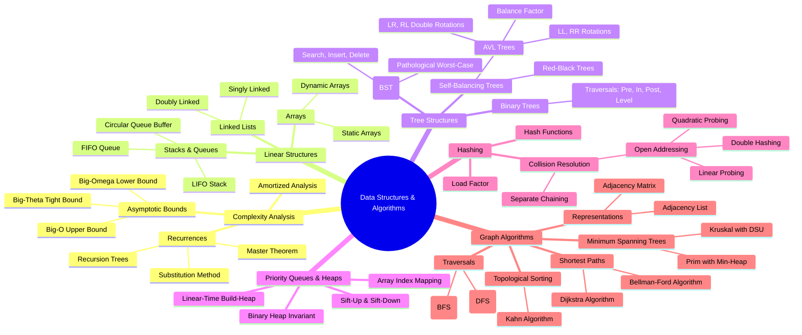

# Mindmap: Data Structures and Algorithms

This conceptual mindmap charts the taxonomy of fundamental data structures, algorithm complexity classes, and graph techniques.

```mermaid
mindmap
  root((Data Structures & Algorithms))
    Complexity Analysis
      Asymptotic Bounds
        Big-O Upper Bound
        Big-Omega Lower Bound
        Big-Theta Tight Bound
      Recurrences
        Master Theorem
        Recursion Trees
        Substitution Method
      Amortized Analysis
    Linear Structures
      Arrays
        Static Arrays
        Dynamic Arrays
      Linked Lists
        Singly Linked
        Doubly Linked
      Stacks & Queues
        LIFO Stack
        FIFO Queue
        Circular Queue Buffer
    Tree Structures
      Binary Trees
        Traversals: Pre, In, Post, Level
      Binary Search Trees (BST)
        Search, Insert, Delete
        Pathological Worst-Case
      Self-Balancing Trees
        AVL Trees
          Balance Factor
          LL, RR Rotations
          LR, RL Double Rotations
        Red-Black Trees
    Priority Queues & Heaps
      Binary Heap Invariant
      Array Index Mapping
      Sift-Up & Sift-Down
      Linear-Time Build-Heap
    Hashing
      Hash Functions
      Load Factor
      Collision Resolution
        Separate Chaining
        Open Addressing
          Linear Probing
          Quadratic Probing
          Double Hashing
    Graph Algorithms
      Representations
        Adjacency Matrix
        Adjacency List
      Traversals
        Breadth-First Search (BFS)
        Depth-First Search (DFS)
      Topological Sorting
        Kahn Algorithm
      Shortest Paths
        Dijkstra Algorithm
        Bellman-Ford Algorithm
      Minimum Spanning Trees
        Kruskal with DSU
        Prim with Min-Heap
```

