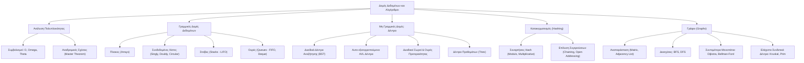

# Εννοιολογικός Χάρτης: Δομές Δεδομένων και Αλγόριθμοι

## Διάγραμμα Δομών Δεδομένων και Αλγορίθμων

```mermaid
graph TD
    DSA["Δομές Δεδομένων και Αλγόριθμοι"]
    
    DSA --> Anal["Ανάλυση Πολυπλοκότητας"]
    Anal --> Asymp["Συμβολισμοί: O, Omega, Theta"]
    Anal --> Recur["Αναδρομικές Σχέσεις (Master Theorem)"]

    DSA --> Linear["Γραμμικές Δομές Δεδομένων"]
    Linear --> Arr["Πίνακες (Arrays)"]
    Linear --> LL["Συνδεδεμένες Λίστες (Singly, Doubly, Circular)"]
    Linear --> Stk["Στοίβες (Stacks - LIFO)"]
    Linear --> Que["Ουρές (Queues - FIFO, Deque)"]

    DSA --> Trees["Μη Γραμμικές Δομές: Δέντρα"]
    Trees --> BST["Δυαδικά Δέντρα Αναζήτησης (BST)"]
    Trees --> AVL["Αυτο-εξισορροπούμενα AVL Δέντρα"]
    Trees --> Heap["Δυαδικοί Σωροί & Ουρές Προτεραιότητας"]
    Trees --> Trie["Δέντρα Προθεμάτων (Tries)"]

    DSA --> Hash["Κατακερματισμός (Hashing)"]
    Hash --> HF["Συναρτήσεις Hash (Modulo, Multiplicative)"]
    Hash --> Coll["Επίλυση Συγκρούσεων (Chaining, Open Addressing)"]

    DSA --> Graphs["Γράφοι (Graphs)"]
    Graphs --> Rep["Αναπαράσταση (Matrix, Adjacency List)"]
    Graphs --> Trav["Διασχίσεις: BFS, DFS"]
    Graphs --> SP["Συντομότερα Μονοπάτια: Dijkstra, Bellman-Ford"]
    Graphs --> MST["Ελάχιστα Συνδετικά Δέντρα: Kruskal, Prim"]
```

