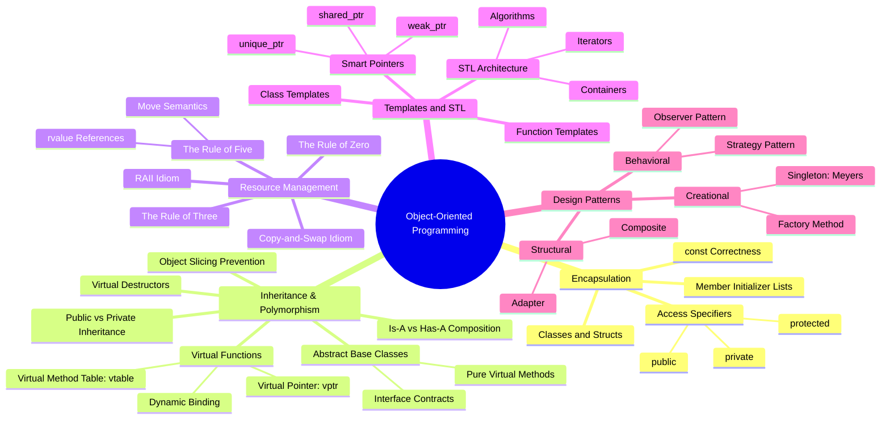

# Mindmap: Object-Oriented Programming

This conceptual mindmap illustrates the structural taxonomy, idioms, and language features of Object-Oriented Programming in C++.

```mermaid
mindmap
  root((Object-Oriented Programming))
    Encapsulation
      Classes and Structs
      Access Specifiers
        private
        protected
        public
      Member Initializer Lists
      const Correctness
    Inheritance & Polymorphism
      Is-A vs Has-A Composition
      Public vs Private Inheritance
      Virtual Functions
        Dynamic Binding
        Virtual Method Table: vtable
        Virtual Pointer: vptr
      Abstract Base Classes
        Pure Virtual Methods
        Interface Contracts
      Virtual Destructors
      Object Slicing Prevention
    Resource Management
      RAII Idiom
      The Rule of Three
      The Rule of Five
        Move Semantics
        rvalue References
      The Rule of Zero
      Copy-and-Swap Idiom
    Templates and STL
      Function Templates
      Class Templates
      STL Architecture
        Containers
        Iterators
        Algorithms
      Smart Pointers
        unique_ptr
        shared_ptr
        weak_ptr
    Design Patterns
      Creational
        Factory Method
        Singleton: Meyers
      Structural
        Adapter
        Composite
      Behavioral
        Strategy Pattern
        Observer Pattern
```

