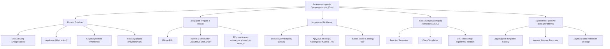

# Εννοιολογικός Χάρτης: Αντικειμενοστραφής Προγραμματισμός (C++)

## Διάγραμμα Εννοιών OOP & C++

```mermaid
graph TD
    OOP["Αντικειμενοστραφής Προγραμματισμός (C++)"]
    
    OOP --> Core["Βασικοί Πυλώνες"]
    Core --> Enc["Ενθυλάκωση (Encapsulation)"]
    Core --> Abs["Αφαίρεση (Abstraction)"]
    Core --> Inh["Κληρονομικότητα (Inheritance)"]
    Core --> Poly["Πολυμορφισμός (Polymorphism)"]

    OOP --> Memory["Διαχείριση Μνήμης & Πόρων"]
    Memory --> RAII["Ιδίωμα RAII"]
    Memory --> Rule5["Rule of 5: Destructor, Copy/Move Ctor & Op="]
    Memory --> SmartPtr["Έξυπνοι Δείκτες: unique_ptr, shared_ptr, weak_ptr"]

    OOP --> Runtime["Μηχανισμοί Εκτέλεσης"]
    Runtime --> Virt["Εικονικές Συναρτήσεις (virtual)"]
    Runtime --> Pure["Αμιγώς Εικονικές & Αφηρημένες Κλάσεις (= 0)"]
    Runtime --> VTab["Πίνακας vtable & δείκτης vptr"]

    OOP --> Generic["Γενικός Προγραμματισμός (Templates & STL)"]
    Generic --> FuncT["Function Templates"]
    Generic --> ClassT["Class Templates"]
    Generic --> STL["STL: vector, map, algorithms, iterators"]

    OOP --> Patterns["Σχεδιαστικά Πρότυπα (Design Patterns)"]
    Patterns --> Creational["Δημιουργικά: Singleton, Factory"]
    Patterns --> Structural["Δομικά: Adapter, Decorator"]
    Patterns --> Behavioral["Συμπεριφοράς: Observer, Strategy"]
```

