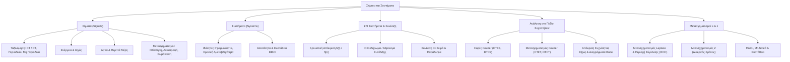

# Εννοιολογικός Χάρτης: Σήματα και Συστήματα

## Διάγραμμα Εννοιών Σημάτων και Συστημάτων

```mermaid
graph TD
    SS["Σήματα και Συστήματα"]
    
    SS --> Sig["Σήματα (Signals)"]
    Sig --> ClassSig["Ταξινόμηση: CT / DT, Περιοδικά / Μη Περιοδικά"]
    Sig --> EnergyPower["Ενέργεια & Ισχύς"]
    Sig --> EvenOdd["Άρτια & Περιττά Μέρη"]
    Sig --> Transf["Μετασχηματισμοί: Ολίσθηση, Αναστροφή, Κλιμάκωση"]

    SS --> Sys["Συστήματα (Systems)"]
    Sys --> SysProp["Ιδιότητες: Γραμμικότητα, Χρονική Αμεταβλητότητα"]
    Sys --> CausStab["Αιτιατότητα & Ευστάθεια BIBO"]

    SS --> LTI["LTI Συστήματα & Συνέλιξη"]
    LTI --> ImpResp["Κρουστική Απόκριση h(t) / h[n]"]
    LTI --> ConvInt["Ολοκλήρωμα / Άθροισμα Συνέλιξης"]
    LTI --> Conn["Σύνδεση σε Σειρά & Παράλληλα"]

    SS --> Freq["Ανάλυση στο Πεδίο Συχνοτήτων"]
    Freq --> FS["Σειρές Fourier (CTFS, DTFS)"]
    Freq --> FT["Μετασχηματισμός Fourier (CTFT, DTFT)"]
    Freq --> FResp["Απόκριση Συχνότητας H(jω) & Διαγράμματα Bode"]

    SS --> Trans["Μετασχηματισμοί s & z"]
    Trans --> Laplace["Μετασχηματισμός Laplace & Περιοχή Σύγκλισης (ROC)"]
    Trans --> ZTrans["Μετασχηματισμός Z (Διακριτός Χρόνος)"]
    Trans --> PolesZeros["Πόλοι, Μηδενικά & Ευστάθεια"]
```

