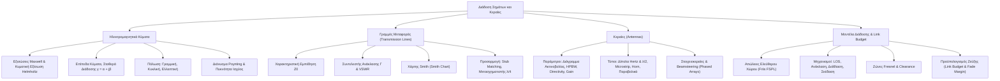

# Εννοιολογικός Χάρτης: Διάδοση Σημάτων και Κεραίες

## Διάγραμμα Εννοιών Διάδοσης Σημάτων

```mermaid
graph TD
    SP["Διάδοση Σημάτων και Κεραίες"]
    
    SP --> Waves["Ηλεκτρομαγνητικά Κύματα"]
    Waves --> Max["Εξισώσεις Maxwell & Κυματική Εξίσωση Helmholtz"]
    Waves --> Prop["Επίπεδα Κύματα, Σταθερά Διάδοσης γ = α + jβ"]
    Waves --> Pol["Πόλωση: Γραμμική, Κυκλική, Ελλειπτική"]
    Waves --> Poynt["Διάνυσμα Poynting & Πυκνότητα Ισχύος"]

    SP --> TL["Γραμμές Μεταφοράς (Transmission Lines)"]
    TL --> Z0["Χαρακτηριστική Εμπέδηση Z0"]
    TL --> Refl["Συντελεστής Ανάκλασης Γ & VSWR"]
    TL --> Smith["Χάρτης Smith (Smith Chart)"]
    TL --> Match["Προσαρμογή: Stub Matching, Μετασχηματιστής λ/4"]

    SP --> Ant["Κεραίες (Antennas)"]
    Ant --> Param["Παράμετροι: Διάγραμμα Ακτινοβολίας, HPBW, Directivity, Gain"]
    Ant --> Types["Τύποι: Δίπολα Hertz & λ/2, Microstrip, Horn, Παραβολικά"]
    Ant --> Arrays["Στοιχειοκεραίες & Beamsteering (Phased Arrays)"]

    SP --> Link["Μοντέλα Διάδοσης & Link Budget"]
    Link --> FSPL["Απώλειες Ελεύθερου Χώρου (Friis FSPL)"]
    Link --> Mech["Μηχανισμοί: LOS, Ανάκλαση, Διάθλαση, Σκέδαση"]
    Link --> Fresnel["Ζώνες Fresnel & Clearance"]
    Link --> Budget["Προϋπολογισμός Ζεύξης (Link Budget & Fade Margin)"]
```

