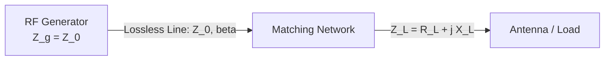

# Tutorial 02: Smith Chart Fundamentals and High-Frequency Impedance Matching Techniques

This tutorial provides a rigorous mathematical and practical engineering treatment of transmission line impedance matching, conformal bilinear mapping, the Smith Chart, quarter-wave transformers, and single-stub tuning networks.

---

## 1. Transmission Line Fundamentals and Reflection Mechanics

Consider a lossless transmission line characterized by characteristic impedance $Z_0$ (typically $50\,\Omega$) terminated in an arbitrary complex load impedance $Z_L = R_L + jX_L$.



### 1.1 Voltage Reflection Coefficient ($\Gamma$)
The voltage reflection coefficient at the load plane is defined as:
$$
\Gamma_L = \frac{Z_L - Z_0}{Z_L + Z_0} = |\Gamma_L| e^{j \theta_\Gamma}
$$

Normalizing the load impedance with respect to $Z_0$:
$$
z_L = \frac{Z_L}{Z_0} = \frac{R_L}{Z_0} + j \frac{X_L}{Z_0} = r + jx
$$
$$
\Gamma_L = \frac{z_L - 1}{z_L + 1}
$$

### 1.2 Voltage Standing Wave Ratio (VSWR)
Constructive and destructive superposition of forward and reflected traveling waves creates a standing wave pattern characterized by the Voltage Standing Wave Ratio:
$$
\text{VSWR} = \frac{V_{\max}}{V_{\min}} = \frac{1 + |\Gamma|}{1 - |\Gamma|}
$$
- Perfect match: $|\Gamma| = 0 \implies \text{VSWR} = 1.0$.
- Total reflection (open, short, pure reactance): $|\Gamma| = 1 \implies \text{VSWR} \to \infty$.

### 1.3 Return Loss and Power Delivery
The return loss ($\text{RL}$) measures reflected power in decibels:
$$
\text{RL}_{[\text{dB}]} = -20 \log_{10}|\Gamma|
$$
Fractional power delivered to the load is:
$$
P_{\text{del}} = P_{\text{inc}} \cdot (1 - |\Gamma|^2)
$$

---

## 2. Mathematical Formulation of the Smith Chart

The Smith Chart represents a bilinear conformal transformation that maps the right half of the complex impedance plane ($\text{Re}\{z\} \ge 0$) onto the interior of the unit circle in the complex reflection coefficient plane ($\Gamma = u + jv$, where $u^2 + v^2 \le 1$).

Starting from the normalized impedance relation:
$$
z = r + jx = \frac{1 + \Gamma}{1 - \Gamma} = \frac{1 + (u + jv)}{1 - (u + jv)}
$$

Multiplying numerator and denominator by the complex conjugate $(1 - u) + jv$:
$$
r + jx = \frac{(1 + u + jv)((1 - u) + jv)}{(1 - u)^2 + v^2} = \frac{(1 - u^2 - v^2) + j(2v)}{(1 - u)^2 + v^2}
$$

Equating real and imaginary parts produces two families of orthogonal circles:

### 2.1 Constant Resistance ($r$) Circles
$$
r = \frac{1 - u^2 - v^2}{(1 - u)^2 + v^2} \implies \left(u - \frac{r}{r + 1}\right)^2 + v^2 = \left(\frac{1}{r + 1}\right)^2
$$
- Center: $(u_c, v_c) = \left(\frac{r}{r + 1}, 0\right)$
- Radius: $R = \frac{1}{r + 1}$
- All circles pass through the open-circuit point $(1, 0)$.

### 2.2 Constant Reactance ($x$) Circles
$$
x = \frac{2v}{(1 - u)^2 + v^2} \implies (u - 1)^2 + \left(v - \frac{1}{x}\right)^2 = \left(\frac{1}{x}\right)^2
$$
- Center: $(u_c, v_c) = \left(1, \frac{1}{x}\right)$
- Radius: $R = \frac{1}{|x|}$
- Upper half-plane ($v > 0$): Inductive ($x > 0$).
- Lower half-plane ($v < 0$): Capacitive ($x < 0$).

---

## 3. Quarter-Wave Transformer Matching

A transmission line section of electrical length $l = \frac{\lambda}{4}$ acts as an impedance inverter.

The input impedance of a lossless line of length $l$ is given by:
$$
Z_{\text{in}} = Z_0 \frac{Z_L + j Z_0 \tan(\beta l)}{Z_0 + j Z_L \tan(\beta l)}
$$
For a quarter-wave line ($l = \lambda/4$):
$$
\beta l = \left(\frac{2\pi}{\lambda}\right)\left(\frac{\lambda}{4}\right) = \frac{\pi}{2} \implies \tan(\beta l) \to \infty
$$
Dividing numerator and denominator by $\tan(\beta l)$ as $\beta l \to \pi/2$:
$$
Z_{\text{in}} = \frac{Z_T^2}{Z_L}
$$

### Design Condition:
To match a purely resistive load $R_L$ to feedline $Z_0$, select transformer characteristic impedance $Z_T$:
$$
Z_T = \sqrt{Z_0 R_L}
$$

### Example Calculation:
Match an antenna with input resistance $R_L = 100\,\Omega$ to a $Z_0 = 50\,\Omega$ coaxial cable at $f = 2.4\text{ GHz}$.
1. Transformer impedance:
   $$
   Z_T = \sqrt{50 \times 100} = \sqrt{5000} \approx 70.71\,\Omega
   $$
2. Physical length with velocity factor $VF = 0.66$ (PTFE dielectric):
   $$
   \lambda_0 = \frac{c}{f} = \frac{3 \times 10^8}{2.4 \times 10^9} = 0.125\text{ m} = 12.5\text{ cm}
   $$
   $$
   \lambda_g = VF \times \lambda_0 = 0.66 \times 12.5\text{ cm} = 8.25\text{ cm}
   $$
   $$
   l = \frac{\lambda_g}{4} = \frac{8.25\text{ cm}}{4} = 2.0625\text{ cm}
   $$

---

## 4. Single-Stub Shunt Impedance Matching

When matching a complex load $Z_L = R_L + jX_L$ without transformers, a single shunt transmission line stub provides complete cancellation of reflected power.

```
       <------- d ------->
-------------------------+------------------ Load
Line (Z0)                |                   ZL = RL + j XL
-------------------------+------------------
                         |
                         | Stub (length l)
                         | Short or Open circuited
```

### 4.1 Theory of Shunt Matching
Because elements are placed in parallel, admittance formulation ($Y = G + jB$) simplifies calculations:
$$
y_L = \frac{1}{z_L} = g + jb
$$
At distance $d$ from the load toward the generator, the normalized input admittance $y(d)$ rotates along a constant $|\Gamma|$ circle until it intersects the unity conductance circle:
$$
y(d) = 1 + jb_{\text{in}}
$$
A shunt stub of susceptance $b_s = -b_{\text{in}}$ placed at distance $d$ cancels the reactive component:
$$
y_{\text{total}} = y(d) + jb_s = (1 + jb_{\text{in}}) - jb_{\text{in}} = 1 + j0 \implies Y_{\text{total}} = Y_0
$$

### 4.2 Analytical Formulas for Distance $d$ and Length $l$

For normalized load admittance $y_L = g_L + jb_L$:
1. Distance to matching point $d$ ($0 \le d < \lambda/2$):
   $$
   d = \begin{cases} 
   \frac{\lambda}{2\pi} \arctan\left(\frac{b_L \pm \sqrt{g_L((1 - g_L)^2 + b_L^2)/g_L}}{g_L - 1}\right), & g_L \ne 1 \\
   \frac{\lambda}{2\pi} \arctan\left(\frac{b_L}{2}\right), & g_L = 1
   \end{cases}
   $$

2. Stub length $l$ ($0 \le l < \lambda/2$):
   - **Short-Circuited Stub** ($y_{\text{stub}} = -j \cot(\beta l)$):
     $$
     - \cot(\beta l) = b_s = -b_{\text{in}} \implies \beta l = \text{arccot}(b_{\text{in}}) \implies l = \frac{\lambda}{2\pi} \arctan\left(-\frac{1}{b_s}\right)
     $$
   - **Open-Circuited Stub** ($y_{\text{stub}} = j \tan(\beta l)$):
     $$
     \tan(\beta l) = b_s = -b_{\text{in}} \implies l = \frac{\lambda}{2\pi} \arctan(b_s)
     $$

---

## 5. Step-by-Step Worked Scenario: Complex Load Matching

**Given Parameters:**
- Characteristic Impedance: $Z_0 = 50\,\Omega$
- Operating Frequency: $f = 1.0\text{ GHz} \implies \lambda = \frac{3 \times 10^8}{10^9} = 0.30\text{ m} = 30\text{ cm}$
- Load Impedance: $Z_L = 30 - j40\,\Omega$

### Step 1: Normalize Load Impedance
$$
z_L = \frac{30 - j40}{50} = 0.6 - j0.8
$$

### Step 2: Compute Load Reflection Coefficient
$$
\Gamma_L = \frac{z_L - 1}{z_L + 1} = \frac{-0.4 - j0.8}{1.6 - j0.8} = \frac{(-0.4 - j0.8)(1.6 + j0.8)}{1.6^2 + (-0.8)^2} = \frac{-0.64 - j0.32 - j1.28 + 0.64}{2.56 + 0.64} = \frac{-j1.6}{3.2} = -j0.5
$$
$$
|\Gamma_L| = 0.5, \quad \theta_{\Gamma} = -90^\circ
$$
$$
\text{VSWR} = \frac{1 + 0.5}{1 - 0.5} = \frac{1.5}{0.5} = 3.0
$$

### Step 3: Convert to Load Admittance ($y_L$)
$$
y_L = \frac{1}{z_L} = \frac{1}{0.6 - j0.8} = \frac{0.6 + j0.8}{0.36 + 0.64} = 0.6 + j0.8
$$

### Step 4: Determine Distance $d$ to Unity Conductance Circle ($\text{Re}\{y\} = 1$)
The admittance transformed along distance $d$ is:
$$
y(d) = \frac{y_L + j \tan(\beta d)}{1 + j y_L \tan(\beta d)}
$$
Setting $\text{Re}\{y(d)\} = 1$ gives:
$$
t = \tan(\beta d) = \frac{b_L \pm \sqrt{g_L((1 - g_L)^2 + b_L^2)}}{g_L - 1} = \frac{0.8 \pm \sqrt{0.6((0.4)^2 + (0.8)^2)}}{-0.4}
$$
$$
(0.4)^2 + (0.8)^2 = 0.16 + 0.64 = 0.80
$$
$$
\sqrt{0.6 \times 0.80} = \sqrt{0.48} \approx 0.6928
$$

Selecting Solution 1 (closest distance):
$$
t_1 = \frac{0.8 - 0.6928}{-0.4} = \frac{0.1072}{-0.4} = -0.268
$$
Since $t_1 < 0$, add $\pi$:
$$
\beta d_1 = \arctan(-0.268) + \pi = -0.2622 + 3.1416 = 2.8794\text{ rad}
$$
$$
d_1 = \frac{2.8794}{2\pi} \lambda \approx 0.4582 \lambda = 0.4582 \times 30\text{ cm} \approx 13.75\text{ cm}
$$

Substitute $t_1$ to calculate susceptance $b_{\text{in}}$ at $d_1$:
$$
b_{\text{in}} = \frac{b_L + t(1 - g_L^2 - b_L^2) - b_L t^2}{(1 - b_L t)^2 + (g_L t)^2} = +1.155
$$

### Step 5: Determine Short-Circuited Stub Length ($l_1$)
To cancel $b_{\text{in}} = +1.155$, stub susceptance must be:
$$
b_s = -1.155
$$
For a short-circuited stub:
$$
b_s = -\cot(\beta l) = -1.155 \implies \tan(\beta l) = \frac{1}{1.155} \approx 0.8658
$$
$$
\beta l = \arctan(0.8658) \approx 0.7137\text{ rad}
$$
$$
l = \frac{0.7137}{2\pi} \lambda \approx 0.1136 \lambda = 0.1136 \times 30\text{ cm} \approx 3.41\text{ cm}
$$

### Summary of Solution:
- Position of stub from load: $d = 13.75\text{ cm}$ ($0.458\lambda$)
- Length of short-circuited stub: $l = 3.41\text{ cm}$ ($0.114\lambda$)
- System input reflection coefficient: $|\Gamma_{\text{in}}| = 0.0$ ($\text{VSWR} = 1.0$)

---

## 6. Practical Tuning and Smith Chart Quick Reference

| Problem Goal | Movement Direction on Smith Chart | Target Coordinate |
|:---|:---|:---|
| Moving from load toward generator along line | Rotate clockwise around center | Desired impedance/admittance plane |
| Adding series inductor $+j\omega L$ | Clockwise along constant $r$ circle | $x_{\text{new}} = x_{\text{old}} + \omega L / Z_0$ |
| Adding series capacitor $-j/(\omega C)$ | Counter-clockwise along constant $r$ circle | $x_{\text{new}} = x_{\text{old}} - 1/(\omega C Z_0)$ |
| Adding shunt capacitor $+j\omega C$ | Clockwise along constant $g$ circle | $b_{\text{new}} = b_{\text{old}} + \omega C Z_0$ |
| Adding shunt inductor $-j/(\omega L)$ | Counter-clockwise along constant $g$ circle | $b_{\text{new}} = b_{\text{old}} - Z_0/(\omega L)$ |

