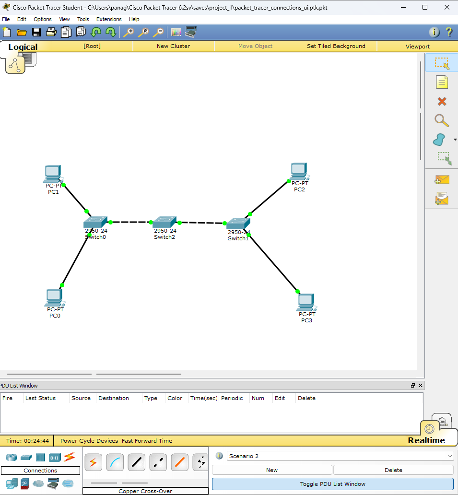
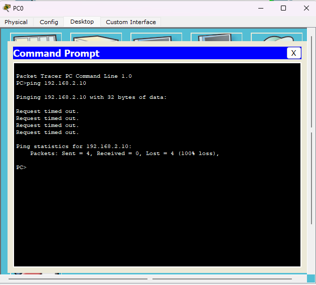
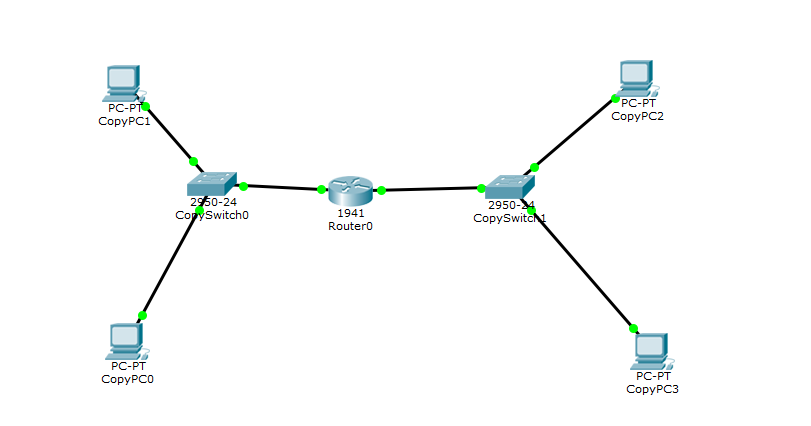
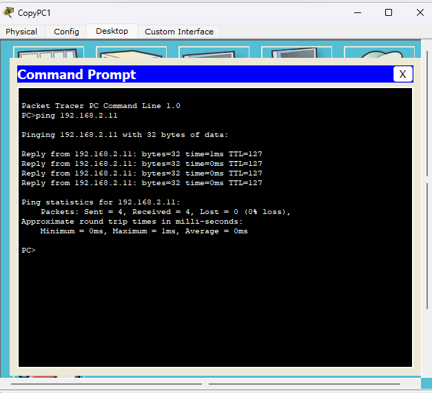

**Full Name:** Panagopoulos Nikolaos

**(Registration No.):** 3323

# Part 1: Network Delay Measurement

**Theoretical Formula:** $$\boxed{d_{nodal} = d_{proc} + d_{queue} + \frac{L}{R} + \frac{d}{u}}$$

Where:
* $L$ = packet length
* $R$ = transmission rate
* $d$ = distance
* $u$ = propagation speed ($2.8 \times 10^8$ m/sec)

#### Table 1-1: Delay vs. Distance (Parameters: R = 512 Kbps, L = 100 Bytes)
| Distance (d) | Measured Delay (A1) | Calculated Delay (A2) |
| :--- | :--- | :--- |
| 10 Km | 1.6 ms | 1.5982 ms |
| 100 Km | 2.090 ms | 1.9196 ms |
| 500 Km | null (`site limit`) | 3.3482 ms |
| 1000 Km | 7.030 ms | 5.1339 ms |

#### Table 1-2: Delay vs. Packet Size (Parameters: d = 10 Km, R = 512 Kbps)
| Packet Size (L) | Measured Delay (A1) | Calculated Delay (A2) |
| :--- | :--- | :--- |
| 100 Bytes | 1.600 ms | 1.5982 ms |
| 500 Bytes | 7.74 ms | 7.8482 ms |
| 1 KB | 15.430 ms | 15.6607 ms |
| 2 KB | null (`site limit`) | 31.2857 ms |

#### Table 1-3: Delay vs. Transmission Rate (Parameters: d = 10 Km, L = 500 Bytes)
| Rate (R) | Measured Delay (A1) | Calculated Delay (A2) |
| :--- | :--- | :--- |
| 512 Kbps | 1.600 ms | 7.8482 ms |
| 1 Mbps | 0.850 ms | 4.0357 ms |
| 10 Mbps | 0.140 ms | 0.4357 ms |
| 100 Mbps | 0.070 ms | 0.0757 ms |

---

### **Graph Analysis**

### **Comments**
- **Comparing the measured values ($A_1$) from the simulator with the theoretically calculated ones ($A_2$), we observe that the two do not always match — and this is expected. The theoretical model takes into account only propagation and transmission delay, ignoring **processing delay** ($d_{proc}$) and **queuing delay** ($d_{queue}$). In practice, every router spends time analyzing the packet header, while on loaded links the packet waits in a buffer before being transmitted.**

- **Regarding distance (Table 1-1), the linear increase in delay confirms the theory. However, the gap between $A_1$ and $A_2$ grows at larger distances, indicating that the simulator introduces additional overhead as path complexity increases.**

- **On the transmission rate axis (Table 1-3), the results clearly show that increasing bandwidth rapidly decreases delay — up to a point. Beyond 100 Mbps, overall delay stabilizes as transmission delay becomes negligible and propagation delay dominates.**

- **Finally, regarding packet size (Table 1-2), larger packets naturally increase transmission time. The small discrepancies observed can be attributed to slight queuing or internal fragmentation check processes within the simulator.**

---

### **Jitter Investigation**

### **Comments**
- **Jitter represents the variation in delay over time. In the collected data, inter-packet jitter remains relatively low, indicating a stable link with consistent queue times. High jitter is typically caused by transient network congestion or varying path lengths in more complex routing environments.**

---

# Part 2: Network Creation
## 1. Switch Only

The topology consists of 4 PCs connected via 3 switches (Switch0, Switch1, Switch2) in a chain. Each PC is in a different subnet.

| **Device** | **IP Address** | **Subnet Mask** | **Default Gateway** |
| --- | --- | --- | --- |
| PC0 | `192.168.1.10` | `255.255.255.0` | `192.168.1.1` |
| PC1 | `192.168.2.10` | `255.255.255.0` | `192.168.1.1`  |
| PC2 | `192.168.3.10` | `255.255.255.0` | `192.168.1.1`  |
| PC3 | `192.168.4.10` | `255.255.255.0` | `192.168.1.1`  |
- The default gateway `192.168.1.1` was set on all PCs, but because there is no router in the topology, this address is unreachable and has no effect.

Even though 3 switches are used in a chain, this does not change the behavior — switches cannot route between subnets.

The switch operates at **Layer 2 (Data Link)** and forwards frames based solely on **MAC addresses** — it has no concept of IP routing. Since the four PCs are in **different subnets**, PC0 treats PC1 as a remote host and tries to send the packet to its Default Gateway (`192.168.1.1`). However, there is no router in the topology, so the packet is dropped — result: **100% packet loss**.

### What Should Be Done to Make It Work

If all PCs shared the **same subnet** (e.g. `192.168.1.10`–`192.168.1.13 /24`), PC0 would recognize PC1 as a local host, resolve its MAC address via ARP, and the switch would forward the frame directly — without a router.

---

## 2. Router Added

A **Cisco 1941 Router** (Router0) was added between the two switches. The 4 PCs were reorganized into **2 subnet groups**, each with its own default gateway pointing to the corresponding router interface.
- **Subnet 1** (`192.168.1.0/24`): CopyPC0, CopyPC1 → gateway `192.168.1.1` (Router Gig0/0)
- **Subnet 2** (`192.168.2.0/24`): CopyPC2, CopyPC3 → gateway `192.168.2.1` (Router Gig0/1)

| **Device** | **IP Address** | **Subnet Mask** | **Default Gateway** |
| --- | --- | --- | --- |
| CopyPC0 | `192.168.1.10` | `255.255.255.0` | `192.168.1.1` |
| CopyPC1 | `192.168.1.11` | `255.255.255.0` | `192.168.1.1` |
| Router (Gig0/0) | `192.168.1.1` | `255.255.255.0` | - |
| Router (Gig0/1) | `192.168.2.1` | `255.255.255.0` | - |
| CopyPC2 | `192.168.2.10` | `255.255.255.0` | `192.168.2.1` |
| CopyPC3 | `192.168.2.11` | `255.255.255.0` | `192.168.2.1` |

### Why Communication Succeeded

---

# Part 3: File Transfer Performance

### Scenario Parameters

| Parameter | Value |
| :--- | :--- |
| File size (AM) | 3,323 KB = 3,402,752 bytes |
| Link rate | 1 Mbps = 1,000,000 bps |
| Packet payload | 984 bytes |
| Header overhead | 40 bytes |
| Packet total on wire | 1 KB = 1,024 bytes = 8,192 bits |
| One-way propagation delay | 40 ms |
| RTT | 80 ms |
| Initial handshake | 1 RTT = 80 ms |
| Total packets | 3,459 |
| Transmission time per packet | 8.192 ms |

---

### Case A: Continuous Transmission

All packets are sent sequentially without waiting for acknowledgements. Total time includes initial handshake, time to transmit all bits on the wire, and propagation delay for the last bit to reach the receiver.

$$T_A = \text{Handshake} + \frac{\text{TotalBits}}{\text{Rate}} + d_{prop}$$

$$T_A = 80 + \frac{28{,}336{,}128}{1{,}000{,}000} + 40 = 80 + 28{,}336.128 + 40$$

$$\boxed{T_A = 28{,}456.128 \text{ ms} \approx 28.46 \text{ s}}$$

---

### Case B: Stop-and-Wait

After each packet, the sender waits for one full RTT before sending the next. It is the least efficient strategy, as the link remains idle for most of each cycle.

$$T_B = \text{Handshake} + N \times (T_{packet} + RTT)$$

$$T_B = 80 + 3{,}459 \times (8.192 + 80) = 80 + 3{,}459 \times 88.192$$

$$\boxed{T_B = 305{,}136.128 \text{ ms} \approx 305.14 \text{ s}}$$

---

### Case C: Exponential Window Growth (TCP Slow-Start)

We assume the link has infinite bandwidth (transmission delay = 0). The sender starts with a window of 1 packet and doubles it every RTT, following the TCP slow-start rule ($2^0, 2^1, 2^2, \ldots$). The process continues until all 3,459 packets are sent.

$$T_C = \text{Handshake} + \text{DataRTTs} \times RTT$$

| RTT | Window (pkts) | Sent This RTT | Remaining |
| :---: | :---: | :---: | :---: |
| 1 | 1 | 1 | 3,458 |
| 2 | 2 | 2 | 3,456 |
| 3 | 4 | 4 | 3,452 |
| 4 | 8 | 8 | 3,444 |
| 5 | 16 | 16 | 3,428 |
| 6 | 32 | 32 | 3,396 |
| 7 | 64 | 64 | 3,332 |
| 8 | 128 | 128 | 3,204 |
| 9 | 256 | 256 | 2,948 |
| 10 | 512 | 512 | 2,436 |
| 11 | 1,024 | 1,024 | 1,412 |
| 12 | 2,048 | 1,412 | 0 |

It takes 12 data RTTs. The last RTT sends only 1,412 packets (whatever was left), not a full window of 2,048.

$$T_C = 80 + 12 \times 80$$

$$\boxed{T_C = 1{,}040 \text{ ms} \approx 1.04 \text{ s}}$$

---

### Summary

| Case | Strategy | Total Time |
| :--- | :--- | :--- |
| A | Continuous Transmission | 28,456.128 ms (28.46 s) |
| B | Stop-and-Wait | 305,136.128 ms (305.14 s) |
| C | Exponential Window Growth | 1,040.000 ms (1.04 s) |

The results clearly show how large an impact the transmission strategy has on total time. Case B is approximately **10.7x slower** than Case A, as the link stays idle after each packet waiting for ACK — propagation delay dominates every cycle. Case C, despite using infinite bandwidth as a simplification, demonstrates why TCP slow-start is so efficient: by doubling the in-flight window every RTT, all 3,459 packets are delivered in just 12 RTTs — **27.4x faster** than Case A and **293x faster** than Case B.