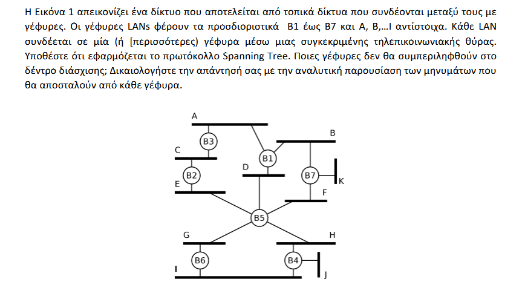
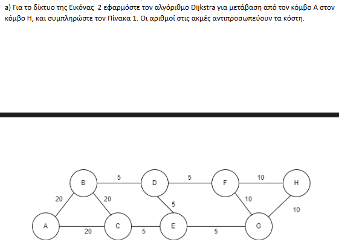
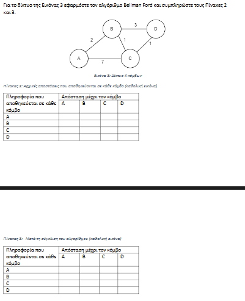
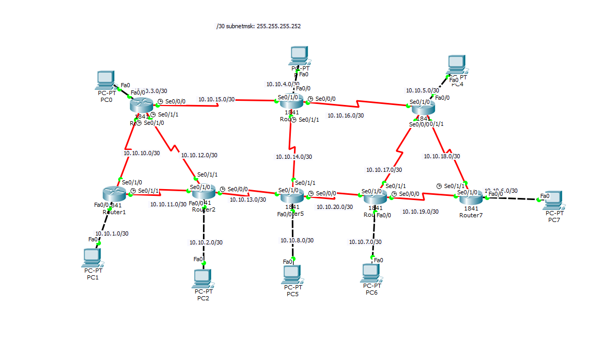
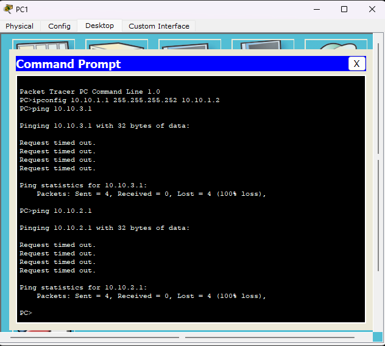
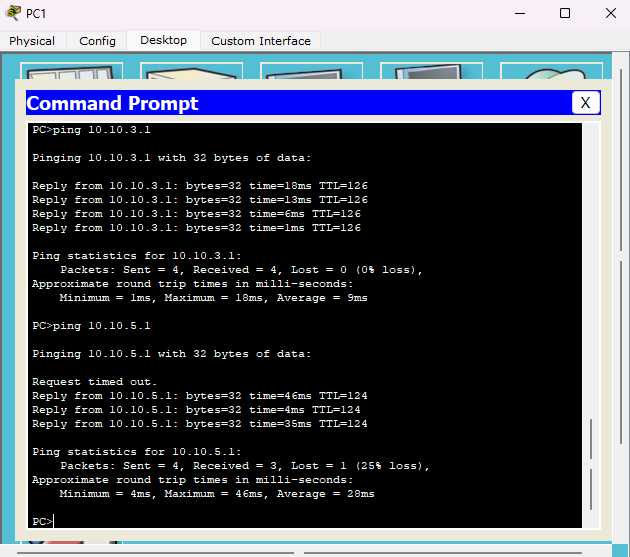
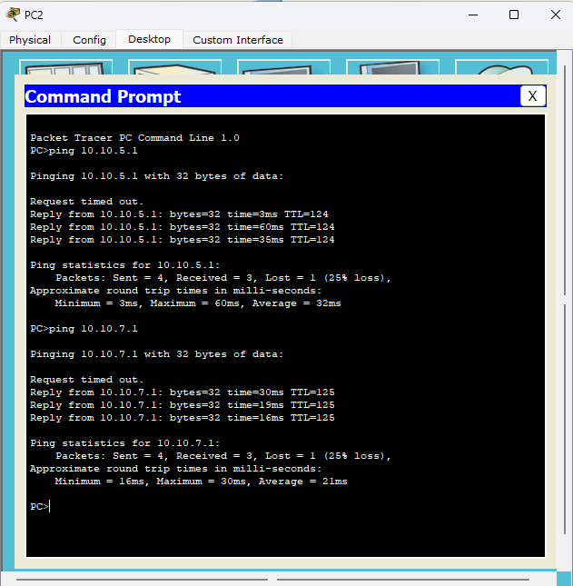

## i. Application of Spanning Tree Protocol

### 1. Root Bridge Election

The bridge with the smallest identifier (ID) is elected as the **Root Bridge**.
- **Result:** Bridge **$B1$** is the Root of the tree.

### 2. Message Exchange (BPDU) and Root Port Selection

- **$B1$:** Sends $(B1, 0, B1)$ to LANs $A, B, D$.
- **$B3$:** Receives the message on LAN $A$. Sets port towards $A$ as **Root Port (RP)** (Cost $1$). Sends $(B1, 1, B3)$ to LAN $C$.
- **$B5$:** Receives the message on LAN $D$. Sets port towards $D$ as **RP** (Cost $1$). Sends $(B1, 1, B5)$ to LANs $E, F, G, H$.
- **$B7$:** Receives the message on LAN $B$. Sets port towards $B$ as **RP** (Cost $1$). Sends $(B1, 1, B7)$ to LANs $F, K$.
- **$B2$:** Receives $(B1, 1, B3)$ from $C$ and $(B1, 1, B5)$ from $E$. Total cost from both is $2$. Chooses port towards $C$ as **RP** due to lower sender ID ($B3 < B5$).
- **$B4$:** Receives $(B1, 1, B5)$ from $H$. Sets port towards $H$ as **RP** (Cost $2$). Sends $(B1, 2, B4)$ to $I, J$.
- **$B6$:** Receives $(B1, 1, B5)$ from $G$. Sets port towards $G$ as **RP** (Cost $2$). Sends $(B1, 2, B6)$ to $I$.

---

### 3. Designated Bridges per LAN

|**LAN**|**Connected Bridges (Cost to Root)**|**Designated Bridge**|
|---|---|---|
|**A**|$B1(0), B3(1)$|**$B1$**|
|**B**|$B1(0), B7(1)$|**$B1$**|
|**D**|$B1(0), B5(1)$|**$B1$**|
|**C**|$B3(1), B2(2)$|**$B3$**|
|**E**|$B5(1), B2(2)$|**$B5$**|
|**F**|$B5(1), B7(1)$|**$B5$** (due to ID: $5 < 7$)|
|**G**|$B5(1), B6(2)$|**$B5$**|
|**H**|$B5(1), B4(2)$|**$B5$**|
|**I**|$B4(2), B6(2)$|**$B4$** (due to ID: $4 < 6$)|
|**J**|$B4(2)$|**$B4$**|
|**K**|$B7(1)$|**$B7$**|

---

### 4. Conclusion

A bridge is not included in the active tree (i.e. does not forward data packets) if all its ports, except for the root port (RP), are set to **Blocking** state. This happens when the bridge is not "Designated" for any of the LANs to which it connects.

- **Bridge $B2$:**
    - On LAN $C$, $B3$ is designated.
    - On LAN $E$, $B5$ is designated.
    - $B2$ serves no LAN, hence **it is not included**.
- **Bridge $B6$:**
    - On LAN $G$, $B5$ is designated.
    - On LAN $I$, $B4$ is designated.
    - $B6$ serves no LAN, hence **it is not included**.

**Answer:** The bridges that will not be included in the spanning tree are **$B2$** and **$B6$**.

---

## ii. Application of Dijkstra's Algorithm


## Table 1

- Round 1, add A: A=0, B=20, C=20, D=∞, E=∞, F=∞, G=∞, H=∞.
- Round 2, add B: A=0, B=20, C=20, D=25, E=∞, F=∞, G=∞, H=∞.
- Round 3, add C: A=0, B=20, C=20, D=25, E=25, F=∞, G=∞, H=∞.
- Round 4, add D: A=0, B=20, C=20, D=25, E=25, F=30, G=∞, H=∞.
- Round 5, add E: A=0, B=20, C=20, D=25, E=25, F=30, G=30, H=∞.
- Round 6, add F: A=0, B=20, C=20, D=25, E=25, F=30, G=30, H=40.
- Round 7, add G: A=0, B=20, C=20, D=25, E=25, F=30, G=30, H=40.
- Round 8, add H: A=0, B=20, C=20, D=25, E=25, F=30, G=30, H=40.

## Completed Table

|Round|Node Addition|A|B|C|D|E|F|G|H|
|---|---|---|---|---|---|---|---|---|---|
|1|A|0|20|20|∞|∞|∞|∞|∞|
|2|B|0|20|20|25|∞|∞|∞|∞|
|3|C|0|20|20|25|25|∞|∞|∞|
|4|D|0|20|20|25|25|30|∞|∞|
|5|E|0|20|20|25|25|30|30|∞|
|6|F|0|20|20|25|25|30|30|40|
|7|G|0|20|20|25|25|30|30|40|
|8|H|0|20|20|25|25|30|30|40|

## Final Result

- Node finalization sequence: A, B, C, D, E, F, G, H.
- Shortest path: A → B → D → F → H.
- Total cost: 40.

## iii. Application of Bellman-Ford Algorithm



## Table 2

|Node|A|B|C|D|
|---|---|---|---|---|
|A|0|2|7|∞|
|B|2|0|1|3|
|C|7|1|0|1|
|D|∞|3|1|0|

## Table 3

|Node|A|B|C|D|
|---|---|---|---|---|
|A|0|2|3|4|
|B|2|0|1|2|
|C|3|1|0|1|
|D|4|2|1|0|

---
## LAB 
## i. Network Creation

> **File: Lab5-3323-RIP.pkt**



### PC Configurations

**PC0** IP: 10.10.3.1 Mask: 255.255.255.252 Gateway: 10.10.3.2 
**PC1** IP: 10.10.1.1 Mask: 255.255.255.252 Gateway: 10.10.1.2 
**PC2** IP: 10.10.2.1 Mask: 255.255.255.252 Gateway: 10.10.2.2 
**PC3** IP: 10.10.4.1 Mask: 255.255.255.252 Gateway: 10.10.4.2 
**PC4** IP: 10.10.5.1 Mask: 255.255.255.252 Gateway: 10.10.5.2 
**PC5** IP: 10.10.8.1 Mask: 255.255.255.252 Gateway: 10.10.8.2 
**PC6** IP: 10.10.7.1 Mask: 255.255.255.252 Gateway: 10.10.7.2 
**PC7** IP: 10.10.6.1 Mask: 255.255.255.252 Gateway: 10.10.6.2

### Shell input: 
**$PC_x$:**  
```  
ipconfig <IP> <MASK> <GATEWAY>  
```  
  
---

### Router CLI Commands

#### Router0
```bash
enable
configure terminal
interface fa0/0
 ip address 10.10.3.2 255.255.255.252
 no shutdown
exit
interface s0/0/0
 shutdown
 no ip address
 ip address 10.10.15.1 255.255.255.252
 clock rate 64000
 no shutdown
exit
interface s0/1/0
 shutdown
 no ip address
 ip address 10.10.10.1 255.255.255.252
 clock rate 64000
 no shutdown
exit
interface s0/1/1
 shutdown
 no ip address
 ip address 10.10.12.1 255.255.255.252
 clock rate 64000
 no shutdown
exit
end
write memory
```

#### Router1
```bash
enable
configure terminal
interface fa0/0
 ip address 10.10.1.2 255.255.255.252
 no shutdown
exit
interface s0/1/0
 shutdown
 no ip address
 ip address 10.10.10.2 255.255.255.252
 clock rate 64000
 no shutdown
exit
interface s0/1/1
 shutdown
 no ip address
 ip address 10.10.11.1 255.255.255.252
 clock rate 64000
 no shutdown
exit
end
write memory
```

#### Router2
```bash
enable
configure terminal
interface fa0/0
 ip address 10.10.2.2 255.255.255.252
 no shutdown
exit
interface s0/1/0
 shutdown
 no ip address
 ip address 10.10.11.2 255.255.255.252
 clock rate 64000
 no shutdown
exit
interface s0/1/1
 shutdown
 no ip address
 ip address 10.10.12.2 255.255.255.252
 clock rate 64000
 no shutdown
exit
interface s0/0/0
 shutdown
 no ip address
 ip address 10.10.13.1 255.255.255.252
 clock rate 64000
 no shutdown
exit
end
write memory
```

#### Router3
```bash
enable
configure terminal
interface fa0/0
 ip address 10.10.4.2 255.255.255.252
 no shutdown
exit
interface s0/1/0
 shutdown
 no ip address
 ip address 10.10.15.2 255.255.255.252
 clock rate 64000
 no shutdown
exit
interface s0/0/0
 shutdown
 no ip address
 ip address 10.10.16.1 255.255.255.252
 clock rate 64000
 no shutdown
exit
interface s0/1/1
 shutdown
 no ip address
 ip address 10.10.14.1 255.255.255.252
 clock rate 64000
 no shutdown
exit
end
write memory
```

#### Router4
```bash
enable
configure terminal
interface fa0/0
 ip address 10.10.5.2 255.255.255.252
 no shutdown
exit
interface s0/1/0
 shutdown
 no ip address
 ip address 10.10.16.2 255.255.255.252
 clock rate 64000
 no shutdown
exit
interface s0/0/0
 shutdown
 no ip address
 ip address 10.10.17.1 255.255.255.252
 clock rate 64000
 no shutdown
exit
interface s0/1/1
 shutdown
 no ip address
 ip address 10.10.18.1 255.255.255.252
 clock rate 64000
 no shutdown
exit
end
write memory
```

#### Router5
```bash
enable
configure terminal
interface fa0/0
 ip address 10.10.8.2 255.255.255.252
 no shutdown
exit
interface s0/1/0
 shutdown
 no ip address
 ip address 10.10.13.2 255.255.255.252
 clock rate 64000
 no shutdown
exit
interface s0/1/1
 shutdown
 no ip address
 ip address 10.10.14.2 255.255.255.252
 clock rate 64000
 no shutdown
exit
interface s0/0/0
 shutdown
 no ip address
 ip address 10.10.20.1 255.255.255.252
 clock rate 64000
 no shutdown
exit
end
write memory
```

#### Router6
```bash
enable
configure terminal
interface fa0/0
 ip address 10.10.7.2 255.255.255.252
 no shutdown
exit
interface s0/1/0
 shutdown
 no ip address
 ip address 10.10.20.2 255.255.255.252
 clock rate 64000
 no shutdown
exit
interface s0/1/1
 shutdown
 no ip address
 ip address 10.10.17.2 255.255.255.252
 clock rate 64000
 no shutdown
exit
interface s0/0/0
 shutdown
 no ip address
 ip address 10.10.19.1 255.255.255.252
 clock rate 64000
 no shutdown
exit
end
write memory
```

#### Router7
```bash
enable
configure terminal
interface fa0/0
 ip address 10.10.6.2 255.255.255.252
 no shutdown
exit
interface s0/1/0
 shutdown
 no ip address
 ip address 10.10.19.2 255.255.255.252
 clock rate 64000
 no shutdown
exit
interface s0/1/1
 shutdown
 no ip address
 ip address 10.10.18.2 255.255.255.252
 clock rate 64000
 no shutdown
exit
end
write memory
```

### Testing Network

- All result in "Request timed out." because routers only know their directly connected networks. They do not know routes to remote subnets because no routing protocol is active.
---

## Router0
```bash
enable
configure terminal
router rip
 version 2
 no auto-summary
 network 10.10.3.0
 network 10.10.10.0
 network 10.10.12.0
 network 10.10.15.0
exit
end
write memory
```

## Router1
```bash
enable
configure terminal
router rip
 version 2
 no auto-summary
 network 10.10.1.0
 network 10.10.10.0
 network 10.10.11.0
exit
end
write memory
```

## Router2
```bash
enable
configure terminal
router rip
 version 2
 no auto-summary
 network 10.10.2.0
 network 10.10.11.0
 network 10.10.12.0
 network 10.10.13.0
exit
end
write memory
```

## Router3
```bash
enable
configure terminal
router rip
 version 2
 no auto-summary
 network 10.10.4.0
 network 10.10.14.0
 network 10.10.15.0
 network 10.10.16.0
exit
end
write memory
```

## Router4
```bash
enable
configure terminal
router rip
 version 2
 no auto-summary
 network 10.10.5.0
 network 10.10.16.0
 network 10.10.17.0
 network 10.10.18.0
exit
end
write memory
```

## Router5
```bash
enable
configure terminal
router rip
 version 2
 no auto-summary
 network 10.10.8.0
 network 10.10.13.0
 network 10.10.14.0
 network 10.10.20.0
exit
end
write memory
```

## Router6
```bash
enable
configure terminal
router rip
 version 2
 no auto-summary
 network 10.10.7.0
 network 10.10.17.0
 network 10.10.19.0
 network 10.10.20.0
exit
end
write memory
```

## Router7
```bash
enable
configure terminal
router rip
 version 2
 no auto-summary
 network 10.10.6.0
 network 10.10.18.0
 network 10.10.19.0
exit
end
write memory
```


- The network operates correctly now that routers know routes to remote subnets and inter-computer communication is possible.
---

## vi. OSPF Routing

### OSPF Configuration
---
> **File: Lab5-3323-OSPF.pkt**
## Router0
```bash
enable
configure terminal
router ospf 1
 network 10.10.3.0 0.0.0.3 area 0
 network 10.10.10.0 0.0.0.3 area 0
 network 10.10.12.0 0.0.0.3 area 0
 network 10.10.15.0 0.0.0.3 area 0
exit
end
write memory
```

## Router1
```bash
enable
configure terminal
router ospf 1
 network 10.10.1.0 0.0.0.3 area 0
 network 10.10.10.0 0.0.0.3 area 0
 network 10.10.11.0 0.0.0.3 area 0
exit
end
write memory
```

## Router2
```bash
enable
configure terminal
router ospf 1
 network 10.10.2.0 0.0.0.3 area 0
 network 10.10.11.0 0.0.0.3 area 0
 network 10.10.12.0 0.0.0.3 area 0
 network 10.10.13.0 0.0.0.3 area 0
exit
end
write memory
```

## Router3
```bash
enable
configure terminal
router ospf 1
 network 10.10.4.0 0.0.0.3 area 0
 network 10.10.14.0 0.0.0.3 area 0
 network 10.10.15.0 0.0.0.3 area 0
 network 10.10.16.0 0.0.0.3 area 0
exit
end
write memory
```

## Router4
```bash
enable
configure terminal
router ospf 1
 network 10.10.5.0 0.0.0.3 area 0
 network 10.10.16.0 0.0.0.3 area 0
 network 10.10.17.0 0.0.0.3 area 0
 network 10.10.18.0 0.0.0.3 area 0
exit
end
write memory
```

## Router5
```bash
enable
configure terminal
router ospf 1
 network 10.10.8.0 0.0.0.3 area 0
 network 10.10.13.0 0.0.0.3 area 0
 network 10.10.14.0 0.0.0.3 area 0
 network 10.10.20.0 0.0.0.3 area 0
exit
end
write memory
```

## Router6
```bash
enable
configure terminal
router ospf 1
 network 10.10.7.0 0.0.0.3 area 0
 network 10.10.17.0 0.0.0.3 area 0
 network 10.10.19.0 0.0.0.3 area 0
 network 10.10.20.0 0.0.0.3 area 0
exit
end
write memory
```

## Router7
```bash
enable
configure terminal
router ospf 1
 network 10.10.6.0 0.0.0.3 area 0
 network 10.10.18.0 0.0.0.3 area 0
 network 10.10.19.0 0.0.0.3 area 0
exit
end
write memory
```

### Verification
```bash
show ip protocols
show ip route
show ip ospf neighbor
```
Router2:
```bash
Router>show ip protocols
Routing Protocol is "rip"
Sending updates every 30 seconds, next due in 11 seconds
Invalid after 180 seconds, hold down 180, flushed after 240
Outgoing update filter list for all interfaces is not set
Incoming update filter list for all interfaces is not set
Redistributing: rip
Default version control: send version 2, receive 2
  Interface             Send  Recv  Triggered RIP  Key-chain
  FastEthernet0/0       2     2     
  Serial0/0/0           2     2     
  Serial0/1/0           2     2     
  Serial0/1/1           2     2     
Automatic network summarization is not in effect
Maximum path: 4
Routing for Networks:
	10.0.0.0
Passive Interface(s):
Routing Information Sources:
	Gateway         Distance      Last Update
	10.10.11.1           120      00:00:12
	10.10.12.1           120      00:00:03
	10.10.13.2           120      00:00:12
Distance: (default is 120)

Routing Protocol is "ospf 1"
  Outgoing update filter list for all interfaces is not set 
  Incoming update filter list for all interfaces is not set 
  Router ID 10.10.13.1
  Number of areas in this router is 1. 1 normal 0 stub 0 nssa
  Maximum path: 4
  Routing for Networks:
    10.10.2.0 0.0.0.3 area 0
    10.10.11.0 0.0.0.3 area 0
    10.10.12.0 0.0.0.3 area 0
    10.10.13.0 0.0.0.3 area 0
  Routing Information Sources:  
    Gateway         Distance      Last Update 
    10.10.11.1           110      00:11:14
    10.10.13.1           110      00:10:13
    10.10.15.1           110      00:11:02
    10.10.16.1           110      00:10:17
    10.10.18.1           110      00:10:37
    10.10.19.2           110      00:09:48
    10.10.20.1           110      00:10:03
    10.10.20.2           110      00:09:48
  Distance: (default is 110)

Router>
Router>show ip route
Codes: C - connected, S - static, I - IGRP, R - RIP, M - mobile, B - BGP
       D - EIGRP, EX - EIGRP external, O - OSPF, IA - OSPF inter area
       N1 - OSPF NSSA external type 1, N2 - OSPF NSSA external type 2
       E1 - OSPF external type 1, E2 - OSPF external type 2, E - EGP
       i - IS-IS, L1 - IS-IS level-1, L2 - IS-IS level-2, ia - IS-IS inter area
       * - candidate default, U - per-user static route, o - ODR
       P - periodic downloaded static route

Gateway of last resort is not set

     10.0.0.0/30 is subnetted, 19 subnets
O       10.10.1.0 [110/65] via 10.10.11.1, 00:11:19, Serial0/1/0
C       10.10.2.0 is directly connected, FastEthernet0/0
O       10.10.3.0 [110/65] via 10.10.12.1, 00:11:29, Serial0/1/1
O       10.10.4.0 [110/129] via 10.10.12.1, 00:10:21, Serial0/1/1
                  [110/129] via 10.10.13.2, 00:10:21, Serial0/0/0
O       10.10.5.0 [110/193] via 10.10.12.1, 00:10:21, Serial0/1/1
                  [110/193] via 10.10.13.2, 00:10:21, Serial0/0/0
O       10.10.6.0 [110/193] via 10.10.13.2, 00:09:50, Serial0/0/0
O       10.10.7.0 [110/129] via 10.10.13.2, 00:10:00, Serial0/0/0
O       10.10.8.0 [110/65] via 10.10.13.2, 00:10:21, Serial0/0/0
O       10.10.10.0 [110/128] via 10.10.11.1, 00:11:19, Serial0/1/0
                   [110/128] via 10.10.12.1, 00:11:19, Serial0/1/1
C       10.10.11.0 is directly connected, Serial0/1/0
C       10.10.12.0 is directly connected, Serial0/1/1
C       10.10.13.0 is directly connected, Serial0/0/0
O       10.10.14.0 [110/128] via 10.10.13.2, 00:10:21, Serial0/0/0
O       10.10.15.0 [110/128] via 10.10.12.1, 00:11:29, Serial0/1/1
O       10.10.16.0 [110/192] via 10.10.12.1, 00:10:21, Serial0/1/1
                   [110/192] via 10.10.13.2, 00:10:21, Serial0/0/0
O       10.10.17.0 [110/192] via 10.10.13.2, 00:10:00, Serial0/0/0
O       10.10.18.0 [110/256] via 10.10.12.1, 00:10:21, Serial0/1/1
                   [110/256] via 10.10.13.2, 00:10:21, Serial0/0/0
O       10.10.19.0 [110/192] via 10.10.13.2, 00:10:00, Serial0/0/0
O       10.10.20.0 [110/128] via 10.10.13.2, 00:10:21, Serial0/0/0
Router>
Router>show ip ospf neighbor


Neighbor ID     Pri   State           Dead Time   Address         Interface
10.10.20.1        0   FULL/  -        00:00:39    10.10.13.2      Serial0/0/0
10.10.11.1        0   FULL/  -        00:00:37    10.10.11.1      Serial0/1/0
10.10.15.1        0   FULL/  -        00:00:30    10.10.12.1      Serial0/1/1
Router>
Router>
```


- The network operates correctly with OSPF as routers exchange LSAs (Link State Advertisements) and build a complete view of the topology using the Shortest Path First algorithm.


Resources:
> 	`https://networklessons.com/system-management`