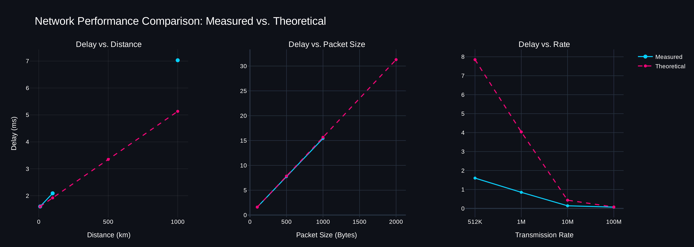
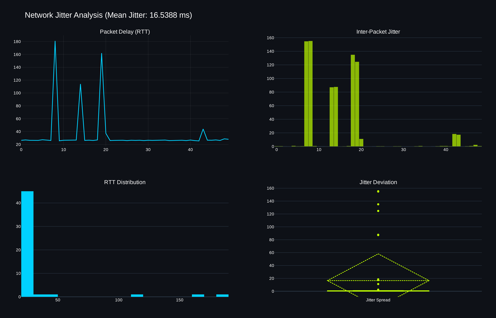

**Ονοματεπώνυμο:** Παναγόπουλος Νικόλαος

**(AM):** 3323

# Μέρος 1: Μέτρηση Καθυστέρησης Δικτύου

**Θεωρητικός Τύπος:** $$d_{nodal} = d_{proc} + d_{queue} + \frac{L}{R} + \frac{d}{u}$$

Όπου:
* $L$ = μέγεθος πακέτου (packet length)
* $R$ = ρυθμός μετάδοσης (transmission rate)
* $d$ = απόσταση (distance)
* $u$ = ταχύτητα διάδοσης (propagation speed) ($2.8 \times 10^8$ m/sec)

#### Table 1-1: Delay vs. Distance (Parameters: R = 512 Kbps, L = 100 Bytes)
| Distance (d) | Measured Delay (A1) | Calculated Delay (A2) |
| :--- | :--- | :--- |
| 10 Km | 1.6 ms | 1.5982 ms |
| 100 Km | 2.090 ms | 1.9196 ms |
| 500 Km | null (`site limit`) | 3.3482 ms |
| 1000 Km | 7.030 ms | 5.1339 ms |

#### Table 1-2: Delay vs. Packet Size (Parameters: d = 10 Km, R = 512 Kbps)
| Packet Size (L) | Measured Delay (A1) | Calculated Delay (A2) |
| :--- | :--- | :--- |
| 100 Bytes | 1.600 ms | 1.5982 ms |
| 500 Bytes | 7.74 ms | 7.8482 ms |
| 1 KB | 15.430 ms | 15.6607 ms |
| 2 KB | null (`site limit`) | 31.2857 ms |

#### Table 1-3: Delay vs. Transmission Rate (Parameters: d = 10 Km, L = 500 Bytes)
| Rate (R) | Measured Delay (A1) | Calculated Delay (A2) |
| :--- | :--- | :--- |
| 512 Kbps | 1.600 ms | 7.8482 ms |
| 1 Mbps | 0.850 ms | 4.0357 ms |
| 10 Mbps | 0.140 ms | 0.4357 ms |
| 100 Mbps | 0.070 ms | 0.0757 ms |

---

### **Ανάλυση Γραφημάτων**

### **Σχολιασμός**
- **Συγκρίνοντας τις μετρημένες τιμές ($A_1$) από τον simulator με τις θεωρητικά υπολογισμένες ($A_2$), παρατηρούμε ότι οι δύο δεν συμπίπτουν πάντα — και αυτό είναι αναμενόμενο. Το θεωρητικό μοντέλο λαμβάνει υπόψη μόνο το propagation και το transmission delay, αγνοώντας το **processing delay** ($d_{proc}$) και το **queuing delay** ($d_{queue}$). Στην πράξη, κάθε router αφιερώνει χρόνο για να αναλύσει την επικεφαλίδα του πακέτου, ενώ σε φορτωμένους συνδέσμους το πακέτο περιμένει στο buffer πριν μεταδοθεί.**

- **Όσον αφορά την απόσταση (Table 1-1), η γραμμική αύξηση της καθυστέρησης επιβεβαιώνει τη θεωρία. Ωστόσο, το χάσμα μεταξύ $A_1$ και $A_2$ μεγαλώνει σε μεγαλύτερες αποστάσεις, γεγονός που υποδηλώνει ότι ο simulator εισάγει επιπλέον overhead όσο αυξάνεται η πολυπλοκότητα της διαδρομής.**

- **Στον άξονα του ρυθμού μετάδοσης (Table 1-3), τα αποτελέσματα δείχνουν καθαρά ότι η αύξηση του bandwidth μειώνει ταχύτατα την καθυστέρηση — μέχρι ένα σημείο. Πέρα από τα 100 Mbps, η συνολική καθυστέρηση σταθεροποιείται, καθώς το transmission delay γίνεται αμελητέο και κυριαρχεί πλέον το propagation delay.**

- **Τέλος, στο μέγεθος πακέτου (Table 1-2), μεγαλύτερα πακέτα αυξάνουν φυσικά τον χρόνο μετάδοσης. Οι μικρές αποκλίσεις που παρατηρούνται μπορούν να αποδοθούν σε ελαφρύ queuing ή σε εσωτερικές διαδικασίες ελέγχου fragmentation εντός του simulator.**

---

### **Έρευνα Jitter**

### **Σχολιασμός**
- **Το jitter αντιπροσωπεύει τη διακύμανση της καθυστέρησης στον χρόνο. Στα δεδομένα που συλλέχθηκαν, το inter-packet jitter παραμένει σχετικά χαμηλό, γεγονός που υποδηλώνει σταθερό link με συνεπείς χρόνους αναμονής. Υψηλό jitter συνήθως προκαλείται από παροδική συμφόρηση δικτύου (network congestion) ή από μεταβαλλόμενα μήκη μονοπατιού σε πιο πολύπλοκα routing περιβάλλοντα.**

---

# Μέρος 2: Δημιουργία Δικτύου
## 1. Μόνο Switch

Η τοπολογία αποτελείται από 4 PC συνδεδεμένα μέσω 3 switches (Switch0, Switch1, Switch2) σε αλυσίδα. Κάθε PC βρίσκεται σε διαφορετικό subnet.

| **Device** | **IP Address** | **Subnet Mask** | **Default Gateway** |
| --- | --- | --- | --- |
| PC0 | `192.168.1.10` | `255.255.255.0` | `192.168.1.1` |
| PC1 | `192.168.2.10` | `255.255.255.0` | `192.168.1.1`  |
| PC2 | `192.168.3.10` | `255.255.255.0` | `192.168.1.1`  |
| PC3 | `192.168.4.10` | `255.255.255.0` | `192.168.1.1`  |
- Το default gateway `192.168.1.1` ορίστηκε σε όλα τα PC, αλλά επειδή δεν υπάρχει router στην τοπολογία, η διεύθυνση αυτή είναι μη προσβάσιμη και δεν έχει κανένα αποτέλεσμα.

Παρόλο που χρησιμοποιούνται 3 switches σε αλυσίδα, αυτό δεν αλλάζει τη συμπεριφορά — τα switches δεν μπορούν να δρομολογήσουν μεταξύ subnets.

### Γιατί η επικοινωνία απέτυχε

Το switch λειτουργεί στο **Layer 2 (Data Link)** και προωθεί frames μόνο βάσει **MAC addresses** — δεν έχει καμία αντίληψη IP routing. Εφόσον τα τέσσερα PC βρίσκονται σε **διαφορετικά subnets**, το PC0 αντιμετωπίζει το PC1 ως απομακρυσμένο host και προσπαθεί να στείλει το πακέτο στο Default Gateway του (`192.168.1.1`). Όμως δεν υπάρχει router στην τοπολογία, οπότε το πακέτο απορρίπτεται — αποτέλεσμα: **100% packet loss**.

### Τι θα έπρεπε να γίνει για να δουλέψει

Αν όλα τα PC μοιράζονταν το **ίδιο subnet** (π.χ. `192.168.1.10`–`192.168.1.13 /24`), το PC0 θα αναγνώριζε το PC1 ως local host, θα έλυνε το MAC address του μέσω ARP, και το switch θα προωθούσε το frame απευθείας — χωρίς router.

---

## 2. Router Προστέθηκε

Προστέθηκε ένας **Cisco 1941 Router** (Router0) ανάμεσα στα δύο switches. Τα 4 PC αναδιοργανώθηκαν σε **2 subnet groups**, καθένα με το δικό του default gateway που δείχνει στο αντίστοιχο interface του router.

- **Subnet 1** (`192.168.1.0/24`): CopyPC0, CopyPC1 → gateway `192.168.1.1` (Router Gig0/0)
- **Subnet 2** (`192.168.2.0/24`): CopyPC2, CopyPC3 → gateway `192.168.2.1` (Router Gig0/1)

| **Device** | **IP Address** | **Subnet Mask** | **Default Gateway** |
| --- | --- | --- | --- |
| CopyPC0 | `192.168.1.10` | `255.255.255.0` | `192.168.1.1` |
| CopyPC1 | `192.168.1.11` | `255.255.255.0` | `192.168.1.1` |
| Router (Gig0/0) | `192.168.1.1` | `255.255.255.0` | - |
| Router (Gig0/1) | `192.168.2.1` | `255.255.255.0` | - |
| CopyPC2 | `192.168.2.10` | `255.255.255.0` | `192.168.2.1` |
| CopyPC3 | `192.168.2.11` | `255.255.255.0` | `192.168.2.1` |

### Γιατί η επικοινωνία πέτυχε

Το ping στάλθηκε από το **CopyPC1** (`192.168.1.11`) στο **CopyPC3** (`192.168.2.11`) — cross-subnet ping. Το CopyPC1 προώθησε το πακέτο στο default gateway (Router Gig0/0 στο `192.168.1.1`). Ο router στη συνέχεια το δρομολόγησε στο subnet `192.168.2.0/24` μέσω Gig0/1, φτάνοντας επιτυχώς στο CopyPC3.

---

# Μέρος 3: Απόδοση Μεταφοράς Αρχείου

### Παράμετροι Σεναρίου

| Parameter | Value |
| :--- | :--- |
| File size (AM) | 3,323 KB = 3,402,752 bytes |
| Link rate | 1 Mbps = 1,000,000 bps |
| Packet payload | 984 bytes |
| Header overhead | 40 bytes |
| Packet total on wire | 1 KB = 1,024 bytes = 8,192 bits |
| One-way propagation delay | 40 ms |
| RTT | 80 ms |
| Initial handshake | 1 RTT = 80 ms |
| Total packets | 3,459 |
| Transmission time per packet | 8.192 ms |

---

### Case A: Continuous Transmission

Όλα τα πακέτα αποστέλλονται διαδοχικά χωρίς αναμονή για acknowledgements. Ο συνολικός χρόνος περιλαμβάνει το αρχικό handshake, τον χρόνο για τη μετάδοση όλων των bits στο καλώδιο, και το propagation delay για το τελευταίο bit να φτάσει στον παραλήπτη.

$$T_A = \text{Handshake} + \frac{\text{TotalBits}}{\text{Rate}} + d_{prop}$$

$$T_A = 80 + \frac{27{,}222{,}016}{1{,}000{,}000} + 40 = 80 + 27{,}222.016 + 40$$

$$\boxed{T_A = 27{,}342.016 \text{ ms} \approx 27.34 \text{ s}}$$

---

### Case B: Stop-and-Wait

Μετά από κάθε πακέτο, ο αποστολέας περιμένει ένα πλήρες RTT πριν στείλει το επόμενο. Είναι η λιγότερο αποδοτική στρατηγική, καθώς ο σύνδεσμος παραμένει αδρανής για το μεγαλύτερο μέρος κάθε κύκλου.

$$T_B = \text{Handshake} + N \times (T_{packet} + RTT)$$

$$T_B = 80 + 3{,}459 \times (8.192 + 80) = 80 + 3{,}459 \times 88.192$$

$$\boxed{T_B = 305{,}136.128 \text{ ms} \approx 305.14 \text{ s}}$$

---

### Case C: Exponential Window Growth (TCP Slow-Start)

Υποθέτουμε ότι το link έχει άπειρο bandwidth (transmission delay = 0). Ο αποστολέας ξεκινά με window 1 πακέτου και το διπλασιάζει κάθε RTT, ακολουθώντας τον κανόνα TCP slow-start ($2^0, 2^1, 2^2, \ldots$). Η διαδικασία συνεχίζεται μέχρι να αποσταλούν και τα 3,459 πακέτα.

$$T_C = \text{Handshake} + \text{DataRTTs} \times RTT$$

| RTT | Window (pkts) | Sent This RTT | Remaining |
| :---: | :---: | :---: | :---: |
| 1 | 1 | 1 | 3,458 |
| 2 | 2 | 2 | 3,456 |
| 3 | 4 | 4 | 3,452 |
| 4 | 8 | 8 | 3,444 |
| 5 | 16 | 16 | 3,428 |
| 6 | 32 | 32 | 3,396 |
| 7 | 64 | 64 | 3,332 |
| 8 | 128 | 128 | 3,204 |
| 9 | 256 | 256 | 2,948 |
| 10 | 512 | 512 | 2,436 |
| 11 | 1,024 | 1,024 | 1,412 |
| 12 | 2,048 | 1,412 | 0 |

Χρειάζονται 12 data RTTs. Το τελευταίο RTT στέλνει μόνο 1,412 πακέτα (ό,τι απόμεινε), όχι ένα πλήρες window των 2,048.

$$T_C = 80 + 12 \times 80$$

$$\boxed{T_C = 1{,}040 \text{ ms} \approx 1.04 \text{ s}}$$

---

### Σύνοψη

| Case | Strategy | Total Time |
| :--- | :--- | :--- |
| A | Continuous Transmission | 27,342.016 ms (27.34 s) |
| B | Stop-and-Wait | 305,136.128 ms (305.14 s) |
| C | Exponential Window Growth | 1,040.000 ms (1.04 s) |

Τα αποτελέσματα δείχνουν καθαρά πόσο μεγάλη είναι η επίδραση της στρατηγικής μετάδοσης στον συνολικό χρόνο. Το Case B είναι περίπου **11.1x πιο αργό** από το Case A, καθώς ο σύνδεσμος μένει αδρανής μετά από κάθε πακέτο περιμένοντας ACK — το propagation delay κυριαρχεί σε κάθε κύκλο. Το Case C, παρόλο που χρησιμοποιεί άπειρο bandwidth ως απλοποίηση, δείχνει γιατί το TCP slow-start είναι τόσο αποδοτικό: διπλασιάζοντας το in-flight window κάθε RTT, τα 3,459 πακέτα παραδίδονται σε μόλις 12 RTTs — **26.2x πιο γρήγορο** από το Case A και **293x πιο γρήγορο** από το Case B.