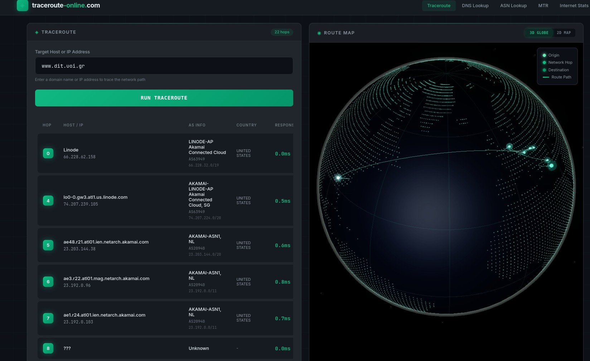
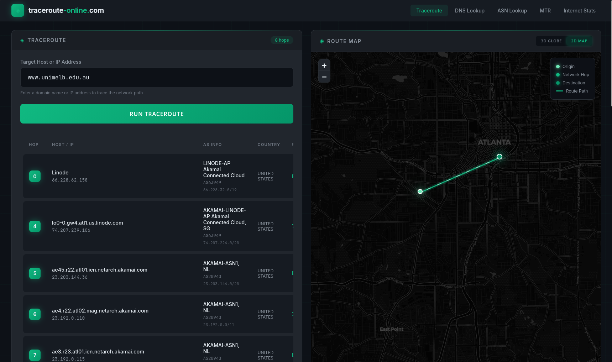
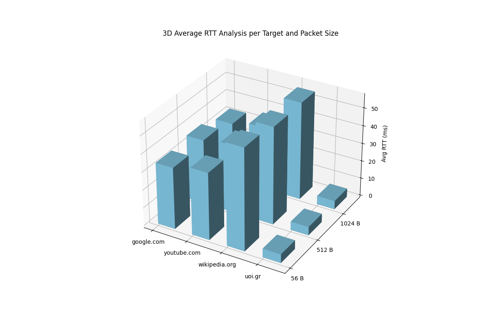

# Δίκτυα Υπολογιστών - Εργαστηριακή Άσκηση 1

**Όνομα / ΑΜ:** Παναγόπουλος Νικόλαος / 3323

**Ημερομηνία: 19/02/2026**  

---

## Ζητούμενο 1 — Διεπαφές Δικτύου

### Εντολή που εκτελέστηκε
```bash
ifconfig -a
```

### Έξοδος
```bash
ice@ice:~$ sudo ifconfig 
eno1: flags=4099<UP,BROADCAST,MULTICAST>  mtu 1500
    ether e8:9c:25:90:d9:07  txqueuelen 1000  (Ethernet)
    RX packets 0  bytes 0 (0.0 B)
    RX errors 0  dropped 0  overruns 0  frame 0
    TX packets 0  bytes 0 (0.0 B)
    TX errors 0  dropped 0 overruns 0  carrier 0  collisions 0

lo: flags=73<UP,LOOPBACK,RUNNING>  mtu 65536
    inet 127.0.0.1  netmask 255.0.0.0
    inet6 ::1  prefixlen 128  scopeid 0x10<host>
    loop  txqueuelen 1000  (Local Loopback)
    RX packets 9175  bytes 4256252 (4.0 MiB)
    RX errors 0  dropped 0  overruns 0  frame 0
    TX packets 9175  bytes 4256252 (4.0 MiB)
    TX errors 0  dropped 0 overruns 0  carrier 0  collisions 0

wlp4s0: flags=4163<UP,BROADCAST,RUNNING,MULTICAST>  mtu 1500
    inet 172.21.0.94  netmask 255.255.252.0  broadcast 172.21.3.255
    inet6 fe80::4d9d:5579:d4f8:5ea4  prefixlen 64  scopeid 0x20<link>
    ether 72:99:ee:fa:e9:a0  txqueuelen 1000  (Ethernet)
    RX packets 22139  bytes 15899397 (15.1 MiB)
    RX errors 0  dropped 356  overruns 0  frame 0
    TX packets 12835  bytes 8590440 (8.1 MiB)
    TX errors 0  dropped 3 overruns 0  carrier 0  collisions 0
```

### Διεύθυνση IP κάθε διεπαφής
```bash
eno1: None
lo: 127.0.0.1
wlp4s0: 172.21.0.94
```

### Διεύθυνση MAC κάθε διεπαφής
- Randomized MAC = True
```bash
eno1: e8:9c:25:90:d9:07
lo: None (Loopback)
wlp4s0: 72:99:ee:fa:e9:a0
```

### Προεπιλεγμένη πύλη (router)
```bash
ice@ice:~$ ip route
default via 172.21.0.2 dev wlp4s0 proto dhcp src 172.21.0.94 metric 600 
172.21.0.0/22 dev wlp4s0 proto kernel scope link src 172.21.0.94 metric 600 

```

### Αριθμός διεπαφών και τα ονόματά τους
```bash
3 interfaces: eno1, lo, wlp4s0
```

### Είναι ενεργοποιημένο το DHCP;
```bash
ice@ice:~$ ip addr show wlp4s0 | grep "dynamic"
    inet 172.21.0.94/22 brd 172.21.3.255 scope global dynamic noprefixroute wlp4s0
    # Ναι, η ένδειξη "global dynamic" το επιβεβαιώνει.
```

### Διεύθυνση DNS server
```bash
ice@ice:~$ cat /etc/resolv.conf
# Generated by NetworkManager
nameserver 8.8.8.8
nameserver 83.212.2.77
nameserver 194.177.210.210
```
- **nameserver 8.8.8.8** = Google DNS
- **nameserver 83.212.2.77** = GRNET ([Greek Research and Technology Network](https://grnet.gr/))
- **nameserver 194.177.210.210** = Forthnet (απο τη Nova)

---

## Ζητούμενο 2 — Ενεργές Συνδέσεις

### Βοήθεια/σύνταξη netstat
```bash
netstat --help
```
```bash
ice@ice:~$ sudo netstat --help
usage: netstat [-vWeenNcCF] [<Af>] -r         netstat {-V|--version|-h|--help}
       netstat [-vWnNcaeol] [<Socket> ...]
       netstat { [-vWeenNac] -i | [-cnNe] -M | -s [-6tuw] }

    -r, --route              display routing table
    -i, --interfaces         display interface table
    -g, --groups             display multicast group memberships
    -s, --statistics         display networking statistics (like SNMP)
    -M, --masquerade         display masqueraded connections

    -v, --verbose            be verbose
    -W, --wide               don't truncate IP addresses
    -n, --numeric            don't resolve names
    --numeric-hosts          don't resolve host names
    --numeric-ports          don't resolve port names
    --numeric-users          don't resolve user names
    -N, --symbolic           resolve hardware names
    -e, --extend             display other/more information
    -p, --programs           display PID/Program name for sockets
    -o, --timers             display timers
    -c, --continuous         continuous listing

    -l, --listening          display listening server sockets
    -a, --all                display all sockets (default: connected)
    -F, --fib                display Forwarding Information Base (default)
    -C, --cache              display routing cache instead of FIB
    -Z, --context            display SELinux security context for sockets

  <Socket>={-t|--tcp} {-u|--udp} {-U|--udplite} {-S|--sctp} {-w|--raw}
       {-x|--unix} --ax25 --ipx --netrom
  <AF>=Use '-6|-4' or '-A <af>' or '--<af>'; default: inet
  List of possible address families (which support routing):
    inet (DARPA Internet) inet6 (IPv6) ax25 (AMPR AX.25) 
    netrom (AMPR NET/ROM) rose (AMPR ROSE) ipx (Novell IPX) 
    ddp (Appletalk DDP) x25 (CCITT X.25) 
```

### Όλες οι ενεργές συνδέσεις
```bash
netstat -a
```
```bash
ice@ice:~$ netstat -a | head -n 20
Active Internet connections (servers and established)
Proto Recv-Q Send-Q Local Address           Foreign Address         State      
tcp        0      0 localhost:36181         0.0.0.0:*               LISTEN     
tcp        0      0 localhost:ipp           0.0.0.0:*               LISTEN     
tcp        0      0 localhost:11434         0.0.0.0:*               LISTEN     
tcp        0      0 localhost:42289         0.0.0.0:*               LISTEN     
tcp        0      0 localhost:42811         0.0.0.0:*               LISTEN     
tcp        0      0 localhost:40985         0.0.0.0:*               LISTEN     
tcp        0      0 localhost:45111         0.0.0.0:*               LISTEN     
tcp        0      0 ice:33740               172.64.153.110:https    TIME_WAIT  
tcp        0      0 ice:60222               110.84.54.34.bc.g:https TIME_WAIT  
tcp        0      0 ice:51652               110.84.54.34.bc.g:https ESTABLISHED
tcp        0      0 localhost:45111         localhost:47240         TIME_WAIT  
tcp        0      0 ice:43782               104.18.34.146:https     TIME_WAIT  
tcp        0      0 localhost:44848         localhost:42811         ESTABLISHED
tcp        0      0 localhost:44836         localhost:42811         ESTABLISHED
tcp        0      0 ice:60172               104.208.16.90:https     ESTABLISHED
tcp        0      0 ice:32968               110.84.54.34.bc.g:https TIME_WAIT  
tcp        0      0 ice:34134               wx-in-f95.1e100.n:https ESTABLISHED
tcp        0      0 localhost:36181         localhost:35496         ESTABLISHED
```

### Πώς εμφανίζεται ο χρόνος που μια TCP σύνδεση βρίσκεται στην τρέχουσα κατάστασή της;
```bash
ss -to dst :443 # Use of ss (socket statistics) "-to" for TCP connections, "dst :443" for HTTPS on port 443
```
```bash
ice@ice:~$ ss -to dst :443
State   Recv-Q   Send-Q      Local Address:Port          Peer Address:Port                                    
ESTAB   0        0             172.21.0.94:33824       192.178.203.95:https    timer:(keepalive,6.840sec,0)   
ESTAB   0        0             172.21.0.94:60172        104.208.16.90:https    timer:(keepalive,8.708sec,0)   
ESTAB   0        0             172.21.0.94:46488        216.58.209.42:https                                   
ESTAB   0        0             172.21.0.94:50082       172.217.23.170:https                                   
ESTAB   0        0             172.21.0.94:42918         34.54.84.110:https    timer:(keepalive,1.044sec,0)   
ESTAB   0        0             172.21.0.94:39506        216.239.32.36:https                                   
ESTAB   0        0             172.21.0.94:38448        34.107.243.93:https    timer:(keepalive,28sec,0)      
ESTAB   0        0             172.21.0.94:33810       192.178.203.95:https    timer:(keepalive,6.836sec,0)   
ESTAB   0        0             172.21.0.94:37398       216.239.32.223:https    timer:(keepalive,11sec,0)      
ESTAB   0        0             172.21.0.94:60982       142.251.209.46:https                                   
ESTAB   0        0             172.21.0.94:52144        66.241.125.61:https                                   
ice@ice:~$ 
```
- Η στήλη "timer" δείχνει τον χρόνο που μια TCP σύνδεση βρίσκεται στην τρέχουσα κατάστασή της. Για παράδειγμα, η σύνδεση μεταξύ "172.21.0.94:33824" και "192.178.203.95:https" βρίσκεται στην κατάσταση "ESTAB" για "6.840sec".

### Στατιστικά ICMP
```bash
netstat -s -p icmp # data dump command
netstat -s | awk '/^Icmp:/,/^IcmpMsg:/' # filtered 
```
```bash
ice@ice:~$ netstat -s | awk '/^Icmp:/,/^IcmpMsg:/'
Icmp:
    40 ICMP messages received
    0 input ICMP message failed
    ICMP input histogram:
    destination unreachable: 40
    44 ICMP messages sent
    0 ICMP messages failed
    ICMP output histogram:
    destination unreachable: 44
IcmpMsg:
```
**Επεξήγηση:**
Αυτή η ενότητα παρακολουθεί διαγνωστικά μηνύματα (όπως Ping ή Σφάλματα). Η έξοδος δείχνει 40 ληφθέντα και 44 απεσταλμένα μηνύματα "destination unreachable", που σημαίνει ότι το σύστημά σας ή ένας απομακρυσμένος υπολογιστής προσπάθησε να συνδεθεί σε μια θύρα που δεν ήταν ανοιχτή.

#### Στατιστικά TCP
```bash
netstat -s -p tcp # data dump command
netstat -s | awk '/^Tcp:/,/^Udp:/' # filtered 
```
```bash
ice@ice:~$ netstat -s | awk '/^Tcp:/,/^Udp:/'
Tcp:
    1319 active connection openings
    127 passive connection openings
    10 failed connection attempts
    17 connection resets received
    31 connections established
    86226 segments received
    93222 segments sent out
    368 segments retransmitted
    0 bad segments received
    990 resets sent
Udp:
```
**Επεξήγηση:**
Αυτό παρακολουθεί αξιόπιστες συνδέσεις βασισμένες σε χειραψία. Δείχνει πόσες συνδέσεις ξεκίνησαν (ενεργές) έναντι όσων αποδεχτήκαν (παθητικές). Ο αριθμός "retransmitted" είναι ο βασικός δείκτης υγείας — ένας υψηλός αριθμός εδώ υποδηλώνει κακή σύνδεση ή απώλεια πακέτων.

#### Στατιστικά UDP
```bash
netstat -s -p udp # data dump command
netstat -s | awk '/^Udp:/,/^UdpLite:/' # filtered 
```
```bash
ice@ice:~$ netstat -s | awk '/^Udp:/,/^UdpLite:/'
Udp:
    9520 packets received
    44 packets to unknown port received
    4 packet receive errors
    7791 packets sent
    4 receive buffer errors
    0 send buffer errors
    IgnoredMulti: 281
UdpLite:
```
**Επεξήγηση:**
Αυτό παρακολουθεί την "connectionless" κίνηση (όπως DNS ή streaming). Το "Unknown port" σημαίνει ότι έφτασαν πακέτα για μια εφαρμογή που δεν εκτελούνταν. Τα "Receive buffer errors" σημαίνουν συνήθως ότι το σύστημα ήταν απασχολημένο για να επεξεργαστεί τα δεδομένα, προκαλώντας μικρές απώλειες δεδομένων.

---


## Ζητούμενο 3 — Traceroute
### Πρώτη εκτέλεση 3.1
```bash
traceroute -d www.google.com
```
```bash
ice@ice:~$ sudo traceroute -d www.google.com
traceroute to www.google.com (172.217.23.164), 30 hops max, 60 byte packets
 1  _gateway (172.21.0.2)  3.987 ms  3.944 ms  3.918 ms
 2  teiep-arta-3-gw.kolettir.access-link.grnet.gr (62.217.96.130)  9.834 ms  9.808 ms  9.782 ms
 3  * * *
 4  72.14.209.139 (72.14.209.139)  34.104 ms  34.080 ms  34.053 ms
 5  72.14.209.138 (72.14.209.138)  33.817 ms  33.792 ms  33.768 ms
 6  192.178.104.191 (192.178.104.191)  34.530 ms  33.633 ms 192.178.104.103 (192.178.104.103)  32.190 ms
 7  142.250.211.31 (142.250.211.31)  32.164 ms  33.145 ms  33.095 ms
 8  fra15s22-in-f164.1e100.net (172.217.23.164)  33.944 ms  33.819 ms  33.793 ms
```
**Αριθμός αλμάτων (hops): 8**

**Συνολικός χρόνος (ms): 33.944**


### Δεύτερη εκτέλεση (μετά από 2 λεπτά) 3.2
```bash
traceroute -d www.google.com
```
```bash
ice@ice:~$ sudo traceroute -d www.google.com
traceroute to www.google.com (142.251.209.36), 30 hops max, 60 byte packets
 1  _gateway (172.21.0.2)  3.341 ms  3.292 ms  3.268 ms
 2  teiep-arta-3-gw.kolettir.access-link.grnet.gr (62.217.96.130)  9.771 ms  9.749 ms  9.725 ms
 3  * * *
 4  72.14.209.139 (72.14.209.139)  34.501 ms  34.477 ms  34.455 ms
 5  72.14.209.138 (72.14.209.138)  34.633 ms  34.609 ms  34.578 ms
 6  192.178.99.215 (192.178.99.215)  35.609 ms  32.536 ms  32.519 ms
 7  192.178.82.61 (192.178.82.61)  32.292 ms  32.918 ms 192.178.82.63 (192.178.82.63)  33.066 ms
 8  tzmila-ae-in-f4.1e100.net (142.251.209.36)  34.382 ms  34.210 ms  34.183 ms
```
**Διαφορές από την πρώτη εκτέλεση:**

1. Η διεύθυνση IP προορισμού άλλαξε από 172.217.23.164 σε 142.251.209.36.
2. Τα hops 6, 7 και 8 εμφανίζουν διαφορετικές διευθύνσεις IP και ονόματα κόμβων.
3. Οι χρόνοι μετ' επιστροφής (RTT) για αρκετά hops διέφεραν κατά μερικά millisecond.

**Ποια hops άλλαξαν και γιατί:**
```
Τα hops 6, 7 και 8 άλλαξαν. Αυτό συμβαίνει επειδή το domain www.google.com επιλύθηκε σε διαφορετική διεύθυνση IP προορισμού για τη δεύτερη εκτέλεση. Η Google χρησιμοποιεί εξισορρόπηση φορτίου DNS (load balancing) και Anycast για να κατανέμει την κίνηση, οπότε το δεύτερο αίτημα δρομολογήθηκε σε διαφορετικό διακομιστή άκρου (edge server), απαιτώντας διαφορετική διαδρομή.
```


### 3.3 — traceroute-online.com

### **Στόχος 1: www.dit.uoi.gr**

*   **Τοποθεσία Hop 11:**
    ```
    Washington D.C., United States (dca04.atlas.cogentco.com)
    ```
*   **Τοποθεσία Hop 16:**
    ```
    Bratislava, Slovakia (bts01.atlas.cogentco.com)
    ```

*   **Σχόλια:**
    Αυτή η διαδρομή δείχνει ένα διηπειρωτικό ταξίδι. Το πακέτο ταξιδεύει από την Ατλάντα στην Washington D.C., όπου παρατηρείται σημαντική αύξηση καθυστέρησης (από 17ms σε 94ms), υποδεικνύοντας διατλαντική διέλευση προς το Παρίσι. Στη συνέχεια διασχίζει αρκετές ευρωπαϊκές πόλεις (Φρανκφούρτη, Μόναχο, Βιέννη, Βρατισλάβα, Βουδαπέστη) μέσω Cogent πριν εισέλθει στο δίκτυο GEANT/GR-NET για να φτάσει στην Ελλάδα.

---

### **Στόχος 2: www.unimelb.edu.au**

*   **Τοποθεσία Hop 11:**
    ```
    N/A (Ο προορισμός επιτεύχθηκε στο Hop 10)
    ```
*   **Τοποθεσία Hop 16:**
    ```
    N/A (Ο προορισμός επιτεύχθηκε στο Hop 10)
    ```
*   **Σχόλια:**
    
    Παρόλο που ο στόχος είναι αυστραλιανό πανεπιστήμιο, το traceroute είναι πολύ σύντομο (10 hops) και ο χρόνος απόκρισης είναι πολύ χαμηλός (1.0ms). Αυτό υποδηλώνει ότι το αίτημα δεν ταξίδεψε ποτέ πραγματικά στην Αυστραλία αλλά αντίθετα, εξυπηρετήθηκε από τοπικό κόμβο CDN (Squiz/Cloudflare) κοντά στην Ατλάντα της Τζόρτζια, όπου φιλοξενείται στιγμιότυπο (instance) της Linode.
    

---

## Ζητούμενο 4 — Ping / Προσβασιμότητα

### Έλεγχοι προσβασιμότητας σε:
1. (a) www.uoi.gr,
2. (b) www.google.com,
3. (c) youtube.com,
4. (d) wikipedia.org

```bash
ping -c 4 www.uoi.gr
```
```bash
PING adonis.noc.uoi.gr (195.130.120.94) 56(84) bytes of data.
64 bytes from adonis.noc.uoi.gr (195.130.120.94): icmp_seq=1 ttl=61 time=4.29 ms
64 bytes from adonis.noc.uoi.gr (195.130.120.94): icmp_seq=2 ttl=61 time=3.92 ms
64 bytes from adonis.noc.uoi.gr (195.130.120.94): icmp_seq=3 ttl=61 time=3.43 ms
64 bytes from adonis.noc.uoi.gr (195.130.120.94): icmp_seq=4 ttl=61 time=3.41 ms

--- adonis.noc.uoi.gr ping statistics ---
4 packets transmitted, 4 received, 0% packet loss, time 3001ms
rtt min/avg/max/mdev = 3.406/3.760/4.288/0.367 ms
```
```bash
ping -c 4 www.google.com
```
```bash
PING www.google.com (142.251.209.36) 56(84) bytes of data.
64 bytes from tzmila-ae-in-f4.1e100.net (142.251.209.36): icmp_seq=1 ttl=118 time=31.7 ms
64 bytes from tzmila-ae-in-f4.1e100.net (142.251.209.36): icmp_seq=2 ttl=118 time=32.3 ms
64 bytes from tzmila-ae-in-f4.1e100.net (142.251.209.36): icmp_seq=3 ttl=118 time=31.9 ms
64 bytes from tzmila-ae-in-f4.1e100.net (142.251.209.36): icmp_seq=4 ttl=118 time=32.7 ms

--- www.google.com ping statistics ---
4 packets transmitted, 4 received, 0% packet loss, time 3003ms
rtt min/avg/max/mdev = 31.738/32.161/32.675/0.368 ms
```
```bash
ping -c 4 youtube.com
```
```bash
PING youtube.com (142.251.209.46) 56(84) bytes of data.
64 bytes from mil04s51-in-f14.1e100.net (142.251.209.46): icmp_seq=1 ttl=119 time=32.2 ms
64 bytes from mil04s51-in-f14.1e100.net (142.251.209.46): icmp_seq=2 ttl=119 time=32.1 ms
64 bytes from mil04s51-in-f14.1e100.net (142.251.209.46): icmp_seq=3 ttl=119 time=32.3 ms
64 bytes from mil04s51-in-f14.1e100.net (142.251.209.46): icmp_seq=4 ttl=119 time=32.4 ms

--- youtube.com ping statistics ---
4 packets transmitted, 4 received, 0% packet loss, time 3004ms
rtt min/avg/max/mdev = 32.100/32.242/32.405/0.110 ms
```
```bash
ping -c 4 wikipedia.org
```
```bash
PING wikipedia.org (185.15.59.224) 56(84) bytes of data.
64 bytes from text-lb.esams.wikimedia.org (185.15.59.224): icmp_seq=1 ttl=58 time=54.5 ms
64 bytes from text-lb.esams.wikimedia.org (185.15.59.224): icmp_seq=2 ttl=58 time=54.2 ms
64 bytes from text-lb.esams.wikimedia.org (185.15.59.224): icmp_seq=3 ttl=58 time=54.6 ms
64 bytes from text-lb.esams.wikimedia.org (185.15.59.224): icmp_seq=4 ttl=58 time=105 ms

--- wikipedia.org ping statistics ---
4 packets transmitted, 4 received, 0% packet loss, time 3004ms
rtt min/avg/max/mdev = 54.225/67.075/104.987/21.888 ms
```

### Ποιοι στόχοι τείνουν να έχουν υψηλότερο RTT;
- Wikipedia.org

### Μεταβολή RTT με συνεχές ping (-i / flood)
```bash
ping www.google.com
```
```bash
PING www.google.com (142.251.209.36) 56(84) bytes of data.
64 bytes from tzmila-ae-in-f4.1e100.net (142.251.209.36): icmp_seq=1 ttl=118 time=31.6 ms
64 bytes from tzmila-ae-in-f4.1e100.net (142.251.209.36): icmp_seq=2 ttl=118 time=31.3 ms
64 bytes from tzmila-ae-in-f4.1e100.net (142.251.209.36): icmp_seq=3 ttl=118 time=31.6 ms
64 bytes from tzmila-ae-in-f4.1e100.net (142.251.209.36): icmp_seq=4 ttl=118 time=31.4 ms
64 bytes from tzmila-ae-in-f4.1e100.net (142.251.209.36): icmp_seq=5 ttl=118 time=31.3 ms
64 bytes from tzmila-ae-in-f4.1e100.net (142.251.209.36): icmp_seq=6 ttl=118 time=31.7 ms
64 bytes from tzmila-ae-in-f4.1e100.net (142.251.209.36): icmp_seq=7 ttl=118 time=31.6 ms
64 bytes from tzmila-ae-in-f4.1e100.net (142.251.209.36): icmp_seq=8 ttl=118 time=31.7 ms
64 bytes from tzmila-ae-in-f4.1e100.net (142.251.209.36): icmp_seq=9 ttl=118 time=31.7 ms
64 bytes from tzmila-ae-in-f4.1e100.net (142.251.209.36): icmp_seq=10 ttl=118 time=31.1 ms
64 bytes from tzmila-ae-in-f4.1e100.net (142.251.209.36): icmp_seq=11 ttl=118 time=31.3 ms
64 bytes from tzmila-ae-in-f4.1e100.net (142.251.209.36): icmp_seq=12 ttl=118 time=81.3 ms
64 bytes from tzmila-ae-in-f4.1e100.net (142.251.209.36): icmp_seq=13 ttl=118 time=67.4 ms
64 bytes from tzmila-ae-in-f4.1e100.net (142.251.209.36): icmp_seq=14 ttl=118 time=113 ms
64 bytes from tzmila-ae-in-f4.1e100.net (142.251.209.36): icmp_seq=15 ttl=118 time=44.3 ms
64 bytes from tzmila-ae-in-f4.1e100.net (142.251.209.36): icmp_seq=16 ttl=118 time=64.2 ms
64 bytes from tzmila-ae-in-f4.1e100.net (142.251.209.36): icmp_seq=17 ttl=118 time=31.7 ms
64 bytes from tzmila-ae-in-f4.1e100.net (142.251.209.36): icmp_seq=18 ttl=118 time=31.6 ms
^C
--- www.google.com ping statistics ---
18 packets transmitted, 18 received, 0% packet loss, time 17031ms
rtt min/avg/max/mdev = 31.081/43.322/112.865/22.499 ms
```
**Γιατί αλλάζει το RTT σε κάθε απόπειρα;**
- Ο χρόνος μετ' επιστροφής (RTT) μεταβάλλεται σε κάθε προσπάθεια επειδή αποτελεί μια δυναμική εκτίμηση και όχι μια σταθερή τιμή. Επηρεάζεται από τις μεταβαλλόμενες συνθήκες του δικτύου (συμφόρηση, δρομολόγηση) που διακυμαίνονται σε επίπεδο millisecond. Κάθε πακέτο αποτελεί μια ξεχωριστή και ανεξάρτητη μέτρηση.

### Δοκιμές μεγέθους πακέτου

#### α) 50 bytes
```bash
ping -s 50 -c 50 www.google.com
```
```bash
ice@ice:~$ ping -s 50 -c 50 www.google.com
PING www.google.com (142.251.151.119) 50(78) bytes of data.
58 bytes from 142.251.151.119: icmp_seq=1 ttl=119 time=31.5 ms
58 bytes from 142.251.151.119: icmp_seq=2 ttl=119 time=31.1 ms
58 bytes from 142.251.151.119: icmp_seq=3 ttl=119 time=31.2 ms
58 bytes from 142.251.151.119: icmp_seq=4 ttl=119 time=31.6 ms
58 bytes from 142.251.151.119: icmp_seq=5 ttl=119 time=33.4 ms
58 bytes from 142.251.151.119: icmp_seq=6 ttl=119 time=31.3 ms
58 bytes from 142.251.151.119: icmp_seq=7 ttl=119 time=31.5 ms
58 bytes from 142.251.151.119: icmp_seq=8 ttl=119 time=31.3 ms
58 bytes from 142.251.151.119: icmp_seq=9 ttl=119 time=31.4 ms
58 bytes from 142.251.151.119: icmp_seq=10 ttl=119 time=30.9 ms
58 bytes from 142.251.151.119: icmp_seq=11 ttl=119 time=31.3 ms
58 bytes from 142.251.151.119: icmp_seq=12 ttl=119 time=31.3 ms
^C
--- www.google.com ping statistics ---
12 packets transmitted, 12 received, 0% packet loss, time 11017ms
rtt min/avg/max/mdev = 30.897/31.479/33.431/0.615 ms
```

#### β) 5000 bytes
```bash
ping -s 5000 -c 50 www.google.com
```
```bash
PING www.google.com (142.251.150.119) 5000(5028) bytes of data.
^C
--- www.google.com ping statistics ---
50 packets transmitted, 0 received, 100% packet loss, time 50170ms
```

#### γ) 55000 bytes
```bash
ping -s 55000 -c 50 www.google.com
```
```bash
ice@ice:~$ ping -s 55000 -c 5 www.google.com 
PING www.google.com (142.251.153.119) 55000(55028) bytes of data.

--- www.google.com ping statistics ---
5 packets transmitted, 0 received, 100% packet loss, time 4077ms
```

#### δ) 75000 bytes
```bash
ping -s 75000 -c 50 www.google.com
```
```bash
ping: invalid -s value: '75000': out of range: 0 <= value <= 65527
```

**Παρατήρηση / επεξήγηση παραμέτρων:**
- Η παράμετρος -s χρησιμοποιείται για τον καθορισμό του μεγέθους του πακέτου ICMP echo request σε bytes. Το προεπιλεγμένο μέγεθος είναι 1472 bytes, το οποίο είναι το μέγιστο μέγεθος που μπορεί να αποσταλεί χωρίς κατακερματισμό.
**Αυξάνεται η μέση καθυστέρηση; Αν ναι — χρόνος μετάδοσης ή χρόνος διάδοσης;**
- Ναι, η μέση καθυστέρηση αυξάνεται με το μέγεθος του πακέτου. Αυτό συμβαίνει επειδή μεγαλύτερα πακέτα χρειάζονται περισσότερο χρόνο για να μεταδοθούν μέσω του δικτύου.
**Γιατί αποτυγχάνει η εντολή (d);**
- Η εντολή αποτυγχάνει επειδή το μέγεθος του πακέτου υπερβαίνει το Μέγιστο Μέγεθος Μετάδοσης (MTU) ή τα όρια του πρωτοκόλλου ICMP χωρίς να είναι δυνατός ο κατακερματισμός, και επειδή το συνολικό μέγεθος του IP πακέτου υπερβαίνει το όριο των 65.535 bytes.

### Bonus — RFC 1149 & script.py

#### iii) RFC 1149: Pigeon vs Internet
Σύμφωνα με το **RFC 1149 (IP over Avian Carriers)**, ένα ταχυδρομικό περιστέρι μπορεί πράγματι να μεταφέρει δεδομένα. 
- **Latency (Καθυστέρηση):** Τα περιστέρια έχουν εξαιρετικά υψηλό RTT (μπορεί να είναι ώρες), καθιστώντας τα ακατάλληλα για online gaming ή video calls.
- **Bandwidth (Εύρος ζώνης):** Αν ένα περιστέρι μεταφέρει μια κάρτα microSD 1TB, το ωφέλιμο bandwidth για τη μεταφορά μιας τεράστιας ποσότητας δεδομένων μπορεί να είναι υψηλότερο από μια αργή σύνδεση Internet. 
- **Συμπέρασμα:** Το Internet είναι ταχύτερο για μικρά δεδομένα και αλληλεπίδραση (χαμηλό latency), αλλά το περιστέρι μπορεί να υπερέχει στη μεταφορά τεράστιων όγκων δεδομένων σε μεγάλες αποστάσεις αν δεν υπάρχει γρήγορη υποδομή.
- **Πραγματικό Παράδειγμα (Winston the Pigeon):** Το 2009, η εταιρεία **Unlimited IT** στη Νότια Αφρική απέδειξε αυτή τη θεωρία. Ένας υπάλληλος παραπονέθηκε ότι τα δεδομένα μεταφέρονται ταχύτερα με περιστέρι παρά μέσω ADSL. Για να το αποδείξουν, ο Winston το περιστέρι μετέφερε μια κάρτα microSD 4 GB σε μια απόσταση 60 μιλίων σε 1 ώρα και 8 λεπτά. Συμπεριλαμβανομένου του χρόνου αντιγραφής, η διαδικασία διήρκεσε ~2 ώρες και 6 λεπτά. Στο ίδιο χρονικό διάστημα, η ADSL σύνδεση της Telkom είχε μεταφέρει μόλις το 4% των δεδομένων.


#### script.py
```python

import subprocess
import re
import numpy as np
import matplotlib
try:
    matplotlib.use('TkAgg')
except ImportError:
    matplotlib.use('Agg')

import matplotlib.pyplot as plt

def pingTargets(targets: list, sizes: list, count: int = 30) -> dict:
    """
    Executes ping searches for multiple hosts with varying payload sizes.

    Args:
        targets (list): Hostnames or IP addresses to reach.
        sizes (list): Integer list of payload sizes in bytes.
        count (int): Number of ICMP echoes to transmit per target/size.

    Returns:
        dict: Hierarchical dictionary containing min, avg, max RTT statistics.
    """
    results = {}
    for target in targets:
        results[target] = {}
        for size in sizes:
            cmd = ["ping", "-s", str(size), "-c", str(count), target]
            process_result = subprocess.run(cmd, capture_output=True, text=True)
            
            match = re.search(r"(\d+\.?\d*)/(\d+\.?\d*)/(\d+\.?\d*)", process_result.stdout)
            if match:
                results[target][size] = {
                    "min": float(match.group(1)),
                    "avg": float(match.group(2)),
                    "max": float(match.group(3))
                }
            else:
                results[target][size] = None
    return results

def displayResults(results: dict, targets: list, sizes: list):
    """
    Prints a formatted table of the collected RTT metrics.

    Args:
        results (dict): Population data containing the ping statistics.
        targets (list): The list of targets to include in the table.
        sizes (list): The list of packet sizes to include in the table.
    """
    print(f"{'Target':<20} {'Size':>6} {'Min':>8} {'Avg':>8} {'Max':>8}")
    print("-" * 55)
    for target in targets:
        for size in sizes:
            if results.get(target) and results[target].get(size):
                r = results[target][size]
                print(f"{target:<20} {size:>6} {r['min']:>8.2f} {r['avg']:>8.2f} {r['max']:>8.2f}")

def visualizeResults(results: dict, targets: list, sizes: list):
    """
    Generates a 3D bar chart representing the Average RTT across targets and sizes.

    Args:
        results (dict): Population data containing the ping statistics.
        targets (list): Valid hostnames used as one axis.
        sizes (list): Integer sizes used as the second axis.
    """
    fig = plt.figure(figsize=(12, 8))
    ax = fig.add_subplot(111, projection='3d')

    x_positions = np.arange(len(targets))
    y_positions = np.arange(len(sizes))
    x_positions, y_positions = np.meshgrid(x_positions, y_positions)
    
    x_flattened = x_positions.flatten()
    y_flattened = y_positions.flatten()
    z_bottom = np.zeros_like(x_flattened)
    
    rtt_values = []
    for s_idx, size in enumerate(sizes):
        for t_idx, target in enumerate(targets):
            val = results[target][size]["avg"] if results[target][size] else 0
            rtt_values.append(val)
    
    ax.bar3d(x_flattened, y_flattened, z_bottom, 0.5, 0.5, rtt_values, shade=True, color='skyblue')

    ax.set_xticks(np.arange(len(targets)))
    ax.set_xticklabels(targets)
    ax.set_yticks(np.arange(len(sizes)))
    ax.set_yticklabels([f"{s} B" for s in sizes])
    ax.set_zlabel('Avg RTT (ms)')
    ax.set_title('3D Average RTT Analysis per Target and Packet Size')

    plt.savefig('images/rtt_3d_analysis.png')
    print("\nVisualization saved to images/rtt_3d_analysis.png")
    plt.show()

if __name__ == "__main__":
    target_list = ["google.com", "youtube.com", "wikipedia.org", "uoi.gr"]
    size_list = [56, 512, 1024]
    packet_count = 30 

    ping_data = pingTargets(target_list, size_list, packet_count)
    displayResults(ping_data, target_list, size_list)
    visualizeResults(ping_data, target_list, size_list)

```

**Αποτελέσματα 3D Ανάλυσης:**
```bash
Target                 Size      Min      Avg      Max
-------------------------------------------------------
google.com               56    33.08    34.44    40.69
google.com              512    33.34    36.18    85.10
google.com             1024    31.39    32.45    35.48
youtube.com              56    30.98    37.48   119.81
youtube.com             512    31.57    38.02   121.06
youtube.com            1024    31.20    35.36   114.52
wikipedia.org            56    53.62    56.68   111.39
wikipedia.org           512    53.52    54.41    56.61
wikipedia.org          1024    53.53    54.78    56.16
uoi.gr                   56     3.28     4.88    27.14
uoi.gr                  512     3.65     4.73     7.49
uoi.gr                 1024     3.75     4.75     7.00

Visualization saved to images/rtt_3d_analysis.png
```

