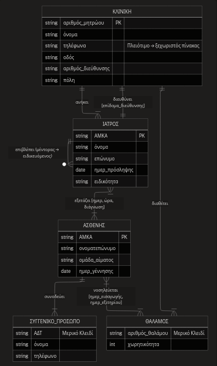

Below is the improved exam. Improvements: unified notation legend at the beginning, cleaner structure, more precise wording, repetitions removed, and 2 new exercises added (Exercise 7: SQL Subqueries, Exercise 8: BCNF).

***

# All-In-One Exam: Advanced Database Design, Translation & SQL

> **Notation Legend (applies throughout):**
> `Entity/Table` | <u>Attribute</u> | **Primary Key** | <u>*Foreign Key*</u>

This exam consists of two parts:
- **Part A** — Advanced E-R design, translation to the Relational Model, identification of pitfalls (recursive relationships, weak entities).
- **Part B** — Relational Algebra, SQL (joins, groupings, subqueries), Normalization (2NF → 3NF → BCNF).

***

## PART A: Advanced E-R Design and Translation to the Relational Model

### Exercise 1: Extraction of Entities, Attributes, Keys and Relationships

Read the following specification describing the information system of a network of hospital units:

> *"A network of hospital units manages independent clinics. Each clinic carries a unique registration number, by which it is identified. Its name, its multiple telephone lines of communication (there may be more than one) and its address, which is decomposed into street, number and city, are also recorded.*
>
> *The medical staff is identified exclusively by its AMKA (Social Security Number). Each physician has a first name, a last name, a date of recruitment and a specialty. Each physician organically belongs to exactly one clinic, while a clinic is staffed by many physicians. Moreover, each clinic is headed by exactly one physician — for this assignment, a monthly management allowance is recorded. In parallel, an experienced physician may supervise (as a mentor) many junior physicians, creating a recursive relationship within the same entity.*
>
> *Patients are identified by their AMKA. Their full name, blood group and date of birth are kept. A physician may examine many patients and vice versa. For each examination, the date, the time and the medical diagnosis are recorded.*
>
> *The patients are accompanied by relatives, who have no autonomous existence in the system without the associated patient. For each relative, an ID number, a name and a phone number are recorded.*
>
> *Each clinic has hospitalization wards. Each ward has a ward number (unique only within the clinic) and a maximum capacity. Patients are hospitalized in wards — a patient may be hospitalized in many wards over time, and each ward hosts many patients. For each hospitalization, the admission date and the discharge date are recorded."*

**Required:** Analyze and record:
- The **Entities** (strong and weak) with their **Attributes** and their **Primary Keys**.
- All **Relationships** between entities with **cardinality** and any **relationship attributes**.

***

*solution:*

**Entities and Attributes:**

1. `Clinic` *(Strong)*
   - **registration_number**, <u>name</u>, <u>phones</u> *(Multivalued)*, <u>address</u> *(Composite: street, number, city)*

2. `Physician` *(Strong)*
   - **AMKA**, <u>first_name</u>, <u>last_name</u>, <u>recruitment_date</u>, <u>specialty</u>

3. `Patient` *(Strong)*
   - **AMKA**, <u>full_name</u>, <u>blood_group</u>, <u>birth_date</u>

4. `Relative` *(Weak — depends on `Patient`)*
   - **ID_number** *(Partial Key)*, <u>name</u>, <u>phone</u>

5. `Ward` *(Weak — depends on `Clinic`)*
   - **ward_number** *(Partial Key)*, <u>capacity</u>

**Relationships:**

| # | Relationship | Entities | Cardinality | Relationship Attributes |
|---|-------|-----------|-------------|-------------------|
| 1 | **Belongs** | `Clinic` — `Physician` | 1:N | — |
| 2 | **Heads** | `Clinic` — `Physician` | 1:1 | <u>management_allowance</u> |
| 3 | **Supervises** *(recursive)* | `Physician` — `Physician` | 1:N | — |
| 4 | **Examines** | `Physician` — `Patient` | M:N | <u>date</u>, <u>time</u>, <u>diagnosis</u> |
| 5 | **Accompanies** *(identifying)* | `Patient` — `Relative` | 1:N | — |
| 6 | **Has** *(identifying)* | `Clinic` — `Ward` | 1:N | — |
| 7 | **Is hospitalized** | `Patient` — `Ward` | M:N | <u>admission_date</u>, <u>discharge_date</u> |

***

### Exercise 2: E-R Diagram Design

Design the E-R diagram of Exercise 1 in **Mermaid.js**. Render with clarity:
- Weak entities and their identifying relationships.
- Recursive relationships.
- Relationship attributes (inline on the relationship).

***

*solution:*



### Exercise 3: Translation to the Relational Model

Translate the diagram of Exercise 2 into tables. For each table, specify: Primary Keys, Foreign Keys, and the reason for existence of each intermediate table.

***

*solution:*

1. `Clinic`(**clinic_id**, <u>name</u>, <u>street</u>, <u>number</u>, <u>city</u>, <u>*director_ssn*</u>, <u>director_allowance</u>)
   - <u>*director_ssn*</u> → FK to `Physician`. Encapsulates the "heads" relationship (1:1) together with the relationship attribute.

2. `Clinic_Phone`(**clinic_id**, **phone_number**)
   - Represents the multivalued attribute. <u>*clinic_id*</u> → FK to `Clinic`.

3. `Physician`(**ssn**, <u>first_name</u>, <u>last_name</u>, <u>hire_date</u>, <u>specialty</u>, <u>*clinic_id*</u>, <u>*mentor_ssn*</u>)
   - <u>*clinic_id*</u> → FK to `Clinic` ("belongs" relationship, 1:N).
   - <u>*mentor_ssn*</u> → self-referencing FK to `Physician` (recursive relationship 1:N, nullable).

4. `Patient`(**ssn**, <u>full_name</u>, <u>blood_type</u>, <u>date_of_birth</u>)

5. `Relative`(**patient_ssn**, **id_number**, <u>first_name</u>, <u>phone_number</u>)
   - Composite PK due to the weak entity. <u>*patient_ssn*</u> → FK to `Patient`.

6. `Ward`(**clinic_id**, **ward_number**, <u>capacity</u>)
   - Composite PK due to the weak entity. <u>*clinic_id*</u> → FK to `Clinic`.

7. `Examination`(**physician_ssn**, **patient_ssn**, **date**, **time**, <u>diagnosis</u>)
   - Intermediate table for the M:N relationship. The composite PK ensures that the same pair (physician, patient) may have multiple examinations on different date/time.

8. `Hospitalization`(**patient_ssn**, **clinic_id**, **ward_number**, **admission_date**, <u>discharge_date</u>)
   - Intermediate table for the M:N relationship. The FK to `Ward` is composite (clinic_id + ward_number), so both parts are carried over. The **admission_date** in the key allows re-hospitalization in the same ward.

***
***

## PART B: Relational Algebra, SQL, and Normalization

**E-commerce schema (applies to Exercises 4–7):**

`Customer`(**customer_id**, <u>first_name</u>, <u>last_name</u>, <u>city</u>)
`Order`(**order_id**, <u>order_date</u>, <u>*customer_id*</u>)
`Product`(**product_id**, <u>description</u>, <u>unit_price</u>, <u>category</u>)
`Order_Item`(**order_id**, **product_id**, <u>quantity</u>)

***

### Exercise 4: Relational Algebra

Write the Relational Algebra expression that returns the <u>First Name</u> and the <u>Last Name</u> of all customers who have purchased at least one product from the category `'Smartphones'`.

***

*solution:*

**Step by step:**

- **R1** = $\sigma_{\text{category} = \text{'Smartphones'}}(`Product`)$ — Filtering of products
- **R2** = R1 ⨝ `Order_Item` — Finding the orders that contain them
- **R3** = R2 ⨝ `Order` — Finding the customer codes
- **R4** = R3 ⨝ `Customer` — Bringing the names
- **Result** = $\pi_{\text{first\_name, last\_name}}$(R4)

**In summary (single expression):**

$$\pi_{\text{first\_name, last\_name}}\bigl(\text{Customer} \bowtie \text{Order} \bowtie \text{Order\_Item} \bowtie \sigma_{\text{category}=\text{'Smartphones'}}(\text{Product})\bigr)$$

> **Observation:** The result may contain duplicates (the same customer may have purchased Smartphones in multiple orders). If uniqueness is required, it is applied implicitly by the semantics of Relational Algebra (sets), so no additional operation is required.

***

### Exercise 5: SQL — Joins, GROUP BY, HAVING

Write an SQL query that returns the <u>Name</u>, the <u>Last Name</u> and the **Total Purchase Amount** of each customer historically, **only** for customers with a total amount > 2500€. Sort descending by total amount.

> *The line amount = Quantity × Price.*

***

*solution:*

```sql
SELECT
    c.first_name,
    c.last_name,
    SUM(oi.quantity * p.unit_price) AS total_amount
FROM
    Customer   c
    INNER JOIN `Order`    o  ON c.customer_id = o.customer_id
    INNER JOIN Order_Item oi ON o.order_id    = oi.order_id
    INNER JOIN Product    p  ON oi.product_id = p.product_id
GROUP BY
    c.customer_id, c.first_name, c.last_name
HAVING
    SUM(oi.quantity * p.unit_price) > 2500
ORDER BY
    total_amount DESC;
```

> **Why `customer_id` in the `GROUP BY`;** The `GROUP BY` must include the PK so that customers with the same name/last name but a different code are not confused. The `HAVING` filters *after* the grouping, in contrast to the `WHERE`, which filters before.

***

### Exercise 6: Normalization Theory — 1NF → 3NF

Given the unnormalized table:

`Employee_Assignment`(**employee_id**, **branch_id**, <u>employee_name</u>, <u>employee_rank</u>, <u>branch_address</u>, <u>working_hours</u>)

**Questions:**
1. Which **Functional Dependencies** hold;
2. In which **Normal Form** is the table and why;
3. Decompose it into **3NF**.

***

*solution:*

**1. Functional Dependencies:**
- **employee_id** → <u>employee_name</u>, <u>employee_rank</u>
- **branch_id** → <u>branch_address</u>
- {**employee_id**, **branch_id**} → <u>working_hours</u>

**2. Normal Form:**
The table is in **1NF** (all fields are atomic), but **NOT in 2NF** due to **partial dependencies**: the <u>employee_name</u> / <u>employee_rank</u> depend only on the **employee_id**, and the <u>branch_address</u> only on the **branch_id** — not on the whole composite key.

**3. Decomposition into 3NF:**

- `Employee`(**employee_id**, <u>employee_name</u>, <u>employee_rank</u>)
- `Branch`(**branch_id**, <u>branch_address</u>)
- `Assignment`(**employee_id**, **branch_id**, <u>working_hours</u>)

In each table, every non-key attribute depends **fully, directly and only** on the (entire) key → 3NF ✓.

***

### Exercise 7: SQL — Subqueries & EXISTS *(New)*

Using the same e-commerce schema, write an SQL query that returns the **Name** and the **Last Name** of customers who **have ordered from ALL product categories** that exist in the database.

> *Hint: Think about when a customer has NOT ordered from a category — and use `NOT EXISTS`.*

***

*solution:*

The classic way to express "for every X, Y holds" in SQL is through **double negation** (`NOT EXISTS ... NOT EXISTS`):

```sql
-- Customers for whom there is NO category
-- from which they have NOT purchased
SELECT c.first_name, c.last_name
FROM Customer c
WHERE NOT EXISTS (
    -- Category that the customer has NOT purchased from
    SELECT DISTINCT p.category
    FROM Product p
    WHERE NOT EXISTS (
        -- Check if the customer has purchased from this category
        SELECT 1
        FROM `Order`       o
             INNER JOIN Order_Item oi ON o.order_id = oi.order_id
             INNER JOIN Product    pi ON oi.product_id = pi.product_id
        WHERE o.customer_id = c.customer_id
          AND pi.category = p.category
    )
);
```

**Alternative (with COUNT):**

```sql
SELECT c.first_name, c.last_name
FROM Customer c
     INNER JOIN `Order`    o  ON c.customer_id = o.customer_id
     INNER JOIN Order_Item oi ON o.order_id    = oi.order_id
     INNER JOIN Product    p  ON oi.product_id = p.product_id
GROUP BY c.customer_id, c.first_name, c.last_name
HAVING COUNT(DISTINCT p.category) = (SELECT COUNT(DISTINCT category) FROM Product);
```

> **Which one do we prefer;** The `COUNT` version is usually more readable and efficient. The `NOT EXISTS` version is the *semantically direct* translation of the "universal quantification" (∀) logic into SQL.

***

### Exercise 8: Normalization — BCNF *(New)*

Given the teaching table of a university (already in 3NF):

`Teaching`(**Student**, **Course**, <u>Professor</u>)

The following additional information (semantic constraints) holds:
- Each **Professor** teaches exactly **one Course**.
- Each **Student** in a **Course** may have many Professors (e.g., section leaders/laboratory).

**Questions:**
1. Which **Functional Dependencies** hold;
2. Why is the table **in 3NF but NOT in BCNF**;
3. Decompose it into **BCNF** and explain whether the decomposition is **lossless** but also whether it preserves dependencies (dependency-preserving).

***

*solution:*

**1. Functional Dependencies:**
- {**Student**, **Course**} → <u>Professor</u> — (a student in a course has a specific professor)
- {**Student**, **Professor**} → **Course** — (the professor teaches exactly one course)
- **Professor** → **Course** — (critical: each professor belongs to exactly one course)

The candidate keys are: `{Student, Course}` and `{Student, Professor}`.

**2. 3NF YES, BCNF NO:**
BCNF definition: for every non-trivial FD **X → Y**, **X must be a superkey**.

The dependency **Professor → Course** violates BCNF: **Professor** is not a superkey (it does not alone determine the student). However, it does not violate 3NF because **Course** is a *prime attribute* (part of some candidate key).

> **The classic "trick":** 3NF allows FDs from a non-superkey to a prime attribute. BCNF does not allow it at all.

**3. Decomposition into BCNF:**

- `Professor_Course`(**Professor**, <u>Course</u>)
- `Enrollment`(**Student**, **Professor**)

**Lossless join check:** Yes — the two tables are connected through **Professor** (common attribute, superkey in `Professor_Course`) → it satisfies the lossless-join decomposition criterion.

**Dependency preservation check:** **NOT fully** — the dependency `{Student, Course} → Professor` cannot be checked in a single table (it requires a join). This is the classic BCNF trade-off: **always lossless, but does not guarantee dependency preservation**.
