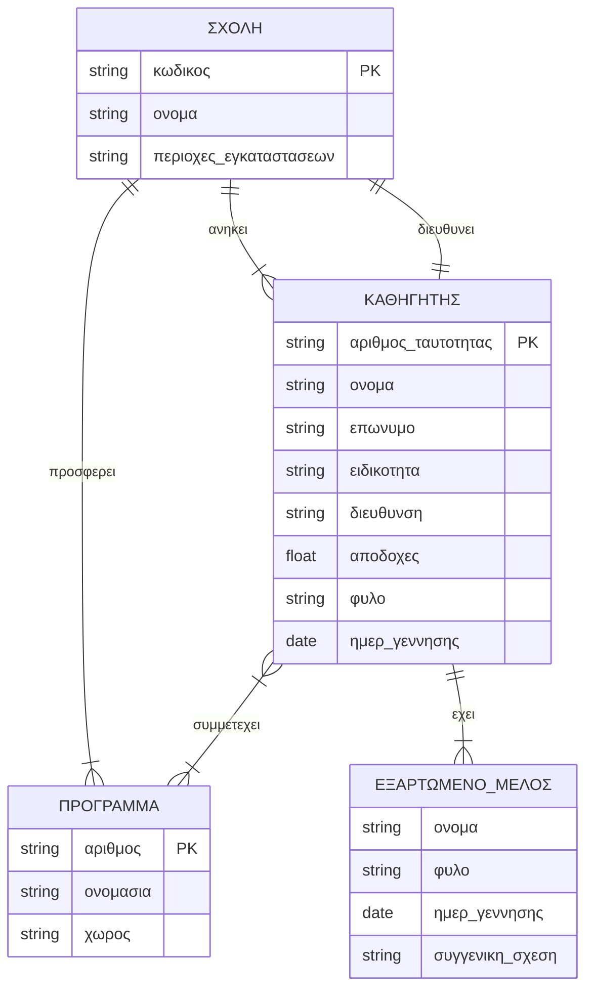

# Exam 6: Image to Markdown & Exam Simulation (Extracted Exercise)

Άσκηση 1: Οντότητες, γνωρίσματα, κλειδιά και σχέσεις, Αναλύστε το κείμενο (Ένα εκπαιδευτικό ίδρυμα διατηρεί πληροφορίες σχετικά με τους καθηγητές, τις σχολές και τα εκπαιδευτικά προγράμματα...) και καταγράψτε τις οντότητες, τα γνωρίσματά τους, τα πρωτεύοντα κλειδιά και τις σχέσεις μεταξύ τους.
---
*solution:*
**Οντότητες και Γνωρίσματα:**
1. **Σχολή (Ισχυρή Οντότητα)**
   - Γνωρίσματα: **κωδικός (Πρωτεύον Κλειδί)**, όνομα, γεωγραφικές περιοχές (Πλειότιμο γνώρισμα).
2. **Καθηγητής (Ισχυρή Οντότητα)**
   - Γνωρίσματα: όνομα, επώνυμο, **αριθμός ταυτότητας (Πρωτεύον Κλειδί)**, ειδικότητα, διεύθυνση κατοικίας, μηνιαίες αποδοχές, φύλο, ημερομηνία γέννησης.
3. **Εκπαιδευτικό Πρόγραμμα (Ισχυρή Οντότητα)**
   - Γνωρίσματα: **αριθμός (Πρωτεύον Κλειδί)**, ονομασία, χώρος.
4. **Εξαρτώμενο Μέλος (Ασθενής Οντότητα)**
   - Γνωρίσματα: **όνομα (Μερικό Κλειδί)**, φύλο, ημερομηνία γέννησης, συγγενική σχέση.

**Σχέσεις:**
1. **Διευθύνει (1:1):** Σχολή - Καθηγητής. Γνώρισμα σχέσης: *ημερομηνία ανάληψης*.
2. **Προσφέρει (1:N):** Σχολή - Πρόγραμμα. (Κάθε σχολή προσφέρει πολλά προγράμματα).
3. **Ανήκει (1:N):** Σχολή - Καθηγητής. (Κάθε καθηγητής ανήκει σε μία σχολή).
4. **Συμμετέχει (M:N):** Καθηγητής - Πρόγραμμα. Γνώρισμα σχέσης: *αριθμός ωρών απασχόλησης*.
5. **Έχει (1:N):** Καθηγητής - Εξαρτώμενο Μέλος. (Σχέση ταυτοποίησης για την ασθενή οντότητα).
---

Άσκηση 2: Σχεδιασμός διαγράμματος E-R, Σχεδιάστε το διάγραμμα E-R για αυτή τη βάση δεδομένων δίνοντας την αιτιολόγηση που θεωρείτε ορθή.
---
*solution:*
*Αιτιολόγηση σχεδιαστικών επιλογών:*
- Το "Εξαρτώμενο Μέλος" σχεδιάζεται ως Ασθενής Οντότητα, καθώς εξαρτάται υπαρξιακά από τον "Καθηγητή". Το μερικό κλειδί του είναι το "όνομα".
- Οι γεωγραφικές περιοχές στη "Σχολή" υποδηλώνονται ως πλειότιμο γνώρισμα, καθώς το κείμενο αναφέρει ότι οι εγκαταστάσεις βρίσκονται σε "διάφορες γεωγραφικές περιοχές".

---

Άσκηση 3: Δομή των πινάκων, Δείξτε τη δομή των πινάκων με τους οποίους θα υλοποιηθεί η βάση δεδομένων σύμφωνα με το διάγραμμα που φτιάξατε. Υπογραμμίστε το πρωτεύον κλειδί του καθενός (χρήση <u>...</u>).
---
*solution:*
1. Σχολή(<u>κωδικός</u>, όνομα, διευθυντής_ΑΔΤ, ημερ_ανάληψης)
   *(Όπου το διευθυντής_ΑΔΤ είναι Ξένο Κλειδί προς τον Καθηγητή).*
2. Σχολή_Περιοχές(<u>σχολή_κωδικός, γεωγραφική_περιοχή</u>)
   *(Ο πίνακας δημιουργείται λόγω του πλειότιμου γνωρίσματος).*
3. Καθηγητής(<u>αριθμός_ταυτότητας</u>, όνομα, επώνυμο, ειδικότητα, διεύθυνση_κατοικίας, μηνιαίες_αποδοχές, φύλο, ημερομηνία_γέννησης, σχολή_κωδικός)
   *(Το σχολή_κωδικός είναι Ξένο Κλειδί για τη σχέση "ανήκει").*
4. Πρόγραμμα(<u>αριθμός</u>, ονομασία, χώρος, σχολή_κωδικός)
   *(Το σχολή_κωδικός είναι Ξένο Κλειδί για τη σχέση "προσφέρει").*
5. Συμμετοχή_Σε_Πρόγραμμα(<u>αριθμός_ταυτότητας_καθηγητή, πρόγραμμα_αριθμός</u>, ώρες_απασχόλησης)
   *(Ενδιάμεσος πίνακας για τη σχέση M:N).*
6. Εξαρτώμενο_Μέλος(<u>αριθμός_ταυτότητας_καθηγητή, όνομα_μέλους</u>, φύλο, ημερομηνία_γέννησης, συγγενική_σχέση)
   *(Ο συνδυασμός ΑΔΤ του καθηγητή και του ονόματος του μέλους αποτελεί το Πρωτεύον Κλειδί της ασθενούς οντότητας).*
---
