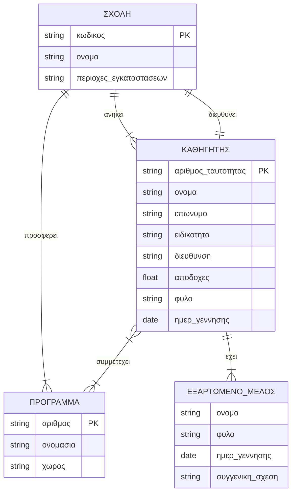

# Exam 6: Image to Markdown & Exam Simulation (Extracted Exercise)

Exercise 1: Entities, attributes, keys and relationships. Analyze the text (An educational institution maintains information about professors, faculties and educational programs...) and record the entities, their attributes, their primary keys and the relationships among them.
---
*solution:*
**Entities and Attributes:**
1. **Faculty (Strong Entity)**
   - Attributes: **code (Primary Key)**, name, geographic areas (Multivalued attribute).
2. **Professor (Strong Entity)**
   - Attributes: first name, last name, **ID number (Primary Key)**, specialty, residential address, monthly salary, gender, date of birth.
3. **Educational Program (Strong Entity)**
   - Attributes: **number (Primary Key)**, title, venue.
4. **Dependent Member (Weak Entity)**
   - Attributes: **name (Partial Key)**, gender, date of birth, family relationship.

**Relationships:**
1. **Heads (1:1):** Faculty - Professor. Relationship attribute: *date of appointment*.
2. **Offers (1:N):** Faculty - Program. (Each faculty offers many programs).
3. **Belongs (1:N):** Faculty - Professor. (Each professor belongs to one faculty).
4. **Participates (M:N):** Professor - Program. Relationship attribute: *number of working hours*.
5. **Has (1:N):** Professor - Dependent Member. (Identifying relationship for the weak entity).
---

Exercise 2: E-R diagram design. Draw the E-R diagram for this database, providing the rationale you consider correct.
---
*solution:*
*Rationale for design choices:*
- The "Dependent Member" is designed as a Weak Entity, since it depends existentially on the "Professor". Its partial key is the "name".
- The geographic areas in the "Faculty" are indicated as a multivalued attribute, since the text states that the facilities are located in "various geographic areas".

---

Exercise 3: Table structure. Show the structure of the tables with which the database will be implemented according to the diagram you drew. Underline the primary key of each one (use <u>...</u>).
---
*solution:*
1. Faculty(<u>code</u>, name, director_ID, date_of_appointment)
   *(Where director_ID is a Foreign Key referencing the Professor).*
2. Faculty_Areas(<u>faculty_code, geographic_area</u>)
   *(The table is created because of the multivalued attribute).*
3. Professor(<u>ID_number</u>, first_name, last_name, specialty, residential_address, monthly_salary, gender, date_of_birth, faculty_code)
   *(The faculty_code is a Foreign Key for the "belongs" relationship).*
4. Program(<u>number</u>, title, venue, faculty_code)
   *(The faculty_code is a Foreign Key for the "offers" relationship).*
5. Program_Enrollment(<u>professor_ID_number, program_number</u>, working_hours)
   *(Intermediate table for the M:N relationship).*
6. Dependent_Member(<u>professor_ID_number, member_name</u>, gender, date_of_birth, family_relationship)
   *(The combination of the professor's ID and the member's name constitutes the Primary Key of the weak entity).*
---
