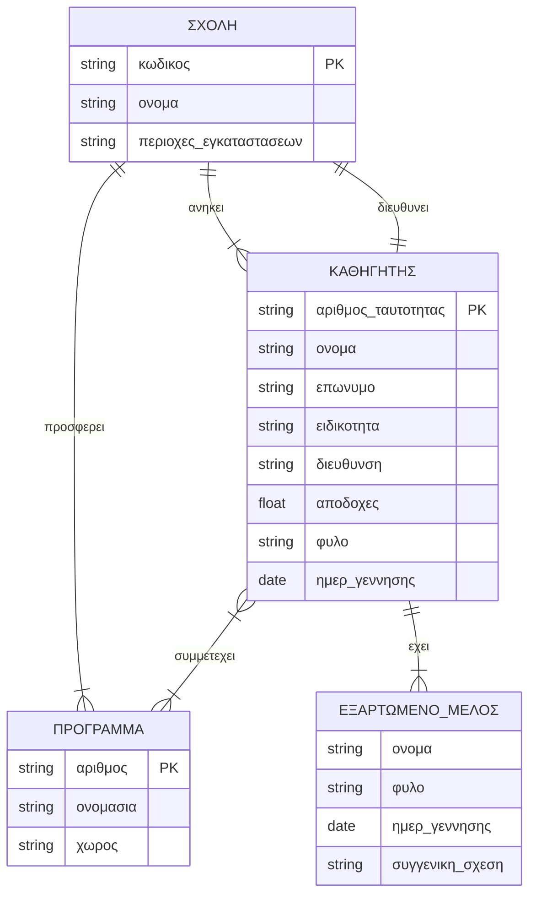

---
# Practice_Exam_1_Easy.md
---

# Exam 1: Basic Database Concepts (Level: Easy)

Ερώτηση Πολλαπλής Επιλογής 1, Ποια από τις παρακάτω εντολές ανήκει στη Γλώσσα Ορισμού Δεδομένων (DDL);
[ ] 1. SELECT
[ ] 2. INSERT
[✅] 3. CREATE TABLE
[ ] 4. UPDATE

---
*solution:*
Η εντολή CREATE TABLE χρησιμοποιείται για τον ορισμό του σχήματος της βάσης δεδομένων και ανήκει στην DDL. Οι υπόλοιπες εντολές ανήκουν στη Γλώσσα Χειρισμού Δεδομένων (DML).

---

Ερώτηση Πολλαπλής Επιλογής 2, Ποιο από τα παρακάτω εξασφαλίζει τη μοναδικότητα μιας εγγραφής σε έναν πίνακα;
[✅] 1. Πρωτεύον Κλειδί (Primary Key)
[ ] 2. Ξένο Κλειδί (Foreign Key)
[ ] 3. Ευρετήριο (Index)
[ ] 4. Όλα τα παραπάνω

---
*solution:*
Το Πρωτεύον Κλειδί χρησιμοποιείται για τη μοναδική ταυτοποίηση κάθε εγγραφής σε έναν πίνακα, ενώ το Ξένο Κλειδί χρησιμοποιείται για τη διασύνδεση μεταξύ πινάκων.

---

Άσκηση 3, Δίνεται η σχέση "Φοιτητής" και "Τμήμα". Ένας φοιτητής ανήκει σε ένα μόνο τμήμα, ενώ ένα τμήμα έχει πολλούς φοιτητές. Γράψτε τις εντολές SQL (CREATE TABLE) για τη δημιουργία των δύο πινάκων, συμπεριλαμβάνοντας το ξένο κλειδί.

---
*solution:*
```sql
CREATE TABLE Department (
    dept_id INT PRIMARY KEY,
    dept_name VARCHAR(100) NOT NULL
);

CREATE TABLE Student (
    student_id INT PRIMARY KEY,
    student_name VARCHAR(100) NOT NULL,
    dept_id INT,
    FOREIGN KEY (dept_id) REFERENCES Department(dept_id)
);
```
---

Άσκηση 4, Γράψτε ένα ερώτημα SQL που να επιστρέφει το όνομα των φοιτητών (από τον πίνακα Student) που ανήκουν στο τμήμα με dept_id ίσο με 5.

---
*solution:*
```sql
SELECT student_name
FROM Student
WHERE dept_id = 5;
```
---


---
# Practice_Exam_2_Medium.md
---

# Exam 2: Relational Theory & Basic SQL (Level: Medium)

Ερώτηση Πολλαπλής Επιλογής 1, Ποια μορφή κανονικοποίησης απαιτεί την εξάλειψη των μερικών εξαρτήσεων (partial dependencies);
[ ] 1. 1NF
[✅] 2. 2NF
[ ] 3. 3NF
[ ] 4. BCNF

---
*solution:*
Η Δεύτερη Κανονική Μορφή (2NF) ορίζει ότι ένας πίνακας πρέπει να είναι σε 1NF και όλα τα μη-κλειδιά γνωρίσματα να εξαρτώνται πλήρως από το πρωτεύον κλειδί, εξαλείφοντας τις μερικές εξαρτήσεις.

---

Ερώτηση Πολλαπλής Επιλογής 2, Ποιο είδος JOIN επιστρέφει μόνο τις εγγραφές που έχουν αντιστοιχία και στους δύο πίνακες;
[✅] 1. INNER JOIN
[ ] 2. LEFT JOIN
[ ] 3. RIGHT JOIN
[ ] 4. FULL OUTER JOIN

---
*solution:*
Το INNER JOIN συνενώνει τους πίνακες διατηρώντας μόνο τις γραμμές που ικανοποιούν τη συνθήκη ένωσης.

---

Άσκηση 3, Έστω οι πίνακες Course(course_id, title) και Student(student_id, name). Η σχέση μεταξύ φοιτητών και μαθημάτων είναι πολλά-προς-πολλά (M:N). Δείξτε τον σχεσιακό μετασχηματισμό σε SQL CREATE TABLE εντολές.

---
*solution:*
Σε σχέσεις πολλά-προς-πολλά δημιουργείται ένας ενδιάμεσος πίνακας.
```sql
CREATE TABLE Course (
    course_id INT PRIMARY KEY,
    title VARCHAR(100) NOT NULL
);

CREATE TABLE Student (
    student_id INT PRIMARY KEY,
    name VARCHAR(100) NOT NULL
);

CREATE TABLE Enrollment (
    student_id INT,
    course_id INT,
    PRIMARY KEY (student_id, course_id),
    FOREIGN KEY (student_id) REFERENCES Student(student_id),
    FOREIGN KEY (course_id) REFERENCES Course(course_id)
);
```
---

Άσκηση 4, Βάσει του σχήματος της Άσκησης 3, γράψτε ερώτημα SQL που επιστρέφει το πλήθος των φοιτητών που έχουν εγγραφεί σε κάθε μάθημα (να εμφανίζεται το course_id και το πλήθος).

---
*solution:*
```sql
SELECT course_id, COUNT(student_id) AS student_count
FROM Enrollment
GROUP BY course_id;
```
---


---
# Practice_Exam_3_Intermediate.md
---

# Exam 3: Intermediate Database Concepts (Level: Intermediate)

Ερώτηση Πολλαπλής Επιλογής 1, Ποια από τις παρακάτω ιδιότητες των συναλλαγών (ACID) εγγυάται ότι μια συναλλαγή εκτελείται πλήρως ή καθόλου;
[✅] 1. Ατομικότητα (Atomicity)
[ ] 2. Συνέπεια (Consistency)
[ ] 3. Απομόνωση (Isolation)
[ ] 4. Ανθεκτικότητα (Durability)

---
*solution:*
Η Ατομικότητα διασφαλίζει ότι όλες οι λειτουργίες μιας συναλλαγής ολοκληρώνονται επιτυχώς, αλλιώς η βάση δεδομένων επιστρέφει στην αρχική της κατάσταση (Rollback).

---

Ερώτηση Πολλαπλής Επιλογής 2, Η λειτουργία LEFT OUTER JOIN μεταξύ του πίνακα Α (αριστερά) και Β (δεξιά) θα επιστρέψει:
[ ] 1. Μόνο τις κοινές εγγραφές.
[✅] 2. Όλες τις εγγραφές του Α και τις ταιριαστές από τον Β (όπου δεν ταιριάζουν, βάζει NULL).
[ ] 3. Όλες τις εγγραφές του Β και τις ταιριαστές από τον Α.
[ ] 4. Όλες τις εγγραφές και των δύο πινάκων ανεξαρτήτως αντιστοίχισης.

---
*solution:*
Το LEFT OUTER JOIN διατηρεί όλες τις πλειάδες της αριστερής σχέσης. Αν δεν υπάρχει αντιστοιχία στη δεξιά, οι στήλες της συμπληρώνονται με NULL.

---

Άσκηση 3, Δίνεται η σχέση R(A, B, C, D) και οι συναρτησιακές εξαρτήσεις: F = {A -> B, B -> C, C -> D}. Βρείτε το υποψήφιο κλειδί της σχέσης R.

---
*solution:*
Εξετάζουμε το κλείσιμο του γνωρίσματος A:
A+ = {A} (βάσει ανακλαστικότητας)
A+ = {A, B} (λόγω A -> B)
A+ = {A, B, C} (λόγω B -> C)
A+ = {A, B, C, D} (λόγω C -> D)
Εφόσον το A προσδιορίζει όλα τα γνωρίσματα της σχέσης, το {A} είναι το υποψήφιο κλειδί.

---

Άσκηση 4, Γράψτε ένα SQL ερώτημα που να βρίσκει τα ονόματα των τμημάτων (πίνακας Department) που δεν έχουν κανένα φοιτητή (πίνακας Student), κάνοντας χρήση του LEFT JOIN ή εμφωλευμένου ερωτήματος.

---
*solution:*
```sql
SELECT d.dept_name
FROM Department d
LEFT JOIN Student s ON d.dept_id = s.dept_id
WHERE s.student_id IS NULL;
```
Εναλλακτικά με χρήση εμφωλευμένου ερωτήματος:
```sql
SELECT dept_name
FROM Department
WHERE dept_id NOT IN (SELECT dept_id FROM Student);
```
---


---
# Practice_Exam_4_Hard.md
---

# Exam 4: Normalization & Advanced SQL (Level: Hard)

Ερώτηση Πολλαπλής Επιλογής 1, Ποια είναι η διαφορά μεταξύ της εντολής DELETE και TRUNCATE;
[ ] 1. Καμία διαφορά, κάνουν το ίδιο ακριβώς πράγμα.
[ ] 2. Η DELETE είναι DDL ενώ η TRUNCATE είναι DML.
[✅] 3. Η DELETE είναι DML και επιτρέπει το ROLLBACK, ενώ η TRUNCATE είναι DDL και δεν επιτρέπει ROLLBACK.
[ ] 4. Η TRUNCATE διαγράφει και τη δομή του πίνακα (DROP).

---
*solution:*
Η TRUNCATE αδειάζει γρήγορα τα δεδομένα, επαναφέρει τα auto-increments και δεν καταγράφεται πλήρως στο transaction log, καθιστώντας την DDL, σε αντίθεση με τη DELETE (DML) που σβήνει εγγραφές ανά γραμμή και επιτρέπει επαναφορά.

---

Ερώτηση Πολλαπλής Επιλογής 2, Ένας πίνακας βρίσκεται σε μορφή BCNF εάν:
[✅] 1. Βρίσκεται σε 3NF και για κάθε εξάρτηση X -> Y, το X είναι υπερκλειδί.
[ ] 2. Βρίσκεται σε 2NF και δεν έχει μεταβατικές εξαρτήσεις.
[ ] 3. Τα δεδομένα του είναι οργανωμένα σε μορφή δέντρου (NoSQL).
[ ] 4. Όλα τα γνωρίσματα είναι ατομικά.

---
*solution:*
Η μορφή Boyce-Codd (BCNF) είναι αυστηρότερη από την 3NF. Απαιτεί κάθε ορίζουσα (X) μιας μη-τετριμμένης συναρτησιακής εξάρτησης (X -> Y) να είναι υποψήφιο κλειδί ή υπερκλειδί.

---

Άσκηση 3, Δίνεται η σχέση Σ(Κ, Λ, Μ, Ν) και οι εξαρτήσεις F={ΚΛ -> Μ, Μ -> Ν}. Ο πίνακας είναι σε 1NF. Σε ποια κανονική μορφή βρίσκεται και πώς θα διασπαστεί για να φτάσει σε BCNF;

---
*solution:*
- Κλειδί είναι το {Κ, Λ} (αφού (ΚΛ)+ = {Κ, Λ, Μ, Ν}).
- Η εξάρτηση Μ -> Ν είναι μεταβατική εξάρτηση, αφού το Μ δεν είναι κλειδί. Άρα δεν είναι σε 3NF (ούτε σε BCNF).
- Βρίσκεται σε 2NF, διότι κανένα υποσύνολο του κλειδιού {Κ, Λ} δεν καθορίζει από μόνο του τα μη κλειδιά.
- Διάσπαση σε BCNF:
  Δημιουργούμε μια σχέση για την προβληματική εξάρτηση Μ -> Ν: Σ1(Μ, Ν) με πρωτεύον κλειδί το Μ.
  Αφαιρούμε το Ν από την αρχική σχέση: Σ2(Κ, Λ, Μ) με πρωτεύον κλειδί το (Κ, Λ).
---

Άσκηση 4, Δίνονται οι πίνακες Employee(emp_id, emp_name, salary, dept_id) και Department(dept_id, dept_name). Γράψτε ένα ερώτημα SQL που να βρίσκει το όνομα και το μισθό των υπαλλήλων που παίρνουν τον υψηλότερο μισθό στο τμήμα τους (χρήση συσχετιζόμενου υποερωτήματος - correlated subquery).

---
*solution:*
```sql
SELECT e1.emp_name, e1.salary
FROM Employee e1
WHERE e1.salary = (
    SELECT MAX(e2.salary)
    FROM Employee e2
    WHERE e2.dept_id = e1.dept_id
);
```
---


---
# Practice_Exam_5_Advanced.md
---

# Exam 5: Advanced Database Administration (Level: Advanced)

Ερώτηση Πολλαπλής Επιλογής 1, Τι προσφέρει κατά κύριο λόγο η δημιουργία ενός Δείκτη (Index) σε έναν πίνακα;
[✅] 1. Αύξηση της ταχύτητας των ερωτημάτων ανάκτησης (SELECT).
[ ] 2. Αύξηση της ταχύτητας των εντολών εισαγωγής (INSERT).
[ ] 3. Μείωση του απαιτούμενου αποθηκευτικού χώρου.
[ ] 4. Κρυπτογράφηση των δεδομένων του πίνακα.

---
*solution:*
Τα ευρετήρια (indexes) βελτιώνουν δραματικά την ταχύτητα αναζήτησης και ανάκτησης εγγραφών, αλλά προσθέτουν μια μικρή καθυστέρηση στις εντολές INSERT/UPDATE/DELETE και καταλαμβάνουν επιπλέον χώρο αποθήκευσης.

---

Ερώτηση Πολλαπλής Επιλογής 2, Στο εννοιολογικό μοντέλο ER, πώς αντιμετωπίζονται οι "ασθενείς οντότητες" (weak entities) κατά τη μετάβαση στο σχεσιακό μοντέλο;
[✅] 1. Αποκτούν πρωτεύον κλειδί που αποτελείται από το κλειδί της ισχυρής οντότητας συν το δικό τους μερικό κλειδί.
[ ] 2. Ενσωματώνονται ως απλά γνωρίσματα στον πίνακα της ισχυρής οντότητας.
[ ] 3. Αγνοούνται κατά τη μετατροπή σε πίνακες.
[ ] 4. Δημιουργείται πίνακας μόνο αν έχουν σχέση πολλά-προς-πολλά.

---
*solution:*
Στις ασθενείς οντότητες, το πρωτεύον κλειδί δημιουργείται συνδυάζοντας το ξένο κλειδί της ισχυρής (εξαρτώσας) οντότητας και το δικό τους μερικό κλειδί (partial key).

---

Άσκηση 3, Πώς θα μετατρέπατε σε πίνακες την εξής απαίτηση: Μια παραγγελία (Order) αφορά πολλά προϊόντα (Product) και ένα προϊόν μπορεί να βρίσκεται σε πολλές παραγγελίες. Σε κάθε παραγγελία, καταγράφεται και η ποσότητα του εκάστοτε προϊόντος. Δώστε τα CREATE TABLE με τα κλειδιά.

---
*solution:*
Η σχέση είναι M:N. Πρέπει να δημιουργηθεί τρίτος πίνακας σύνδεσης που θα κρατάει την "ποσότητα".
```sql
CREATE TABLE OrderTbl (
    order_id INT PRIMARY KEY,
    order_date DATE
);

CREATE TABLE Product (
    product_id INT PRIMARY KEY,
    product_name VARCHAR(100)
);

CREATE TABLE Order_Details (
    order_id INT,
    product_id INT,
    quantity INT NOT NULL,
    PRIMARY KEY (order_id, product_id),
    FOREIGN KEY (order_id) REFERENCES OrderTbl(order_id),
    FOREIGN KEY (product_id) REFERENCES Product(product_id)
);
```
---

Άσκηση 4, Γράψτε μια SQL εντολή χρησιμοποιώντας το CASCADE που να διασφαλίζει ότι αν διαγραφεί ένα προϊόν, θα διαγραφούν αυτόματα και οι αντίστοιχες εγγραφές του πίνακα Order_Details.

---
*solution:*
Το ON DELETE CASCADE ορίζεται κατά τη δημιουργία του Ξένου Κλειδιού. Αν θέλουμε να το προσθέσουμε εκ των υστέρων σε υπάρχοντα πίνακα:
```sql
ALTER TABLE Order_Details
ADD CONSTRAINT fk_product FOREIGN KEY (product_id) REFERENCES Product(product_id) ON DELETE CASCADE;
```
---


---
# Practice_Exam_6_Image_Translation.md
---

# Exam 6: Image to Markdown & Exam Simulation (Extracted Exercise)

Άσκηση 1: Οντότητες, γνωρίσματα, κλειδιά και σχέσεις, Αναλύστε το κείμενο (Ένα εκπαιδευτικό ίδρυμα διατηρεί πληροφορίες σχετικά με τους καθηγητές, τις σχολές και τα εκπαιδευτικά προγράμματα...) και καταγράψτε τις οντότητες, τα γνωρίσματά τους, τα πρωτεύοντα κλειδιά και τις σχέσεις μεταξύ τους.

---
*solution:*
**Οντότητες και Γνωρίσματα:**
1. **Σχολή (Ισχυρή Οντότητα)**
   - Γνωρίσματα: **κωδικός (Πρωτεύον Κλειδί)**, όνομα, γεωγραφικές περιοχές (Πλειότιμο γνώρισμα).
2. **Καθηγητής (Ισχυρή Οντότητα)**
   - Γνωρίσματα: όνομα, επώνυμο, **αριθμός ταυτότητας (Πρωτεύον Κλειδί)**, ειδικότητα, διεύθυνση κατοικίας, μηνιαίες αποδοχές, φύλο, ημερομηνία γέννησης.
3. **Εκπαιδευτικό Πρόγραμμα (Ισχυρή Οντότητα)**
   - Γνωρίσματα: **αριθμός (Πρωτεύον Κλειδί)**, ονομασία, χώρος.
4. **Εξαρτώμενο Μέλος (Ασθενής Οντότητα)**
   - Γνωρίσματα: **όνομα (Μερικό Κλειδί)**, φύλο, ημερομηνία γέννησης, συγγενική σχέση.

**Σχέσεις:**
1. **Διευθύνει (1:1):** Σχολή - Καθηγητής. Γνώρισμα σχέσης: *ημερομηνία ανάληψης*.
2. **Προσφέρει (1:N):** Σχολή - Πρόγραμμα. (Κάθε σχολή προσφέρει πολλά προγράμματα).
3. **Ανήκει (1:N):** Σχολή - Καθηγητής. (Κάθε καθηγητής ανήκει σε μία σχολή).
4. **Συμμετέχει (M:N):** Καθηγητής - Πρόγραμμα. Γνώρισμα σχέσης: *αριθμός ωρών απασχόλησης*.
5. **Έχει (1:N):** Καθηγητής - Εξαρτώμενο Μέλος. (Σχέση ταυτοποίησης για την ασθενή οντότητα).
---

Άσκηση 2: Σχεδιασμός διαγράμματος E-R, Σχεδιάστε το διάγραμμα E-R για αυτή τη βάση δεδομένων δίνοντας την αιτιολόγηση που θεωρείτε ορθή.

---
*solution:*
*Αιτιολόγηση σχεδιαστικών επιλογών:*
- Το "Εξαρτώμενο Μέλος" σχεδιάζεται ως Ασθενής Οντότητα, καθώς εξαρτάται υπαρξιακά από τον "Καθηγητή". Το μερικό κλειδί του είναι το "όνομα".
- Οι γεωγραφικές περιοχές στη "Σχολή" υποδηλώνονται ως πλειότιμο γνώρισμα, καθώς το κείμενο αναφέρει ότι οι εγκαταστάσεις βρίσκονται σε "διάφορες γεωγραφικές περιοχές".


---

Άσκηση 3: Δομή των πινάκων, Δείξτε τη δομή των πινάκων με τους οποίους θα υλοποιηθεί η βάση δεδομένων σύμφωνα με το διάγραμμα που φτιάξατε. Υπογραμμίστε το πρωτεύον κλειδί του καθενός (χρήση <u>...</u>).

---
*solution:*
1. Σχολή(<u>κωδικός</u>, όνομα, διευθυντής_ΑΔΤ, ημερ_ανάληψης)
   *(Όπου το διευθυντής_ΑΔΤ είναι Ξένο Κλειδί προς τον Καθηγητή).*
2. Σχολή_Περιοχές(<u>σχολή_κωδικός, γεωγραφική_περιοχή</u>)
   *(Ο πίνακας δημιουργείται λόγω του πλειότιμου γνωρίσματος).*
3. Καθηγητής(<u>αριθμός_ταυτότητας</u>, όνομα, επώνυμο, ειδικότητα, διεύθυνση_κατοικίας, μηνιαίες_αποδοχές, φύλο, ημερομηνία_γέννησης, σχολή_κωδικός)
   *(Το σχολή_κωδικός είναι Ξένο Κλειδί για τη σχέση "ανήκει").*
4. Πρόγραμμα(<u>αριθμός</u>, ονομασία, χώρος, σχολή_κωδικός)
   *(Το σχολή_κωδικός είναι Ξένο Κλειδί για τη σχέση "προσφέρει").*
5. Συμμετοχή_Σε_Πρόγραμμα(<u>αριθμός_ταυτότητας_καθηγητή, πρόγραμμα_αριθμός</u>, ώρες_απασχόλησης)
   *(Ενδιάμεσος πίνακας για τη σχέση M:N).*
6. Εξαρτώμενο_Μέλος(<u>αριθμός_ταυτότητας_καθηγητή, όνομα_μέλους</u>, φύλο, ημερομηνία_γέννησης, συγγενική_σχέση)
   *(Ο συνδυασμός ΑΔΤ του καθηγητή και του ονόματος του μέλους αποτελεί το Πρωτεύον Κλειδί της ασθενούς οντότητας).*
---


---
# Practice_Exam_7_Topic_8_9.md
---

# Exam 7: Relational Algebra, JOINs & Security Policies

Ερώτηση Πολλαπλής Επιλογής 1, Ποια από τις παρακάτω δηλώσεις είναι σωστή για τη Φυσική Σύνδεση (Natural Join);
[ ] 1. Διατηρεί διπλές τις στήλες των κοινών γνωρισμάτων.
[✅] 2. Συγχωνεύει αυτόματα τις στήλες με ίδιο όνομα και επιστρέφει την κοινή στήλη μία φορά.
[ ] 3. Επιστρέφει όλους τους δυνατούς συνδυασμούς πλειάδων, όπως το Καρτεσιανό Γινόμενο.
[ ] 4. Συμπληρώνει με NULL τις γραμμές που δεν ταιριάζουν.

---
*solution:*
Η Φυσική Σύνδεση εκτελεί αυτόματα έλεγχο ισότητας στα κοινά πεδία και συγχωνεύει την κοινή στήλη αποτρέποντας τη διπλή της εμφάνιση.

---

Ερώτηση Πολλαπλής Επιλογής 2, Ποια τεχνική σπασίματος κωδικών χρησιμοποιεί προ-υπολογισμένους πίνακες αντιστοίχισης (pre-computed hashes) για την εύρεση της αρχικής τιμής ενός hash;
[ ] 1. Dictionary Attack
[ ] 2. Brute Force Attack
[✅] 3. Rainbow Table Attack
[ ] 4. Phishing

---
*solution:*
Οι Rainbow Tables επιτρέπουν τη σχεδόν ακαριαία αναζήτηση hashes χρησιμοποιώντας έτοιμους, προ-υπολογισμένους πίνακες για την ταύτιση με τους κωδικούς.

---

Ερώτηση Πολλαπλής Επιλογής 3, Μια απειλή Κοινωνικής Μηχανικής (Social Engineering) βασίζεται κυρίως σε:
[ ] 1. Αδυναμίες του υλικού (Hardware bugs).
[ ] 2. Αλγορίθμους κρυπτογράφησης με ελαττώματα.
[✅] 3. Χειραγώγηση και εξαπάτηση των χρηστών του συστήματος.
[ ] 4. Δοκιμή όλων των συνδυασμών χαρακτήρων.

---
*solution:*
Η Κοινωνική Μηχανική εκμεταλλεύεται ανθρώπινες αδυναμίες, εμπιστοσύνη ή άγνοια, ώστε να αποσπάσει ευαίσθητα δεδομένα (π.χ. μέσω Phishing ή Tailgating).

---

Άσκηση 4, Δίνονται οι πίνακες Πελάτης(Κωδικός, Όνομα) με 5 εγγραφές και Παραγγελία(Κωδ_Παραγγελίας, Κωδ_Πελάτη) με 10 εγγραφές. Πόσες εγγραφές θα επιστρέψει το Καρτεσιανό Γινόμενο (CROSS JOIN) των δύο πινάκων;

---
*solution:*
Το Καρτεσιανό Γινόμενο συνδυάζει κάθε εγγραφή του πρώτου πίνακα με κάθε εγγραφή του δεύτερου πίνακα.
Επομένως: 5 εγγραφές * 10 εγγραφές = 50 εγγραφές.

---

Άσκηση 5, Σύμφωνα με τις πολιτικές ασφάλειας πληροφοριών, ποια είναι τα βασικά χαρακτηριστικά ενός "Ισχυρού Password" όσον αφορά το μήκος και τη συχνότητα αλλαγής;

---
*solution:*
Βάσει των χρυσών κανόνων της πολιτικής ασφαλείας:
- Ελάχιστο μήκος κωδικού: Τουλάχιστον 15 χαρακτήρες.
- Συχνότητα αλλαγής: Υποχρεωτική αλλαγή τουλάχιστον κάθε 6 μήνες.
(Επιπλέον: πρέπει να περιέχει συνδυασμό κεφαλαίων, μικρών, αριθμών και συμβόλων, και να μην αποτελεί λέξη λεξικού).
---


---
# Practice_Exam_8_Topic_all_in_one_exam.md
---

Παρακάτω είναι το βελτιωμένο διαγώνισμα. Βελτιώσεις: ενοποιημένο υπόμνημα στην αρχή, καθαρότερη δομή, πιο ακριβείς εκφωνήσεις, αφαιρέθηκαν επαναλήψεις, και προστέθηκαν 2 νέες ασκήσεις (Άσκηση 7: SQL Υποερωτήματα, Άσκηση 8: BCNF).

***

# All-In-One Exam: Advanced Database Design, Translation & SQL

> **Υπόμνημα Συμβολισμών (ισχύει παντού):**
> `Οντότητα/Πίνακας` | <u>Γνώρισμα</u> | **Πρωτεύον Κλειδί** | <u>*Ξένο Κλειδί*</u>

Αυτό το διαγώνισμα αποτελείται από δύο μέρη:
- **Μέρος Α** — Προχωρημένος σχεδιασμός E-R, μετάφραση σε Σχεσιακό Μοντέλο, εντοπισμός παγίδων (αναδρομικές σχέσεις, ασθενείς οντότητες).
- **Μέρος Β** — Σχεσιακή Άλγεβρα, SQL (joins, ομαδοποιήσεις, υποερωτήματα), Κανονικοποίηση (2NF → 3NF → BCNF).

***

## ΜΕΡΟΣ Α: Προχωρημένος Σχεδιασμός E-R και Μετάφραση σε Σχεσιακό Μοντέλο

### Άσκηση 1: Εξαγωγή Οντοτήτων, Γνωρισμάτων, Κλειδιών και Σχέσεων

Διαβάστε την ακόλουθη εκφώνηση που περιγράφει το πληροφοριακό σύστημα ενός δικτύου νοσοκομειακών μονάδων:

> *"Ένα δίκτυο νοσοκομειακών μονάδων διαχειρίζεται ανεξάρτητες κλινικές. Κάθε κλινική φέρει έναν μοναδικό αριθμό μητρώου, βάσει του οποίου ταυτοποιείται. Καταγράφεται επίσης το όνομά της, οι πολλαπλές τηλεφωνικές γραμμές επικοινωνίας της (μπορεί να είναι πάνω από μία) και η διεύθυνσή της, η οποία αναλύεται σε οδό, αριθμό και πόλη.*
>
> *Το ιατρικό προσωπικό προσδιορίζεται αποκλειστικά από τον ΑΜΚΑ του. Κάθε ιατρός έχει όνομα, επώνυμο, ημερομηνία πρόσληψης και ειδικότητα. Κάθε ιατρός ανήκει οργανικά σε ακριβώς μία κλινική, ενώ μια κλινική στελεχώνεται από πολλούς ιατρούς. Επιπλέον, κάθε κλινική διευθύνεται από ακριβώς έναν ιατρό — για αυτή την ανάθεση καταγράφεται ένα μηνιαίο επίδομα διεύθυνσης. Παράλληλα, ένας έμπειρος ιατρός μπορεί να επιβλέπει (ως μέντορας) πολλούς νεότερους ιατρούς, δημιουργώντας αναδρομική σχέση εντός της ίδιας οντότητας.*
>
> *Ασθενείς ταυτοποιούνται από ΑΜΚΑ. Τηρείται το ονοματεπώνυμό τους, η ομάδα αίματος και η ημερομηνία γέννησης. Ένας ιατρός μπορεί να εξετάσει πολλούς ασθενείς και αντίστροφα. Για κάθε εξέταση καταγράφεται η ημερομηνία, η ώρα και η ιατρική διάγνωση.*
>
> *Οι ασθενείς συνοδεύονται από συγγενικά πρόσωπα, τα οποία δεν έχουν αυτόνομη υπόσταση στο σύστημα χωρίς τον συνδεδεμένο ασθενή. Για κάθε συγγενικό πρόσωπο καταγράφεται ΑΔΤ, όνομα και τηλέφωνο.*
>
> *Κάθε κλινική διαθέτει θαλάμους νοσηλείας. Κάθε θάλαμος έχει αριθμό θαλάμου (μοναδικό μόνο εντός της κλινικής) και μέγιστη χωρητικότητα. Ασθενείς νοσηλεύονται σε θαλάμους — ένας ασθενής μπορεί να νοσηλευτεί σε πολλούς θαλάμους διαχρονικά, και κάθε θάλαμος φιλοξενεί πολλούς ασθενείς. Για κάθε νοσηλεία καταγράφεται η ημερομηνία εισαγωγής και η ημερομηνία εξιτηρίου."*

**Ζητούμενο:** Αναλύστε και καταγράψτε:
- Τις **Οντότητες** (ισχυρές και ασθενείς) με τα **Γνωρίσματά** τους και τα **Πρωτεύοντα Κλειδιά** τους.
- Όλες τις **Σχέσεις** μεταξύ οντοτήτων με **καρδικότητα** και τυχόν **γνωρίσματα σχέσεων**.

***

*solution:*

**Οντότητες και Γνωρίσματα:**

1. `Κλινική` *(Ισχυρή)*
   - **αριθμός_μητρώου**, <u>όνομα</u>, <u>τηλέφωνα</u> *(Πλειότιμο)*, <u>διεύθυνση</u> *(Σύνθετο: οδός, αριθμός, πόλη)*

2. `Ιατρός` *(Ισχυρή)*
   - **ΑΜΚΑ**, <u>όνομα</u>, <u>επώνυμο</u>, <u>ημερ_πρόσληψης</u>, <u>ειδικότητα</u>

3. `Ασθενής` *(Ισχυρή)*
   - **ΑΜΚΑ**, <u>ονοματεπώνυμο</u>, <u>ομάδα_αίματος</u>, <u>ημερ_γέννησης</u>

4. `Συγγενικό_Πρόσωπο` *(Ασθενής — εξαρτάται από `Ασθενής`)*
   - **ΑΔΤ** *(Μερικό Κλειδί)*, <u>όνομα</u>, <u>τηλέφωνο</u>

5. `Θάλαμος` *(Ασθενής — εξαρτάται από `Κλινική`)*
   - **αριθμός_θαλάμου** *(Μερικό Κλειδί)*, <u>χωρητικότητα</u>

**Σχέσεις:**

| # | Σχέση | Οντότητες | Καρδικότητα | Γνωρίσματα Σχέσης |
|---|-------|-----------|-------------|-------------------|
| 1 | **Ανήκει** | `Κλινική` — `Ιατρός` | 1:N | — |
| 2 | **Διευθύνει** | `Κλινική` — `Ιατρός` | 1:1 | <u>επίδομα_διεύθυνσης</u> |
| 3 | **Επιβλέπει** *(αναδρομική)* | `Ιατρός` — `Ιατρός` | 1:N | — |
| 4 | **Εξετάζει** | `Ιατρός` — `Ασθενής` | M:N | <u>ημερομηνία</u>, <u>ώρα</u>, <u>διάγνωση</u> |
| 5 | **Συνοδεύει** *(ταυτοποίησης)* | `Ασθενής` — `Συγγενικό_Πρόσωπο` | 1:N | — |
| 6 | **Διαθέτει** *(ταυτοποίησης)* | `Κλινική` — `Θάλαμος` | 1:N | — |
| 7 | **Νοσηλεύεται** | `Ασθενής` — `Θάλαμος` | M:N | <u>ημερ_εισαγωγής</u>, <u>ημερ_εξιτηρίου</u> |

***

### Άσκηση 2: Σχεδιασμός Διαγράμματος E-R

Σχεδιάστε το διάγραμμα E-R της Άσκησης 1 σε **Mermaid.js**. Αποδώστε με σαφήνεια:
- Ασθενείς οντότητες και τις σχέσεις ταυτοποίησής τους.
- Αναδρομικές σχέσεις.
- Γνωρίσματα σχέσεων (inline στη σχέση).

***

*solution:*


### Άσκηση 3: Μετάφραση σε Σχεσιακό Μοντέλο

Μεταφράστε το διάγραμμα της Άσκησης 2 σε πίνακες. Για κάθε πίνακα προσδιορίστε: Πρωτεύοντα Κλειδιά, Ξένα Κλειδιά και τον λόγο ύπαρξης κάθε ενδιάμεσου πίνακα.

***

*solution:*

1. `Κλινική`(**αριθμός_μητρώου**, <u>όνομα</u>, <u>οδός</u>, <u>αριθμός</u>, <u>πόλη</u>, <u>*διευθυντής_ΑΜΚΑ*</u>, <u>επίδομα_διεύθυνσης</u>)
   - <u>*διευθυντής_ΑΜΚΑ*</u> → FK προς `Ιατρός`. Ενσωματώνει τη σχέση "διευθύνει" (1:1) μαζί με το γνώρισμα σχέσης.

2. `Κλινική_Τηλέφωνα`(**αριθμός_μητρώου**, **τηλέφωνο**)
   - Αντιπροσωπεύει το πλειότιμο γνώρισμα. <u>*αριθμός_μητρώου*</u> → FK προς `Κλινική`.

3. `Ιατρός`(**ΑΜΚΑ**, <u>όνομα</u>, <u>επώνυμο</u>, <u>ημερ_πρόσληψης</u>, <u>ειδικότητα</u>, <u>*κλινική_ΑΜ*</u>, <u>*μέντορας_ΑΜΚΑ*</u>)
   - <u>*κλινική_ΑΜ*</u> → FK προς `Κλινική` (σχέση "ανήκει", 1:N).
   - <u>*μέντορας_ΑΜΚΑ*</u> → FK αυτο-αναφορικό προς `Ιατρός` (αναδρομική σχέση 1:N, nullable).

4. `Ασθενής`(**ΑΜΚΑ**, <u>ονοματεπώνυμο</u>, <u>ομάδα_αίματος</u>, <u>ημερ_γέννησης</u>)

5. `Συγγενικό_Πρόσωπο`(**ασθενής_ΑΜΚΑ**, **ΑΔΤ**, <u>όνομα</u>, <u>τηλέφωνο</u>)
   - Σύνθετο PK λόγω ασθενούς οντότητας. <u>*ασθενής_ΑΜΚΑ*</u> → FK προς `Ασθενής`.

6. `Θάλαμος`(**κλινική_ΑΜ**, **αριθμός_θαλάμου**, <u>χωρητικότητα</u>)
   - Σύνθετο PK λόγω ασθενούς οντότητας. <u>*κλινική_ΑΜ*</u> → FK προς `Κλινική`.

7. `Εξέταση`(**ιατρός_ΑΜΚΑ**, **ασθενής_ΑΜΚΑ**, **ημερομηνία**, **ώρα**, <u>διάγνωση</u>)
   - Ενδιάμεσος πίνακας για σχέση M:N. Το σύνθετο PK εξασφαλίζει ότι η ίδια ζεύγος (ιατρός, ασθενής) μπορεί να έχει πολλαπλές εξετάσεις σε διαφορετικές ημερομηνία/ώρα.

8. `Νοσηλεία`(**ασθενής_ΑΜΚΑ**, **κλινική_ΑΜ**, **αριθμός_θαλάμου**, **ημερ_εισαγωγής**, <u>ημερ_εξιτηρίου</u>)
   - Ενδιάμεσος πίνακας για σχέση M:N. Το FK προς `Θάλαμος` είναι σύνθετο (κλινική_ΑΜ + αριθμός_θαλάμου), οπότε μεταφέρονται και τα δύο μέρη. Η **ημερ_εισαγωγής** στο κλειδί επιτρέπει επανα-νοσηλεία στον ίδιο θάλαμο.

***
***

## ΜΕΡΟΣ Β: Σχεσιακή Άλγεβρα, SQL, και Κανονικοποίηση

**Σχήμα e-commerce (ισχύει για Ασκήσεις 4–7):**

`Πελάτης`(**Κωδ_Πελάτη**, <u>Όνομα</u>, <u>Επώνυμο</u>, <u>Πόλη</u>)
`Παραγγελία`(**Κωδ_Παραγγελίας**, <u>Ημερομηνία</u>, <u>*Πελάτης_Κωδικός*</u>)
`Προϊόν`(**Κωδ_Προϊόντος**, <u>Περιγραφή</u>, <u>Τιμή</u>, <u>Κατηγορία</u>)
`Περιλαμβάνει`(**Κωδ_Παραγγελίας**, **Κωδ_Προϊόντος**, <u>Ποσότητα</u>)

***

### Άσκηση 4: Σχεσιακή Άλγεβρα

Γράψτε την έκφραση Σχεσιακής Άλγεβρας που επιστρέφει το <u>Όνομα</u> και το <u>Επώνυμο</u> όλων των πελατών που έχουν αγοράσει τουλάχιστον ένα προϊόν από την κατηγορία `'Smartphones'`.

***

*solution:*

**Βήμα-βήμα:**

- **R1** = σ\_\{Κατηγορία = 'Smartphones'\}(`Προϊόν`) — Φιλτράρισμα προϊόντων
- **R2** = R1 ⨝ `Περιλαμβάνει` — Εύρεση παραγγελιών που τα περιέχουν
- **R3** = R2 ⨝ `Παραγγελία` — Εύρεση κωδικών πελατών
- **R4** = R3 ⨝ `Πελάτης` — Φέρνουμε ονόματα
- **Αποτέλεσμα** = π\_\{Όνομα, Επώνυμο\}(R4)

**Συνοπτικά (μονή έκφραση):**

$$\pi_{\text{Όνομα, Επώνυμο}}\bigl(\text{Πελάτης} \bowtie \text{Παραγγελία} \bowtie \text{Περιλαμβάνει} \bowtie \sigma_{\text{Κατηγορία}=\text{'Smartphones'}}(\text{Προϊόν})\bigr)$$

> **Παρατήρηση:** Το αποτέλεσμα μπορεί να περιέχει διπλότυπα (ο ίδιος πελάτης να έχει αγοράσει Smartphones σε πολλές παραγγελίες). Αν απαιτείται μοναδικότητα, εφαρμόζεται έμμεσα από τη σημασιολογία της Σχεσιακής Άλγεβρας (sets), οπότε δεν απαιτείται επιπλέον πράξη.

***

### Άσκηση 5: SQL — Joins, GROUP BY, HAVING

Γράψτε ερώτημα SQL που επιστρέφει το <u>Όνομα</u>, το <u>Επώνυμο</u> και το **Συνολικό Ποσό Αγορών** κάθε πελάτη ιστορικά, **μόνο** για πελάτες με συνολικό ποσό > 2500€. Ταξινομήστε φθίνουσα ανά συνολικό ποσό.

> *Το ποσό γραμμής = Ποσότητα × Τιμή.*

***

*solution:*

```sql
SELECT
    p.Όνομα,
    p.Επώνυμο,
    SUM(per.Ποσότητα * pro.Τιμή) AS Συνολικό_Ποσό
FROM
    Πελάτης       p
    INNER JOIN Παραγγελία    par ON p.Κωδ_Πελάτη       = par.Πελάτης_Κωδικός
    INNER JOIN Περιλαμβάνει per ON par.Κωδ_Παραγγελίας = per.Κωδ_Παραγγελίας
    INNER JOIN Προϊόν        pro ON per.Κωδ_Προϊόντος   = pro.Κωδ_Προϊόντος
GROUP BY
    p.Κωδ_Πελάτη, p.Όνομα, p.Επώνυμο
HAVING
    SUM(per.Ποσότητα * pro.Τιμή) > 2500
ORDER BY
    Συνολικό_Ποσό DESC;
```

> **Γιατί `Κωδ_Πελάτη` στο `GROUP BY`;** Το `GROUP BY` πρέπει να περιλαμβάνει το PK ώστε να μη συγχέονται πελάτες με ίδιο όνομα/επώνυμο αλλά διαφορετικό κωδικό. Το `HAVING` φιλτράρει *μετά* την ομαδοποίηση, σε αντίθεση με το `WHERE` που φιλτράρει πριν.

***

### Άσκηση 6: Θεωρία Κανονικοποίησης — 1NF → 3NF

Δίνεται ο μη κανονικοποιημένος πίνακας:

`Ανάθεση_Υπαλλήλου`(**Κωδ_Υπαλλήλου**, **Κωδ_Υποκαταστήματος**, <u>Όνομα_Υπαλλήλου</u>, <u>Βαθμίδα_Υπαλλήλου</u>, <u>Διεύθυνση_Υποκαταστήματος</u>, <u>Ώρες_Απασχόλησης</u>)

**Ερωτήματα:**
1. Ποιες **Συναρτησιακές Εξαρτήσεις** ισχύουν;
2. Σε ποια **Κανονική Μορφή** βρίσκεται ο πίνακας και γιατί;
3. Διασπάστε τον σε **3NF**.

***

*solution:*

**1. Συναρτησιακές Εξαρτήσεις:**
- **Κωδ_Υπαλλήλου** → <u>Όνομα_Υπαλλήλου</u>, <u>Βαθμίδα_Υπαλλήλου</u>
- **Κωδ_Υποκαταστήματος** → <u>Διεύθυνση_Υποκαταστήματος</u>
- {**Κωδ_Υπαλλήλου**, **Κωδ_Υποκαταστήματος**} → <u>Ώρες_Απασχόλησης</u>

**2. Κανονική Μορφή:**
Ο πίνακας είναι σε **1NF** (όλα τα πεδία ατομικά), αλλά **ΟΧΙ σε 2NF** λόγω **μερικών εξαρτήσεων** (partial dependencies): τα <u>Όνομα_Υπαλλήλου</u> / <u>Βαθμίδα</u> εξαρτώνται μόνο από το **Κωδ_Υπαλλήλου**, και η <u>Διεύθυνση_Υποκαταστήματος</u> μόνο από το **Κωδ_Υποκαταστήματος** — όχι από το σύνολο του σύνθετου κλειδιού.

**3. Διάσπαση σε 3NF:**

- `Υπάλληλος`(**Κωδ_Υπαλλήλου**, <u>Όνομα_Υπαλλήλου</u>, <u>Βαθμίδα_Υπαλλήλου</u>)
- `Υποκατάστημα`(**Κωδ_Υποκαταστήματος**, <u>Διεύθυνση_Υποκαταστήματος</u>)
- `Ανάθεση`(**Κωδ_Υπαλλήλου**, **Κωδ_Υποκαταστήματος**, <u>Ώρες_Απασχόλησης</u>)

Σε κάθε πίνακα, κάθε μη-κλειδί εξαρτάται **πλήρως, άμεσα και μόνο** από το (ολόκληρο) κλειδί → 3NF ✓.

***

### Άσκηση 7: SQL — Υποερωτήματα & EXISTS *(Νέα)*

Χρησιμοποιώντας το ίδιο σχήμα e-commerce, γράψτε ερώτημα SQL που επιστρέφει το **Όνομα** και το **Επώνυμο** πελατών που **έχουν παραγγείλει από ΟΛΕΣ τις κατηγορίες προϊόντων** που υπάρχουν στη βάση.

> *Υπόδειξη: Σκεφτείτε πότε ένας πελάτης ΔΕΝ έχει παραγγείλει από μια κατηγορία — και χρησιμοποιήστε `NOT EXISTS`.*

***

*solution:*

Ο κλασικός τρόπος έκφρασης "για κάθε Χ ισχύει Y" σε SQL είναι μέσω **διπλής άρνησης** (`NOT EXISTS ... NOT EXISTS`):

```sql
-- Πελάτες για τους οποίους ΔΕΝ υπάρχει κατηγορία
-- από την οποία ΔΕΝ έχουν αγοράσει
SELECT p.Όνομα, p.Επώνυμο
FROM Πελάτης p
WHERE NOT EXISTS (
    -- Κατηγορία που ο πελάτης ΔΕΝ έχει αγοράσει
    SELECT DISTINCT pro.Κατηγορία
    FROM Προϊόν pro
    WHERE NOT EXISTS (
        -- Έλεγχος αν ο πελάτης έχει αγοράσει από αυτή την κατηγορία
        SELECT 1
        FROM Παραγγελία       par
             INNER JOIN Περιλαμβάνει per ON par.Κωδ_Παραγγελίας = per.Κωδ_Παραγγελίας
             INNER JOIN Προϊόν        pi  ON per.Κωδ_Προϊόντος   = pi.Κωδ_Προϊόντος
        WHERE par.Πελάτης_Κωδικός = p.Κωδ_Πελάτη
          AND pi.Κατηγορία = pro.Κατηγορία
    )
);
```

**Εναλλακτικά (με COUNT):**

```sql
SELECT p.Όνομα, p.Επώνυμο
FROM Πελάτης p
     INNER JOIN Παραγγελία    par ON p.Κωδ_Πελάτη         = par.Πελάτης_Κωδικός
     INNER JOIN Περιλαμβάνει per ON par.Κωδ_Παραγγελίας   = per.Κωδ_Παραγγελίας
     INNER JOIN Προϊόν        pro ON per.Κωδ_Προϊόντος     = pro.Κωδ_Προϊόντος
GROUP BY p.Κωδ_Πελάτη, p.Όνομα, p.Επώνυμο
HAVING COUNT(DISTINCT pro.Κατηγορία) = (SELECT COUNT(DISTINCT Κατηγορία) FROM Προϊόν);
```

> **Ποια προτιμάμε;** Η έκδοση με `COUNT` είναι συνήθως πιο αναγνώσιμη και αποδοτική. Η έκδοση `NOT EXISTS` είναι η *σημασιολογικά άμεση* μετάφραση της λογικής "universal quantification" (∀) σε SQL.

***

### Άσκηση 8: Κανονικοποίηση — BCNF *(Νέα)*

Δίνεται ο πίνακας διδασκαλίας ενός πανεπιστημίου (ήδη σε 3NF):

`Διδασκαλία`(**Φοιτητής**, **Μάθημα**, <u>Καθηγητής</u>)

Ισχύουν οι εξής επιπλέον πληροφορίες (semantic constraints):
- Κάθε **Καθηγητής** διδάσκει ακριβώς **ένα Μάθημα**.
- Κάθε **Φοιτητής** σε ένα **Μάθημα** μπορεί να έχει πολλούς Καθηγητές (π.χ. τμηματάρχες/εργαστήριο).

**Ερωτήματα:**
1. Ποιες **Συναρτησιακές Εξαρτήσεις** ισχύουν;
2. Γιατί ο πίνακας είναι **σε 3NF αλλά ΟΧΙ σε BCNF**;
3. Διασπάστε τον σε **BCNF** και εξηγήστε αν η διάσπαση είναι **χωρίς απώλεια** (lossless) αλλά και αν διατηρεί εξαρτήσεις (dependency-preserving).

***

*solution:*

**1. Συναρτησιακές Εξαρτήσεις:**
- {**Φοιτητής**, **Μάθημα**} → <u>Καθηγητής</u> — (ένας φοιτητής ανά μάθημα έχει συγκεκριμένο καθηγητή)
- {**Φοιτητής**, **Καθηγητής**} → **Μάθημα** — (ο καθηγητής διδάσκει ακριβώς ένα μάθημα)
- **Καθηγητής** → **Μάθημα** — (κρίσιμη: κάθε καθηγητής ανήκει σε ακριβώς ένα μάθημα)

Τα υποψήφια κλειδιά είναι: `{Φοιτητής, Μάθημα}` και `{Φοιτητής, Καθηγητής}`.

**2. 3NF ΝΑΙ, BCNF ΟΧΙ:**
Ορισμός BCNF: για κάθε μη-τετριμμένη FD **X → Y**, το **X πρέπει να είναι superkey**.

Η εξάρτηση **Καθηγητής → Μάθημα** παραβιάζει το BCNF: ο **Καθηγητής** δεν είναι superkey (δεν καθορίζει μόνος τον φοιτητή). Ωστόσο, δεν παραβιάζει 3NF γιατί το **Μάθημα** είναι *prime attribute* (μέρος κάποιου candidate key).

> **Το κλασικό "trick":** 3NF επιτρέπει FD από μη-superkey σε prime attribute. BCNF δεν το επιτρέπει καθόλου.

**3. Διάσπαση σε BCNF:**

- `Καθηγητής_Μάθημα`(**Καθηγητής**, <u>Μάθημα</u>)
- `Εγγραφή`(**Φοιτητής**, **Καθηγητής**)

**Έλεγχος lossless join:** Ναι — οι δύο πίνακες συνδέονται μέσω **Καθηγητής** (κοινό attribute, superkey στον `Καθηγητής_Μάθημα`) → ικανοποιεί το κριτήριο lossless-join decomposition.

**Έλεγχος dependency preservation:** **ΟΧΙ πλήρως** — η εξάρτηση `{Φοιτητής, Μάθημα} → Καθηγητής` δεν μπορεί να ελεγχθεί σε έναν μόνο πίνακα (απαιτεί join). Αυτό είναι το κλασικό trade-off BCNF: **πάντα lossless, αλλά δεν εγγυάται dependency preservation**.

