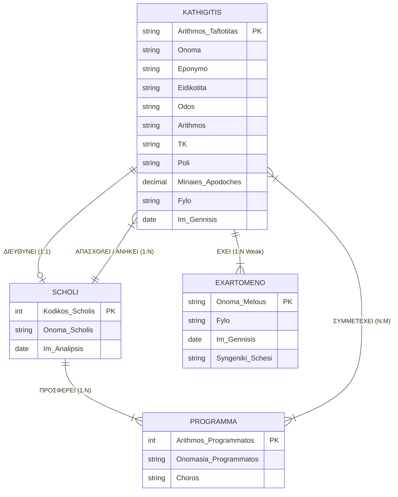
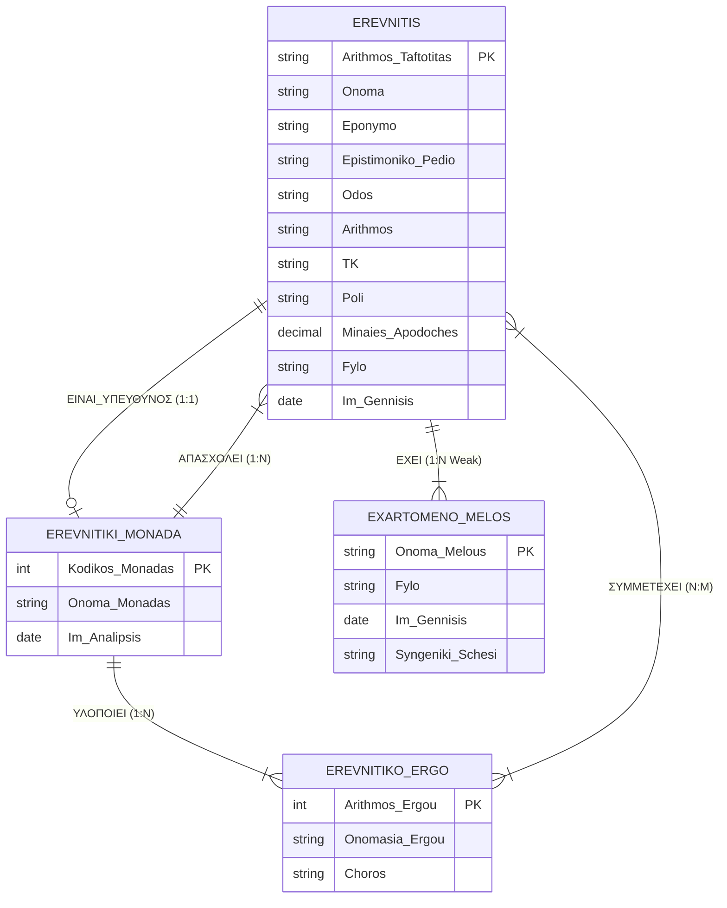

# Test Prep: Ερωτήσεις & Ασκήσεις Εξάσκησης για τις Εξετάσεις Βάσεων Δεδομένων (404)

Κάθε ενότητα του παρόντος οδηγού αντιστοιχεί σε μια θεματική ενότητα του [Complete_Exam_Theory_Guide.md](file:///home/ice/Documents/CodeHub/GitHub-Projects/Public/DitOpenNotes/Year_2/Semester_4/DATABASES/Resources/Notes/Complete_Exam_Theory_Guide.md). Κάθε ερώτηση είναι αυστηρά εξεταστικού τύπου (προσαρμοσμένη στις απαιτήσεις των πραγματικών εξετάσεων 2023–2026), συνοδεύεται από τον απαραίτητο κανόνα/τύπο σε μορφή πλαισίου σημείωσης, και αναλύει πλήρως τη βήμα-προς-βήμα αιτιολόγηση.

---

## Πίνακας Περιεχομένων
1. [Μέρος Ι: Θεματικές Ερωτήσεις & Ασκήσεις Εξάσκησης](#μέρος-ι-θεματικές-ερωτήσεις--ασκήσεις-εξάσκησης)
   - [Ενότητα 1: Ταυτοποίηση Οντοτήτων (Ισχυρές vs. Ασθενείς & Προσδιορίζουσες)](#ενότητα-1-ταυτοποίηση-οντοτήτων-ισχυρές-vs-ασθενείς--προσδιορίζουσες)
   - [Ενότητα 2: Ταξινόμηση Γνωρισμάτων (Απλά, Σύνθετα, Μονότιμα, Πλειότιμα, Παραγόμενα)](#ενότητα-2-ταξινόμηση-γνωρισμάτων-απλά-σύνθετα-μονότιμα-πλειότιμα-παραγόμενα)
   - [Ενότητα 3: Κλειδιά, Υποψήφια Κλειδιά, Πρωτεύοντα & Μερικά Κλειδιά](#ενότητα-3-κλειδιά-υποψήφια-κλειδιά-πρωτεύοντα--μερικά-κλειδιά)
   - [Ενότητα 4: Συσχετίσεις, Λόγος Πληθικότητας & Περιορισμοί Συμμετοχής](#ενότητα-4-συσχετίσεις-λόγος-πληθικότητας--περιορισμοί-συμμετοχής)
   - [Ενότητα 5: Μετατροπή ER σε Σχεσιακό Σχήμα & Ξένα Κλειδιά](#ενότητα-5-μετατροπή-er-σε-σχεσιακό-σχήμα--ξένα-κλειδιά)
   - [Ενότητα 6: Σχεσιακή Άλγεβρα & Ερωτήματα SQL](#ενότητα-6-σχεσιακή-άλγεβρα--ερωτήματα-sql)
   - [Ενότητα 7: Λειτουργικές Εξαρτήσεις & Κανονικοποίηση (1NF, 2NF, 3NF, BCNF)](#ενότητα-7-λειτουργικές-εξαρτήσεις--κανονικοποίηση-1nf-2nf-3nf-bcnf)
2. [Μέρος ΙΙ: Ολοκληρωμένες Πραγματικές & Συνθετικές Εξετάσεις](#μέρος-ιι-ολοκληρωμένες-πραγματικές--συνθετικές-εξετάσεις)
   - [Πραγματικό Θέμα 1: Εκπαιδευτικό Ίδρυμα (Past Exam 1)](#πραγματικό-θέμα-1-εκπαιδευτικό-ίδρυμα-past-exam-1)
   - [Πραγματικό Θέμα 2: Ερευνητικό Ίδρυμα (Past Exam 2)](#πραγματικό-θέμα-2-ερευνητικό-ίδρυμα-past-exam-2)
   - [Συνθετικό Θέμα 1: Πανεπιστημιακό Νοσοκομείο (Hospital Database)](#συνθετικό-θέμα-1-πανεπιστημιακό-νοσοκομείο-hospital-database)
   - [Συνθετικό Θέμα 2: Διεθνής Ναυτιλιακή Εταιρεία (Maritime Fleet)](#συνθετικό-θέμα-2-διεθνής-ναυτιλιακή-εταιρεία-maritime-fleet)
   - [Συνθετικό Θέμα 3: Αεροπορική Εταιρεία & Πτήσεις (Aviation Database)](#συνθετικό-θέμα-3-αεροπορική-εταιρεία--πτήσεις-aviation-database)
   - [Συνθετικό Θέμα 4: Τραπεζικός Όμιλος & Συναλλαγές (Banking Database)](#συνθετικό-θέμα-4-τραπεζικός-όμιλος--συναλλαγές-banking-database)
   - [Συνθετικό Θέμα 5: Ξενοδοχειακά Συγκροτήματα & Κρατήσεις (Resort Database)](#συνθετικό-θέμα-5-ξενοδοχειακά-συγκροτήματα--κρατήσεις-resort-database)
   - [Συνθετικό Θέμα 6: Πλατφόρμα Streaming & Media (Streaming Database)](#συνθετικό-θέμα-6-πλατφόρμα-streaming--media-streaming-database)
   - [Συνθετικό Θέμα 7: Δίκτυο Δημοτικών Βιβλιοθηκών (Library Database)](#συνθετικό-θέμα-7-δίκτυο-δημοτικών-βιβλιοθηκών-library-database)
   - [Συνθετικό Θέμα 8: Αθλητική Ομοσπονδία & Αγώνες (Sports League Database)](#συνθετικό-θέμα-8-αθλητική-ομοσπονδία--αγώνες-sports-league-database)

---

# Μέρος Ι: Θεματικές Ερωτήσεις & Ασκήσεις Εξάσκησης

---

## Ενότητα 1: Ταυτοποίηση Οντοτήτων (Ισχυρές vs. Ασθενείς & Προσδιορίζουσες)

### Ερώτηση 1.1
Σε ένα πανεπιστημιακό σύστημα, καταγράφονται πληροφορίες για τους φοιτητές (ΑΜ, Όνομα, Επώνυμο) και τα εξαρτώμενα τέκνα τους (Όνομα, Ημερομηνία Γέννησης). Να προσδιορίσετε ποιες είναι οι οντότητες, το είδος τους (ισχυρή ή ασθενής) και να αιτιολογήσετε την απάντησή σας.

> **Κανόνας:**
> - **Ισχυρή Οντότητα (Strong Entity):** Έχει ανεξάρτητη ύπαρξη και δικό της Πρωτεύον Κλειδί.
> - **Ασθενής Οντότητα (Weak Entity):** Δεν έχει δικό της πλήρες πρωτεύον κλειδί, εξαρτάται υπαρξιακά από μια προσδιορίζουσα οντότητα-ιδιοκτήτη και διαθέτει μόνο Μερικό Κλειδί (Partial Key).

**Απάντηση:**
1. `ΦΟΙΤΗΤΗΣ`: **Ισχυρή Οντότητα**. Διαθέτει αυτόνομη ύπαρξη και μοναδικό πρωτεύον κλειδί (`ΑΜ`).
2. `ΕΞΑΡΤΩΜΕΝΟ_ΤΕΚΝΟ`: **Ασθενής Οντότητα**. Δεν διαθέτει δικό της μοναδικό πρωτεύον κλειδί σε όλο το σύστημα (το `Όνομα` είναι μοναδικό μόνο εντός της ίδιας οικογένειας). Εξαρτάται υπαρξιακά από την προσδιορίζουσα ισχυρή οντότητα `ΦΟΙΤΗΤΗΣ`.

---

### Ερώτηση 1.2
Σε ένα νοσοκομείο, καταγράφονται οι `ΚΛΙΝΙΚΕΣ` και οι `ΙΑΤΡΟΙ`. Κάθε ιατρός έχει έναν Αριθμό Μητρώου Ιατρού (ΑΜΙ) και κάθε κλινική έναν Κωδικό Κλινικής. Είναι κάποια από αυτές ασθενής οντότητα;

> **Κανόνας:**
> Αν μια οντότητα διαθέτει ένα γνώρισμα που τη μοναδικοποιεί καθολικά σε όλη τη βάση δεδομένων χωρίς τη βοήθεια άλλης οντότητας, είναι **Ισχυρή Οντότητα**.

**Απάντηση:**
Και οι δύο είναι **Ισχυρές Οντότητες**. Η `ΚΛΙΝΙΚΗ` ταυτοποιείται μοναδικά από το δικό της πρωτεύον κλειδί (`Κωδικός_Κλινικής`) και ο `ΙΑΤΡΟΣ` από το δικό του (`ΑΜΙ`). Καμία δεν εξαρτάται υπαρξιακά από την άλλη για την αναγνώρισή της.

---

### Ερώτηση 1.3
Σε μια πολυκατοικία ή ξενοδοχείο, καταγράφονται τα `ΞΕΝΟΔΟΧΕΙΑ` (`Hotel_ID`, `Όνομα`) και τα `ΔΩΜΑΤΙΑ` (`Αριθμός_Δωματίου`, `Όροφος`). Ο αριθμός δωματίου (π.χ. `101`) επαναλαμβάνεται σε κάθε ξενοδοχείο. Ποιο είναι το είδος της οντότητας `ΔΩΜΑΤΙΟ` και ποια η προσδιορίζουσα οντότητά της;

> **Κανόνας:**
> Όταν το αναγνωριστικό ενός στοιχείου έχει τοπική μόνο μοναδικότητα (επαναλαμβάνεται σε διαφορετικούς ιδιοκτήτες), το στοιχείο αποτελεί **Ασθενή Οντότητα** και το αναγνωριστικό του είναι **Μερικό Κλειδί (Partial Key)**.

**Απάντηση:**
Η οντότητα `ΔΩΜΑΤΙΟ` είναι **Ασθενής Οντότητα**. Το γνώρισμα `Αριθμός_Δωματίου` είναι **Μερικό Κλειδί (Discriminator)**. Η προσδιορίζουσα ισχυρή οντότητα (Identifying Entity) είναι το `ΞΕΝΟΔΟΧΕΙΟ` (μέσω του `Hotel_ID`).

---

### Ερώτηση 1.4
Πώς αναπαρίσταται στο διάγραμμα E-R μια ασθενής οντότητα, η προσδιορίζουσα συσχέτισή της και το μερικό κλειδί της;

> **Κανόνας:**
> - Ασθενής Οντότητα: **Διπλό ορθογώνιο**
> - Προσδιορίζουσα Συσχέτιση: **Διπλός ρόμβος**
> - Μερικό Κλειδί (Discriminator): **Διακεκομμένη υπογράμμιση** εντός της έλλειψης
> - Συμμετοχή της Ασθενούς Οντότητας: **Διπλή γραμμή (Ολική συμμετοχή)**

**Απάντηση:**
Η ασθενής οντότητα σχεδιάζεται με διπλό ορθογώνιο. Συνδέεται με την ισχυρή οντότητα μέσω διπλού ρόμβου (προσδιορίζουσα σχέση), με διπλή γραμμή σύνδεσης (ολική συμμετοχή). Το μερικό της κλειδί σχεδιάζεται ως έλλειψη με διακεκομμένη υπογράμμιση (`- - -`).

---

### Ερώτηση 1.5
Σε μια τράπεζα, ένας λογαριασμός έχει κινήσεις/συναλλαγές. Κάθε κίνηση έχει έναν αύξοντα αριθμό κίνησης (`1, 2, 3, ...`) εντός του συγκεκριμένου λογαριασμού, ημερομηνία και ποσό. Ποια είναι η φύση της οντότητας `ΚΙΝΗΣΗ_ΣΥΝΑΛΛΑΓΗΣ`;

> **Κανόνας:**
> Αύξοντες αριθμοί ανά λογαριασμό/περιστατικό συνιστούν μερικά κλειδιά ασθενών οντοτήτων.

**Απάντηση:**
Η `ΚΙΝΗΣΗ_ΣΥΝΑΛΛΑΓΗΣ` είναι **Ασθενής Οντότητα** με μερικό κλειδί τον `Αύξοντα_Αριθμό_Κίνησης`. Προσδιορίζουσα οντότητα είναι ο `ΤΡΑΠΕΖΙΚΟΣ_ΛΟΓΑΡΙΑΣΜΟΣ` (με κλειδί το `IBAN`).

---

### Ερώτηση 1.6
Ένα σύστημα διατηρεί βιβλία και αντίτυπα. Κάθε βιβλίο έχει μοναδικό διεθνές `ISBN`. Κάθε αντίτυπο έχει έναν αριθμό αντιτύπου (`Copy_No: 1, 2, ...`) εντός του ISBN του. Να χαρακτηρίσετε τις οντότητες.

**Απάντηση:**
*   `ΒΙΒΛΙΟ`: **Ισχυρή Οντότητα** με Πρωτεύον Κλειδί το `ISBN`.
*   `ΑΝΤΙΤΥΠΟ_ΒΙΒΛΙΟΥ`: **Ασθενής Οντότητα** με Μερικό Κλειδί το `Copy_No` και προσδιορίζουσα οντότητα το `ΒΙΒΛΙΟ`.

---

### Ερώτηση 1.7
Μπορεί μια ασθενής οντότητα να είναι προσδιορίζουσα οντότητα για μια άλλη ασθενή οντότητα;

> **Κανόνας:**
> Ναι, μια ασθενής οντότητα μπορεί να λειτουργήσει ως προσδιορίζουσα οντότητα για μια άλλη ασθενή οντότητα ιεραρχικά (π.χ. `ΚΤΙΡΙΟ` (Ισχυρή) $\to$ `ΟΡΟΦΟΣ` (Ασθενής) $\to$ `ΔΩΜΑΤΙΟ` (Ασθενής 2ου επιπέδου)).

**Απάντηση:**
Ναι, είναι απόλυτα θεμιτό σε ιεραρχικές σχέσεις εξάρτησης. Το πρωτεύον κλειδί της τελικής ασθενούς οντότητας θα περιλαμβάνει τα μερικά κλειδιά όλων των ενδιάμεσων ασθενών οντοτήτων και το πρωτεύον κλειδί της αρχικής ισχυρής οντότητας.

---

### Ερώτηση 1.8
Σε έναν ποδοσφαιρικό αγώνα, καταγράφονται τα `ΣΥΜΒΑΝΤΑ_ΑΓΩΝΑ` (π.χ. Γκολ, Κάρτα) με αύξοντα αριθμό συμβάντος εντός του συγκεκριμένου αγώνα. Είναι το `ΣΥΜΒΑΝ_ΑΓΩΝΑ` ισχυρή ή ασθενής οντότητα;

**Απάντηση:**
Είναι **Ασθενής Οντότητα** με μερικό κλειδί τον `Αύξοντα_Αριθμό_Συμβάντος`. Εξαρτάται υπαρξιακά και ταυτοποιητικά από την ισχυρή οντότητα `ΑΓΩΝΑΣ` (`Match_ID`).

---

### Ερώτηση 1.9
Εάν διαγραφεί μια εγγραφή από την προσδιορίζουσα ισχυρή οντότητα, τι πρέπει να συμβεί στις συνδεδεμένες εγγραφές της ασθενούς οντότητας;

> **Κανόνας:**
> Λόγω υπαρξιακής εξάρτησης, η διαγραφή της προσδιορίζουσας εγγραφής επιβάλλει **αυτόματη διαγραφή (Cascading Delete)** όλων των εξαρτώμενων εγγραφών της ασθενούς οντότητας.

**Απάντηση:**
Πρέπει να διαγραφούν αυτόματα όλες οι σχετιζόμενες εγγραφές της ασθενούς οντότητας (`ON DELETE CASCADE`), καθώς δεν νοείται ύπαρξη ασθενούς οντότητας χωρίς τον κάτοχο/γονέα της.

---

### Ερώτηση 1.10
Γιατί μια ασθενής οντότητα έχει **πάντα ολική συμμετοχή (total participation)** στην προσδιορίζουσα συσχέτισή της;

**Απάντηση:**
Διότι εξ ορισμού κάθε στιγμιότυπο της ασθενούς οντότητας δεν μπορεί να υπάρξει ούτε να ταυτοποιηθεί χωρίς να συνδέεται με ένα στιγμιότυπο της προσδιορίζουσας οντότητας.

---

## Ενότητα 2: Ταξινόμηση Γνωρισμάτων (Απλά, Σύνθετα, Μονότιμα, Πλειότιμα, Παραγόμενα)

### Ερώτηση 2.1
Η εκφώνηση αναφέρει: *"Για κάθε καθηγητή καταγράφεται η διεύθυνση κατοικίας (οδός, αριθμός, πόλη, ταχυδρομικός κώδικας)"*. Ποιο είναι το είδος του γνωρίσματος `Διεύθυνση`;

> **Κανόνας:**
> Ένα γνώρισμα που αποτελείται από επιμέρους ανεξάρτητα υπογνωρίσματα είναι **Σύνθετο Γνώρισμα (Composite Attribute)**.

**Απάντηση:**
Το γνώρισμα `Διεύθυνση` είναι **Σύνθετο Γνώρισμα (Composite)**, αποτελούμενο από τα απλά υπογνωρίσματα `Οδός`, `Αριθμός`, `Πόλη` και `Ταχυδρομικός_Κώδικας`.

---

### Ερώτηση 2.2
Η εκφώνηση αναφέρει: *"Οι σχολές διαθέτουν εγκαταστάσεις που βρίσκονται σε διάφορες γεωγραφικές περιοχές"*. Ποιο είναι το είδος του γνωρίσματος `Εγκαταστάσεις_Περιοχές` της οντότητας `ΣΧΟΛΗ`;

> **Κανόνας:**
> Όταν ένα γνώρισμα μπορεί να λάβει ένα σύνολο πολλαπλών τιμών για το ίδιο στιγμιότυπο οντότητας, είναι **Πλειότιμο Γνώρισμα (Multi-valued Attribute)** και σχεδιάζεται με **διπλή έλλειψη**.

**Απάντηση:**
Το γνώρισμα `Εγκαταστάσεις_Περιοχές` είναι **Πλειότιμο Γνώρισμα (Multi-valued)**, καθώς μία ενιαία σχολή διαθέτει περισσότερες από μία γεωγραφικές τοποθεσίες/εγκαταστάσεις.

---

### Ερώτηση 2.3
Για κάθε ασθενή καταγράφεται η `Ημερομηνία_Γέννησης` και η τρέχουσα `Ηλικία` του. Ποιο είναι το είδος του γνωρίσματος `Ηλικία` και πώς σχεδιάζεται στο ERD;

> **Κανόνας:**
> Γνώρισμα του οποίου η τιμή προκύπτει υπολογιστικά από άλλο γνώρισμα είναι **Παραγόμενο Γνώρισμα (Derived Attribute)** και σχεδιάζεται με **διακεκομμένη έλλειψη**.

**Απάντηση:**
Το γνώρισμα `Ηλικία` είναι **Παραγόμενο Γνώρισμα (Derived)**, διότι υπολογίζεται δυναμικά από τη διαφορά της τρέχουσας ημερομηνίας με την `Ημερομηνία_Γέννησης`. Σχεδιάζεται με διακεκομμένη έλλειψη.

---

### Ερώτηση 2.4
Ένας υπάλληλος δηλώνει "σταθερό οικίας", "κινητό" και "εσωτερικό γραφείου". Πώς πρέπει να μοντελοποιηθεί το γνώρισμα `Τηλέφωνα`;

**Απάντηση:**
Ως **Πλειότιμο Γνώρισμα (Multi-valued)** με διπλή έλλειψη στο διάγραμμα ER, διότι ένας υπάλληλος έχει πλήθος τηλεφώνων επικοινωνίας.

---

### Ερώτηση 2.5
Ποια είναι η διαφορά μεταξύ ενός απλού και ενός σύνθετου γνωρίσματος κατά τη μετατροπή σε σχεσιακούς πίνακες;

> **Κανόνας:**
> Τα σύνθετα γνωρίσματα **δεν** αποθηκεύονται ως ενιαίο πεδίο ούτε δημιουργούν νέο πίνακα. "Ισοπεδώνονται" (flattened) στις απλές συνιστώσες τους ως αυτόνομες στήλες στον πίνακα της οντότητας.

**Απάντηση:**
Το απλό γνώρισμα μετατρέπεται απευθείας σε μία στήλη του πίνακα. Το σύνθετο γνώρισμα αναλύεται στα επιμέρους απλά πεδία του, τα οποία ενσωματώνονται ως ξεχωριστές στήλες στον ίδιο πίνακα (π.χ. στήλες `Odos`, `Arithmos`, `TK`, `Poli`).

---

### Ερώτηση 2.6
Πώς μετατρέπεται ένα πλειότιμο γνώρισμα (π.χ. `Πιστοποιήσεις` ενός ναυτικού) στο σχεσιακό μοντέλο;

> **Κανόνας:**
> Κάθε πλειότιμο γνώρισμα μετατρέπεται σε **ξεχωριστό ανεξάρτητο πίνακα** με σύνθετο Πρωτεύον Κλειδί: $(\underline{\text{Parent\_PK}}, \underline{\text{Attribute\_Value}})$.

**Απάντηση:**
Δημιουργείται νέος πίνακας `ΠΙΣΤΟΠΟΙΗΣΕΙΣ_ΝΑΥΤΙΚΟΥ`($\underline{\text{Αριθμός\_Φυλλαδίου}}, \underline{\text{Πιστοποίηση}}$), όπου το `Αριθμός_Φυλλαδίου` είναι Ξένο Κλειδί προς τον πίνακα `ΝΑΥΤΙΚΟΣ`.

---

### Ερώτηση 2.7
Είναι το `Ονοματεπώνυμο` απλό ή σύνθετο γνώρισμα;

**Απάντηση:**
Είναι **Σύνθετο Γνώρισμα (Composite)**, αποτελούμενο από τα απλά υπογνωρίσματα `Όνομα` και `Επώνυμο`.

---

### Ερώτηση 2.8
Πότε ένα γνώρισμα χαρακτηρίζεται ως **Μονότιμο**;

**Απάντηση:**
Όταν λαμβάνει το πολύ μία μοναδική τιμή για κάθε συγκεκριμένο στιγμιότυπο της οντότητας (π.χ. `ΑΦΜ`, `Ημερομηνία_Πρόσληψης`, `Βασικός_Μισθός`).

---

### Ερώτηση 2.9
Πρέπει ένα παραγόμενο γνώρισμα να δημιουργήσει φυσική στήλη στον σχεσιακό πίνακα κατά τη λογική σχεδίαση;

> **Κανόνας:**
> Όχι. Η αποθήκευση παραγόμενων τιμών εισάγει πλεονασμό (redundancy) και κίνδυνο ασυνέπειας δεδομένων.

**Απάντηση:**
Όχι, παραλείπεται από το φυσικό σχήμα των πινάκων και υπολογίζεται δυναμικά μέσω SQL ερωτημάτων ή Views.

---

### Ερώτηση 2.10
Ένα ξενοδοχείο προσφέρει παροχές (Amenities: "Πισίνα", "Spa", "Γυμναστήριο"). Πώς ταξινομείται το γνώρισμα `Παροχές`;

**Απάντηση:**
Είναι **Πλειότιμο Γνώρισμα (Multi-valued)** της οντότητας `ΞΕΝΟΔΟΧΕΙΟ`.

---

## Ενότητα 3: Κλειδιά, Υποψήφια Κλειδιά, Πρωτεύοντα & Μερικά Κλειδιά

### Ερώτηση 3.1
Για την οντότητα `ΙΑΤΡΟΣ` διατηρούνται τα εξής μοναδικά γνωρίσματα: `Αριθμός_Μητρώου_Ιατρού (ΑΜΙ)`, `Αριθμός_Φορολογικού_Μητρώου (ΑΦΜ)` και `Αριθμός_Δελτίου_Ταυτότητας (ΑΔΤ)`. Πόσα είναι τα υποψήφια κλειδιά και ποιο είναι το πρωτεύον κλειδί;

> **Κανόνας:**
> - **Υποψήφιο Κλειδί (Candidate Key):** Κάθε ελάχιστο γνώρισμα ή σύνολο γνωρισμάτων που εγγυάται καθολική μοναδικότητα.
> - **Πρωτεύον Κλειδί (Primary Key):** Το μοναδικό υποψήφιο κλειδί που επιλέγει ο σχεδιαστής ως κύριο αναγνωριστικό της οντότητας.

**Απάντηση:**
Υπάρχουν 3 υποψήφια κλειδιά: `{ΑΜΙ}`, `{ΑΦΜ}`, `{ΑΔΤ}`. Επιλέγουμε ως **Πρωτεύον Κλειδί (Primary Key)** το `ΑΜΙ` (ή το `ΑΦΜ`), καθώς αποτελεί το επίσημο αναγνωριστικό εντός του οργανισμού.

---

### Ερώτηση 3.2
Ποια είναι η διαφορά μεταξύ **Υπερκλειδιού (Superkey)** και **Υποψήφιου Κλειδιού (Candidate Key)**;

> **Κανόνας:**
> Κάθε σύνολο που περιέχει ένα υποψήφιο κλειδί είναι υπερκλειδί. Το υποψήφιο κλειδί είναι το **ελάχιστο υπερκλειδί (minimal superkey)**.

**Απάντηση:**
Το Υπερκλειδί είναι οποιοδήποτε σύνολο γνωρισμάτων που εξασφαλίζει μοναδικότητα (π.χ. `{ΑΦΜ, Όνομα}`). Το Υποψήφιο Κλειδί είναι ελάχιστο υπερκλειδί, δηλαδή αν αφαιρεθεί οποιοδήποτε γνώρισμα, παύει να είναι μοναδικό (π.χ. `{ΑΦΜ}`).

---

### Ερώτηση 3.3
Στην ασθενή οντότητα `ΕΞΑΡΤΩΜΕΝΟ_ΜΕΛΟΣ`, ποιο είναι το μερικό κλειδί και πώς σχηματίζεται το πρωτεύον κλειδί στον σχεσιακό πίνακα;

> **Κανόνας:**
> $\text{Primary Key (Weak Table)} = (\underline{\text{Foreign Key Owner}}, \underline{\text{Partial Key}})$.

**Απάντηση:**
Το μερικό κλειδί είναι το `Όνομα_Μέλους`. Το πρωτεύον κλειδί στον σχεσιακό πίνακα είναι το σύνθετο κλειδί: $(\underline{\text{Καθηγητής\_ΑΔΤ}}, \underline{\text{Όνομα\_Μέλους}})$.

---

### Ερώτηση 3.4
Μπορεί ένα Πρωτεύον Κλειδί να δεχθεί τιμή `NULL`;

> **Κανόνας:**
> **Κανόνας Ακεραιότητας Οντοτήτων (Entity Integrity):** Κανένα πρωτεύον κλειδί (ούτε τμήμα σύνθετου πρωτεύοντος κλειδιού) δεν επιτρέπεται να είναι `NULL`.

**Απάντηση:**
Όχι, ποτέ. Βάσει του κανόνα ακεραιότητας οντοτήτων, όλες οι στήλες του Primary Key πρέπει να έχουν `NOT NULL`.

---

### Ερώτηση 3.5
Σε ένα πλοίο καταγράφεται ο διεθνής αριθμός `IMO` και το διακριτικό σήμα κλήσης `Call_Sign`. Και τα δύο είναι μοναδικά. Ποια είναι τα υποψήφια κλειδιά;

**Απάντηση:**
Υπάρχουν 2 υποψήφια κλειδιά: `{IMO}` και `{Call_Sign}`.

---

### Ερώτηση 3.6
Τι είναι το **Υποκατάστατο / Τεχνητό Κλειδί (Surrogate Key)**;

**Απάντηση:**
Είναι ένα τεχνητό μοναδικό αναγνωριστικό (συνήθως αυτόματα αυξανόμενος ακέραιος `AUTO_INCREMENT ID`) που δημιουργείται από τον σχεδιαστή όταν τα φυσικά υποψήφια κλειδιά είναι πολύ μεγάλα, σύνθετα ή ευμετάβλητα.

---

### Ερώτηση 3.7
Στο διάγραμμα E-R, πώς σημειώνεται ένα πρωτεύον κλειδί και πώς ένα μερικό κλειδί;

**Απάντηση:**
*   Πρωτεύον κλειδί: Έλλειψη με **συνεχή υπογράμμιση** του ονόματος.
*   Μερικό κλειδί: Έλλειψη με **διακεκομμένη υπογράμμιση** του ονόματος.

---

### Ερώτηση 3.8
Μπορεί μια ισχυρή οντότητα να έχει **Σύνθετο Πρωτεύον Κλειδί**;

**Απάντηση:**
Ναι, εφόσον η ελάχιστη μοναδικότητα επιτυγχάνεται μόνο με συνδυασμό πολλαπλών απλών γνωρισμάτων (π.χ. `Αριθμός_Πτήσης` και `Ημερομηνία_Πτήσης` για το στιγμιότυπο πτήσης).

---

### Ερώτηση 3.9
Τι είναι το **Ξένο Κλειδί (Foreign Key)**;

> **Κανόνας:**
> Γνώρισμα ενός πίνακα $R_1$ του οποίου οι τιμές οφείλουν είτε να ισούνται με τιμές του πρωτεύοντος κλειδιού ενός πίνακα $R_2$, είτε να είναι `NULL` (**Κανόνας Αναφορικής Ακεραιότητας - Referential Integrity**).

**Απάντηση:**
Είναι ένα πεδίο σε έναν πίνακα που αναφέρεται στο πρωτεύον κλειδί ενός άλλου πίνακα, εξασφαλίζοντας τη συνδεσιμότητα και την αναφορική ακεραιότητα μεταξύ των σχέσεων.

---

### Ερώτηση 3.10
Πόσα πρωτεύοντα κλειδιά μπορεί να έχει ένας σχεσιακός πίνακας;

**Απάντηση:**
Ακριβώς **ένα (1)** Πρωτεύον Κλειδί (το οποίο μπορεί να αποτελείται από μία ή περισσότερες στήλες - σύνθετο κλειδί).

---

## Ενότητα 4: Συσχετίσεις, Λόγος Πληθικότητας & Περιορισμοί Συμμετοχής

### Ερώτηση 4.1
Η εκφώνηση αναφέρει: *"Κάθε σχολή έχει έναν συγκεκριμένο καθηγητή που τη διευθύνει. Ένας καθηγητής μπορεί να διευθύνει το πολύ μία σχολή"*. Ποιος είναι ο λόγος πληθικότητας και οι περιορισμοί συμμετοχής της συσχέτισης `ΔΙΕΥΘΥΝΕΙ`;

> **Κανόνας:**
> - 1 Σχολή $\to$ 1 Καθηγητής Διευθυντής.
> - 1 Καθηγητής $\to$ 0 ή 1 Σχολή.
> - Λόγος Πληθικότητας: **1:1**.
> - Συμμετοχή Σχολής: **Ολική (Total - διπλή γραμμή)**.
> - Συμμετοχή Καθηγητή: **Μερική (Partial - απλή γραμμή)**.

**Απάντηση:**
Ο λόγος πληθικότητας είναι **1:1**. Η συμμετοχή της `ΣΧΟΛΗΣ` είναι **ολική** (κάθε σχολή έχει υποχρεωτικά διευθυντή), ενώ η συμμετοχή του `ΚΑΘΗΓΗΤΗ` είναι **μερική** (δεν είναι όλοι οι καθηγητές διευθυντές).

---

### Ερώτηση 4.2
Η εκφώνηση αναφέρει: *"Κάθε καθηγητής ανήκει σε μία συγκεκριμένη σχολή, ενώ σε κάθε σχολή ανήκουν πολλοί καθηγητές"*. Ποιος είναι ο λόγος πληθικότητας και πού τοποθετείται το ξένο κλειδί;

> **Κανόνας:**
> Σε συσχέτιση **1:N**, το Πρωτεύον Κλειδί της πλευράς 1 εισάγεται ως **Ξένο Κλειδί στην πλευρά του N**.

**Απάντηση:**
Ο λόγος πληθικότητας είναι **1:N** (`ΣΧΟΛΗ` (1) $\to$ `ΚΑΘΗΓΗΤΗΣ` (N)). Το ξένο κλειδί `Κωδικός_Σχολής` τοποθετείται στον πίνακα της πλευράς N (`ΚΑΘΗΓΗΤΗΣ`).

---

### Ερώτηση 4.3
Η εκφώνηση αναφέρει: *"Ένας καθηγητής μπορεί να συμμετέχει σε πολλά εκπαιδευτικά προγράμματα, και σε κάθε εκπαιδευτικό πρόγραμμα συμμετέχουν πολλοί καθηγητές. Καταγράφεται ο αριθμός ωρών εβδομαδιαίως"*. Ποιος είναι ο λόγος πληθικότητας και πού ανήκει το γνώρισμα `Ώρες_Εβδομαδιαίως`;

> **Κανόνας:**
> Σε συσχετίσεις **N:M**, τα γνωρίσματα της συσχέτισης ανήκουν υποχρεωτικά στον νέο ενδιάμεσο συνδετικό πίνακα.

**Απάντηση:**
Ο λόγος πληθικότητας είναι **N:M**. Το γνώρισμα `Ώρες_Εβδομαδιαίως` είναι **γνώρισμα συσχέτισης** και τοποθετείται στον ενδιάμεσο πίνακα `ΣΥΜΜΕΤΟΧΗ_ΚΑΘΗΓΗΤΗ`.

---

### Ερώτηση 4.4
Τι είναι μια **Αναδρομική (Recursive / Unary)** συσχέτιση; Δώστε παράδειγμα.

**Απάντηση:**
Είναι η συσχέτιση όπου ο ίδιος τύπος οντότητας συμμετέχει περισσότερες από μία φορές με διαφορετικούς ρόλους. Παράδειγμα: `ΙΑΤΡΟΣ` *Επιβλέπει* `ΙΑΤΡΟΣ` (ρόλοι: *Επόπτης* 1:N *Ειδικευόμενος*).

---

### Ερώτηση 4.5
Πώς υλοποιείται μια αναδρομική συσχέτιση 1:N στο σχεσιακό μοντέλο;

**Απάντηση:**
Υλοποιείται με την προσθήκη μιας στήλης **Αυτοαναφορικού Ξένου Κλειδιού (Self-referencing FK)** στον ίδιο πίνακα (π.χ. στήλη `Επόπτης_ΑΜΙ` στον πίνακα `ΙΑΤΡΟΣ`, που δείχνει στο `ΑΜΙ` του ίδιου πίνακα).

---

### Ερώτηση 4.6
Πώς συμβολίζεται στο ERD η **ολική συμμετοχή** και πώς η **μερική συμμετοχή**;

**Απάντηση:**
*   Ολική Συμμετοχή: **Διπλή γραμμή** μεταξύ οντότητας και ρόμβου συσχέτισης.
*   Μερική Συμμετοχή: **Απλή γραμμή** μεταξύ οντότητας και ρόμβου συσχέτισης.

---

### Ερώτηση 4.7
Σε μια συσχέτιση 1:1 όπου η οντότητα $A$ έχει ολική συμμετοχή και η $B$ μερική, σε ποιον πίνακα πρέπει να τοποθετηθεί το ξένο κλειδί;

> **Κανόνας:**
> Το ξένο κλειδί τοποθετείται στον πίνακα με την **ολική συμμετοχή** ($A$), ώστε η στήλη να είναι `NOT NULL` και να αποφεύγονται κενές τιμές (`NULL`).

**Απάντηση:**
Τοποθετείται στον πίνακα $A$ (που έχει ολική συμμετοχή) με περιορισμό `NOT NULL` και `UNIQUE`.

---

### Ερώτηση 4.8
Ένας πελάτης μπορεί να έχει πολλούς τραπεζικούς λογαριασμούς και ένας λογαριασμός μπορεί να ανήκει σε πολλούς πελάτες (συνδικαιούχοι). Ποιος είναι ο λόγος πληθικότητας;

**Απάντηση:**
Ο λόγος πληθικότητας είναι **N:M (Πολλά-προς-Πολλά)**.

---

### Ερώτηση 4.9
Ένα αεροπλάνο εκτελεί πολλές πτήσεις, αλλά κάθε πτήση εκτελείται από ακριβώς ένα αεροπλάνο. Ποιος είναι ο λόγος πληθικότητας;

**Απάντηση:**
Ο λόγος πληθικότητας είναι **1:N** (`ΑΕΡΟΣΚΑΦΟΣ` (1) $\to$ `ΠΤΗΣΗ` (N)).

---

### Ερώτηση 4.10
Τι είναι μια **Τριαδική (Ternary)** συσχέτιση;

**Απάντηση:**
Είναι μια συσχέτιση βαθμού 3 που συνδέει ταυτόχρονα τρεις τύπους οντοτήτων (π.χ. `ΙΑΤΡΟΣ`, `ΑΣΘΕΝΗΣ` και `ΦΑΡΜΑΚΟ` μέσω της ενέργειας *Συνταγογραφεί*).

---

## Ενότητα 5: Μετατροπή ER σε Σχεσιακό Σχήμα & Ξένα Κλειδιά

### Ερώτηση 5.1
Δίνεται η ισχυρή οντότητα `ΦΟΙΤΗΤΗΣ` με γνωρίσματα: `ΑΜ` (PK), `Όνομα`, `Επώνυμο` και σύνθετο γνώρισμα `Διεύθυνση(Οδός, Αριθμός, Πόλη)`. Γράψτε τον σχεσιακό πίνακα.

**Απάντηση:**
$$\text{ΦΟΙΤΗΤΗΣ}(\underline{\text{ΑΜ}}, \text{Όνομα}, \text{Επώνυμο}, \text{Οδός}, \text{Αριθμός}, \text{Πόλη})$$

---

### Ερώτηση 5.2
Δίνεται η συσχέτιση 1:N `ΤΜΗΜΑ` (1) $\to$ `ΥΠΑΛΛΗΛΟΣ` (N). Το `ΤΜΗΜΑ` έχει PK το `Τμήμα_ID` και ο `ΥΠΑΛΛΗΛΟΣ` το `ΑΦΜ`. Γράψτε τους σχεσιακούς πίνακες και τα ξένα κλειδιά.

**Απάντηση:**
$$\text{ΤΜΗΜΑ}(\underline{\text{Τμήμα\_ID}}, \text{Όνομα\_Τμήματος})$$
$$\text{ΥΠΑΛΛΗΛΟΣ}(\underline{\text{ΑΦΜ}}, \text{Όνομα}, \text{Επώνυμο}, \text{Τμήμα\_ID})$$
*Ξένο Κλειδί:* $\text{Τμήμα\_ID} \to \text{ΤΜΗΜΑ}(\text{Τμήμα\_ID})$.

---

### Ερώτηση 5.3
Δίνεται η συσχέτιση N:M `ΦΟΙΤΗΤΗΣ` $\leftrightarrow$ `ΜΑΘΗΜΑ` με γνώρισμα συσχέτισης `Βαθμός`. Γράψτε τη δομή του ενδιάμεσου πίνακα.

**Απάντηση:**
$$\text{ΔΗΛΩΣΗ\_ΜΑΘΗΜΑΤΟΣ}(\underline{\text{ΑΜ\_Φοιτητή}}, \underline{\text{Κωδικός\_Μαθήματος}}, \text{Βαθμός})$$
*Ξένα Κλειδιά:*
*   $\text{ΑΜ\_Φοιτητή} \to \text{ΦΟΙΤΗΤΗΣ}(\text{ΑΜ})$
*   $\text{Κωδικός\_Μαθήματος} \to \text{ΜΑΘΗΜΑ}(\text{Κωδικός\_Μαθήματος})$

---

### Ερώτηση 5.4
Δίνεται η οντότητα `ΕΤΑΙΡΕΙΑ` (`ΑΦΜ_Εταιρείας`) με πλειότιμο γνώρισμα `Τηλέφωνα`. Πώς μετατρέπεται σε πίνακες;

**Απάντηση:**
$$\text{ΕΤΑΙΡΕΙΑ}(\underline{\text{ΑΦΜ\_Εταιρείας}}, \text{Επωνυμία})$$
$$\text{ΤΗΛΕΦΩΝΑ\_ΕΤΑΙΡΕΙΑΣ}(\underline{\text{ΑΦΜ\_Εταιρείας}}, \underline{\text{Αριθμός\_Τηλεφώνου}})$$
*Ξένο Κλειδί:* $\text{ΑΦΜ\_Εταιρείας} \to \text{ΕΤΑΙΡΕΙΑ}(\text{ΑΦΜ\_Εταιρείας})$ (`ON DELETE CASCADE`).

---

### Ερώτηση 5.5
Δίνεται η ασθενής οντότητα `ΕΠΕΙΣΟΔΙΟ` (`Αριθμός_Σεζόν`, `Αριθμός_Επεισοδίου`, `Τίτλος`) που ανήκει στην ισχυρή οντότητα `ΣΕΙΡΑ` (`ISAN_Σειράς`). Γράψτε τον σχεσιακό πίνακα.

**Απάντηση:**
$$\text{ΕΠΕΙΣΟΔΙΟ}(\underline{\text{ISAN\_Σειράς}}, \underline{\text{Αριθμός\_Σεζόν}}, \underline{\text{Αριθμός\_Επεισοδίου}}, \text{Τίτλος})$$
*Ξένο Κλειδί:* $\text{ISAN\_Σειράς} \to \text{ΣΕΙΡΑ}(\text{ISAN\_Σειράς})$ (`ON DELETE CASCADE`).

---

### Ερώτηση 5.6
Σε μια σχέση 1:1 `ΠΛΟΙΟ` - `ΠΛΟΙΑΡΧΟΣ`, πώς εξασφαλίζεται στην SQL ότι ένας πλοίαρχος δεν θα ανατεθεί σε δεύτερο πλοίο;

**Απάντηση:**
Προσθέτοντας τον περιορισμό `UNIQUE` στη στήλη του ξένου κλειδιού:
`Ploiarchos_ID INT UNIQUE NOT NULL`.

---

### Ερώτηση 5.7
Τι είναι ο **Πίνακας Σύνδεσης (Junction / Bridge Table)**;

**Απάντηση:**
Είναι ο πίνακας που δημιουργείται για την υλοποίηση μιας συσχέτισης N:M, έχοντας ως πρωτεύον κλειδί το συνδυασμό των ξένων κλειδιών των δύο συσχετιζόμενων οντοτήτων.

---

### Ερώτηση 5.8
Γιατί στα πλειότιμα γνωρίσματα το πρωτεύον κλειδί του νέου πίνακα είναι σύνθετο $(\underline{\text{PK}}, \underline{\text{Value}})$;

**Απάντηση:**
Διότι μία οντότητα μπορεί να έχει πολλές διαφορετικές τιμές (π.χ. πολλαπλά τηλέφωνα), άρα το `PK` μόνο του θα είχε διπλότυπες εγγραφές παραβιάζοντας τη μοναδικότητα.

---

### Ερώτηση 5.9
Πώς μετατρέπεται μια τριαδική συσχέτιση N:M:P σε σχεσιακό πίνακα;

**Απάντηση:**
Δημιουργείται ένας νέος πίνακας με 3 στήλες Ξένων Κλειδιών προς τις 3 συμμετέχουσες οντότητες, και το πρωτεύον κλειδί είναι ο συνδυασμός και των 3 FKs.

---

### Ερώτηση 5.10
Ποιο είναι το αποτέλεσμα της παράλειψης της υπογράμμισης ενός ξένου κλειδιού σε ενδιάμεσο πίνακα N:M;

**Απάντηση:**
Συνιστά σοβαρό λάθος σχεδιασμού, διότι υποδηλώνει ότι ο πίνακας έχει μονοσήμαντο και όχι σύνθετο πρωτεύον κλειδί, επιτρέποντας μόνο μία συσχέτιση ανά εγγραφή.

---

## Ενότητα 6: Σχεσιακή Άλγεβρα & Ερωτήματα SQL

### Ερώτηση 6.1
Δίνεται η σχέση $\text{ΚΑΘΗΓΗΤΗΣ}(\text{ΑΔΤ}, \text{Όνομα}, \text{Επώνυμο}, \text{Μισθός}, \text{Τμήμα})$. Γράψτε την έκφραση σχεσιακής άλγεβρας για την εύρεση του ονοματεπωνύμου των καθηγητών με μισθό $> 2000$.

> **Κανόνας:**
> $\pi_{\text{πεδία}}(\sigma_{\text{συνθήκη}}(\text{Σχέση}))$.

**Απάντηση:**
$$\pi_{\text{Όνομα}, \text{Επώνυμο}}(\sigma_{\text{Μισθός} > 2000}(\text{ΚΑΘΗΓΗΤΗΣ}))$$

---

### Ερώτηση 6.2
Γράψτε το ισοδύναμο ερώτημα SQL για την Ερώτηση 6.1.

**Απάντηση:**
```sql
SELECT DISTINCT Onoma, Eponymo
FROM KATHIGITIS
WHERE Misthos > 2000;
```

---

### Ερώτηση 6.3
Δίνονται οι σχέσεις $\text{ΦΟΙΤΗΤΗΣ}(\underline{\text{ΑΜ}}, \text{Όνομα}, \text{Τμήμα\_ID})$ και $\text{ΤΜΗΜΑ}(\underline{\text{Τμήμα\_ID}}, \text{Όνομα\_Τμήματος})$. Γράψτε έκφραση σχεσιακής άλγεβρας για την εύρεση των ονομάτων φοιτητών που ανήκουν στο τμήμα "Πληροφορικής".

**Απάντηση:**
$$\pi_{\text{Όνομα}}(\text{ΦΟΙΤΗΤΗΣ} \bowtie_{\text{ΦΟΙΤΗΤΗΣ}.\text{Τμήμα\_ID} = \text{ΤΜΗΜΑ}.\text{Τμήμα\_ID}} (\sigma_{\text{Όνομα\_Τμήματος} = \text{'Πληροφορικής'}}(\text{ΤΜΗΜΑ})))$$

---

### Ερώτηση 6.4
Γράψτε ερώτημα SQL για την εύρεση του πλήθους των καθηγητών ανά τμήμα, για τμήματα που έχουν περισσότερους από 5 καθηγητές.

> **Κανόνας:**
> Φιλτράρισμα συναθροιστικών αποτελεσμάτων (`COUNT`, `AVG`) γίνεται **μόνο** με `HAVING` μετά το `GROUP BY`.

**Απάντηση:**
```sql
SELECT Tmima_ID, COUNT(*) AS Plithos_Kathigiton
FROM KATHIGITIS
GROUP BY Tmima_ID
HAVING COUNT(*) > 5;
```

---

### Ερώτηση 6.5
Ποια είναι η διαφορά μεταξύ `INNER JOIN` και `LEFT OUTER JOIN`;

**Απάντηση:**
*   `INNER JOIN`: Επιστρέφει μόνο τις εγγραφές που έχουν αντίστοιχο ταίριασμα και στους δύο πίνακες.
*   `LEFT OUTER JOIN`: Επιστρέφει **όλες** τις εγγραφές του αριστερού πίνακα, συμπληρώνοντας με `NULL` στις στήλες του δεξιού πίνακα όπου δεν υπάρχει ταίριασμα.

---

### Ερώτηση 6.6
Πώς εκφράζεται η πράξη της **Διαίρεσης ($\div$)** στην SQL;

**Απάντηση:**
Εκφράζεται μέσω διπλού αρνητικού ελέγχου `NOT EXISTS` (ή σύγκρισης `COUNT(DISTINCT...)` με υποερώτημα).

---

### Ερώτηση 6.7
Δίνονται οι σχέσεις $R(A, B)$ και $S(B, C)$. Τι επιστρέφει η φυσική συνένωση $R \bowtie S$;

**Απάντηση:**
Επιστρέφει τη σχέση $T(A, B, C)$ όπου συνενώνονται οι πλειάδες με $R.B = S.B$, προβάλλοντας το κοινό γνώρισμα $B$ ακριβώς μία φορά.

---

### Ερώτηση 6.8
Ποια είναι η διαφορά μεταξύ `DELETE FROM Table;` και `TRUNCATE TABLE Table;`;

**Απάντηση:**
*   `DELETE`: Εντολή DML, διαγράφει γραμμή-προς-γραμμή, καταγράφεται στο transaction log και ενεργοποιεί triggers.
*   `TRUNCATE`: Εντολή DDL, αδειάζει ταχύτατα ολόκληρο τον πίνακα αποδεσμεύοντας σελίδες μνήμης, μηδενίζει τους auto-increment μετρητές και δεν ενεργοποιεί row-level triggers.

---

### Ερώτηση 6.9
Γράψτε ερώτημα SQL για την εύρεση των φοιτητών που έχουν βαθμό μεγαλύτερο από τον μέσο όρο όλων των φοιτητών.

**Απάντηση:**
```sql
SELECT AM, Onoma, Vathmos
FROM FOITITIS
WHERE Vathmos > (SELECT AVG(Vathmos) FROM FOITITIS);
```

---

### Ερώτηση 6.10
Τι είναι το **Συσχετισμένο Υποερώτημα (Correlated Subquery)**;

**Απάντηση:**
Είναι ένα ένθετο υποερώτημα που αναφέρεται σε στήλη του εξωτερικού ερωτήματος, με αποτέλεσμα να εκτελείται μία φορά για κάθε γραμμή που εξετάζει το εξωτερικό ερώτημα.

---

## Ενότητα 7: Λειτουργικές Εξαρτήσεις & Κανονικοποίηση (1NF, 2NF, 3NF, BCNF)

### Ερώτηση 7.1
Δίνεται η σχέση $R(A, B, C, D)$ και το σύνολο λειτουργικών εξαρτήσεων $F = \{A \to B, B \to C, C \to D\}$. Υπολογίστε το κλείσιμο $\{A\}^+$ και βρείτε το υποψήφιο κλειδί.

> **Κανόνας:**
> Αρχικοποίηση $X^{(0)} = A$. Αν $X$ περιέχει την αριστερή πλευρά μιας FD, προσθέτουμε τη δεξιά.

**Απάντηση:**
1. $X^{(0)} = \{A\}$
2. Με $A \to B \implies X^{(1)} = \{A, B\}$
3. Με $B \to C \implies X^{(2)} = \{A, B, C\}$
4. Με $C \to D \implies X^{(3)} = \{A, B, C, D\} = R$.
Άρα το $\{A\}$ είναι **Υποψήφιο Κλειδί** της σχέσης $R$.

---

### Ερώτηση 7.2
Πότε μια σχέση βρίσκεται στην **Πρώτη Κανονική Μορφή (1NF)**;

**Απάντηση:**
Όταν όλα τα πεδία περιέχουν αποκλειστικά **ατομικές (αδιαίρετες) τιμές** και δεν υπάρχουν επαναλαμβανόμενες ομάδες ή πλειότιμα γνωρίσματα.

---

### Ερώτηση 7.3
Πότε μια σχέση βρίσκεται στη **Δεύτερη Κανονική Μορφή (2NF)**;

> **Κανόνας:**
> 1NF + Κανένα μη-πρωτεύον γνώρισμα δεν εξαρτάται από **γνήσιο υποσύνολο** οποιουδήποτε υποψήφιου κλειδιού (όχι μερικές εξαρτήσεις).

**Απάντηση:**
Όταν είναι σε 1NF και κάθε μη-πρωτεύον γνώρισμα εξαρτάται πλήρως λειτουργικά από ολόκληρο το υποψήφιο κλειδί (απουσία μερικών εξαρτήσεων).

---

### Ερώτηση 7.4
Δίνεται η σχέση $R(\underline{A, B}, C, D)$ με $F = \{AB \to CD, B \to D\}$. Είναι η σχέση σε 2NF;

**Απάντηση:**
Όχι. Το $D$ εξαρτάται από το $B$, το οποίο είναι γνήσιο υποσύνολο του σύνθετου υποψήφιου κλειδιού $\{A, B\}$ (μερική εξάρτηση). Για να έρθει σε 2NF, διασπάται σε $R_1(\underline{A, B}, C)$ και $R_2(\underline{B}, D)$.

---

### Ερώτηση 7.5
Πότε μια σχέση βρίσκεται στην **Τρίτη Κανονική Μορφή (3NF)**;

> **Κανόνας:**
> 2NF + Κανένα μη-πρωτεύον γνώρισμα δεν εξαρτάται μεταβατικά από υποψήφιο κλειδί ($X \to Y \to Z$).

**Απάντηση:**
Όταν είναι σε 2NF και για κάθε μη-τετριμμένη εξάρτηση $X \to Y$, είτε το $X$ είναι υπερκλειδί είτε το $Y$ είναι πρωτεύον γνώρισμα (prime attribute).

---

### Ερώτηση 7.6
Δίνεται η σχέση $R(\underline{A}, B, C)$ με $F = \{A \to B, B \to C\}$. Είναι η σχέση σε 3NF;

**Απάντηση:**
Όχι. Υπάρχει μεταβατική εξάρτηση $A \to B \to C$ (το $B$ δεν είναι υπερκλειδί και το $C$ δεν είναι prime attribute). Διασπάται σε $R_1(\underline{A}, B)$ και $R_2(\underline{B}, C)$.

---

### Ερώτηση 7.7
Ποιος είναι ο ορισμός της **Κανονικής Μορφής Boyce-Codd (BCNF)**;

> **Κανόνας:**
> Για **κάθε** μη-τετριμμένη λειτουργική εξάρτηση $X \to Y$, το $X$ οφείλει να είναι **Υπερκλειδί (Superkey)**.

**Απάντηση:**
Μια σχέση είναι σε BCNF αν και μόνο αν σε κάθε μη-τετριμμένη εξάρτηση $X \to Y$, ο προσδιοριστής $X$ είναι υποχρεωτικά υπερκλειδί της σχέσης.

---

### Ερώτηση 7.8
Είναι κάθε σχέση που είναι σε BCNF και σε 3NF;

**Απάντηση:**
Ναι. Η BCNF είναι αυστηρότερη μορφή της 3NF ($\text{BCNF} \subset \text{3NF} \subset \text{2NF} \subset \text{1NF}$).

---

### Ερώτηση 7.9
Τι είναι η **Αποσύνθεση χωρίς Απώλεια Πληροφορίας (Lossless-Join Decomposition)**;

**Απάντηση:**
Είναι η διάσπαση μιας σχέσης $R$ σε σχέσεις $R_1, R_2$ τέτοια ώστε η φυσική συνένωση $R_1 \bowtie R_2$ να αναπαράγει ακριβώς την αρχική σχέση $R$ χωρίς εισαγωγή ψευδών πλειάδων (spurious tuples). Ισχύει αν $R_1 \cap R_2 \to R_1$ ή $R_1 \cap R_2 \to R_2$.

---

### Ερώτηση 7.10
Τι είναι η **Διατήρηση Εξαρτήσεων (Dependency Preservation)**;

**Απάντηση:**
Είναι η ιδιότητα μιας αποσύνθεσης κατά την οποία όλες οι αρχικές λειτουργικές εξαρτήσεις μπορούν να ελεγχθούν στους επιμέρους νέους πίνακες χωρίς να απαιτείται συνένωση (JOIN).

---

# Μέρος ΙΙ: Ολοκληρωμένες Πραγματικές & Συνθετικές Εξετάσεις

---

## Πραγματικό Θέμα 1: Εκπαιδευτικό Ίδρυμα (Past Exam 1)

### Εκφώνηση Σεναρίου
Ένα εκπαιδευτικό ίδρυμα διατηρεί πληροφορίες σχετικά με τους καθηγητές, τις σχολές και τα εκπαιδευτικά προγράμματα που προσφέρει.
*   Κάθε σχολή έχει έναν μοναδικό κωδικό, ένα μοναδικό όνομα και έναν συγκεκριμένο καθηγητή που τη διευθύνει. Καταγράφεται η ημερομηνία ανάληψης καθηκόντων του διευθυντή. Οι σχολές διαθέτουν εγκαταστάσεις που βρίσκονται σε διάφορες γεωγραφικές περιοχές.
*   Κάθε σχολή προσφέρει πολλά εκπαιδευτικά προγράμματα. Κάθε πρόγραμμα έχει έναν μοναδικό αριθμό, μια μοναδική ονομασία και πραγματοποιείται σε συγκεκριμένο χώρο.
*   Για κάθε καθηγητή καταγράφονται: όνομα, επώνυμο, αριθμός ταυτότητας, ειδικότητα, διεύθυνση κατοικίας, μηνιαίες αποδοχές, φύλο και ημερομηνία γέννησης. Κάθε καθηγητής ανήκει σε μία συγκεκριμένη σχολή, αλλά μπορεί να συμμετέχει στην υλοποίηση πολλών εκπαιδευτικών προγραμμάτων, ακόμα και αν αυτά εποπτεύονται από άλλες σχολές. Καταγράφεται ο αριθμός ωρών απασχόλησης ανά εβδομάδα του καθηγητή σε κάθε πρόγραμμα.
*   Για κάθε καθηγητή καταγράφονται επίσης τα εξαρτώμενα μέλη της οικογένειάς του: όνομα, φύλο, ημερομηνία γέννησης και συγγενική σχέση.

---

### Ερώτημα Α (4 μονάδες): Εννοιολογική Ανάλυση

#### 1. Οντότητες
*   `ΚΑΘΗΓΗΤΗΣ`: **Ισχυρή Οντότητα**. Αυτόνομη ύπαρξη, ταυτοποιείται από τον αριθμό ταυτότητας.
*   `ΣΧΟΛΗ`: **Ισχυρή Οντότητα**. Αυτόνομη ύπαρξη, ταυτοποιείται από τον κωδικό σχολής.
*   `ΕΚΠΑΙΔΕΥΤΙΚΟ_ΠΡΟΓΡΑΜΜΑ`: **Ισχυρή Οντότητα**. Αυτόνομη ύπαρξη, ταυτοποιείται από τον μοναδικό αριθμό προγράμματος.
*   `ΕΞΑΡΤΩΜΕΝΟ_ΜΕΛΟΣ`: **Ασθενής Οντότητα**. Εξαρτάται υπαρξιακά από την προσδιορίζουσα οντότητα `ΚΑΘΗΓΗΤΗΣ`.

#### 2. Γνωρίσματα
*   `ΚΑΘΗΓΗΤΗΣ`:
    *   `Αριθμός_Ταυτότητας`: Απλό, μονότιμο, γνώρισμα-κλειδί.
    *   `Όνομα`, `Επώνυμο`: Απλά, μονότιμα (συνιστούν το σύνθετο `Ονοματεπώνυμο`).
    *   `Ειδικότητα`, `Μηνιαίες_Αποδοχές`, `Φύλο`, `Ημερομηνία_Γέννησης`: Απλά, μονότιμα.
    *   `Διεύθυνση_Κατοικίας`: Σύνθετο γνώρισμα (`Οδός`, `Αριθμός`, `ΤΚ`, `Πόλη`).
*   `ΣΧΟΛΗ`:
    *   `Κωδικός_Σχολής`: Απλό, μονότιμο, γνώρισμα-κλειδί.
    *   `Όνομα_Σχολής`: Απλό, μονότιμο, υποψήφιο κλειδί.
    *   `Εγκαταστάσεις_Περιοχές`: **Πλειότιμο γνώρισμα (Multi-valued)**.
*   `ΕΚΠΑΙΔΕΥΤΙΚΟ_ΠΡΟΓΡΑΜΜΑ`:
    *   `Αριθμός_Προγράμματος`: Απλό, μονότιμο, γνώρισμα-κλειδί.
    *   `Ονομασία_Προγράμματος`: Απλό, μονότιμο, υποψήφιο κλειδί.
    *   `Χώρος_Πραγματοποίησης`: Απλό, μονότιμο.
*   `ΕΞΑΡΤΩΜΕΝΟ_ΜΕΛΟΣ`:
    *   `Όνομα_Μέλους`: Απλό, **Μερικό Κλειδί (Partial Key / Discriminator)**.
    *   `Φύλο`, `Ημερομηνία_Γέννησης`, `Συγγενική_Σχέση`: Απλά, μονότιμα.

#### 3. Κλειδιά & Επιλογές Πρωτευόντων Κλειδιών
*   `ΚΑΘΗΓΗΤΗΣ`: Υποψήφιο κλειδί `{Αριθμός_Ταυτότητας}` $\implies$ **Πρωτεύον Κλειδί (PK)**: `Αριθμός_Ταυτότητας`.
*   `ΣΧΟΛΗ`: Υποψήφια κλειδιά `{Κωδικός_Σχολής}`, `{Όνομα_Σχολής}` $\implies$ **Πρωτεύον Κλειδί (PK)**: `Κωδικός_Σχολής`.
*   `ΕΚΠΑΙΔΕΥΤΙΚΟ_ΠΡΟΓΡΑΜΜΑ`: Υποψήφια κλειδιά `{Αριθμός_Προγράμματος}`, `{Ονομασία_Προγράμματος}` $\implies$ **Πρωτεύον Κλειδί (PK)**: `Αριθμός_Προγράμματος`.
*   `ΕΞΑΡΤΩΜΕΝΟ_ΜΕΛΟΣ`: Μερικό Κλειδί: `Όνομα_Μέλους`.

#### 4. Συσχετίσεις & Λόγος Πληθικότητας (με Αιτιολόγηση)
1. `ΔΙΕΥΘΥΝΕΙ` (`ΣΧΟΛΗ` $\leftrightarrow$ `ΚΑΘΗΓΗΤΗΣ`):
   *   **Λόγος Πληθικότητας: 1:1**. Κάθε σχολή έχει ακριβώς 1 διευθυντή καθηγητή, και κάθε καθηγητής μπορεί να διευθύνει το πολύ 1 σχολή.
   *   **Συμμετοχή**: Ολική για τη `ΣΧΟΛΗ`, Μερική για τον `ΚΑΘΗΓΗΤΗ`.
   *   **Γνώρισμα Συσχέτισης**: `Ημερομηνία_Ανάληψης_Καθηκόντων`.
2. `ΑΝΗΚΕΙ_ΣΕ` (`ΚΑΘΗΓΗΤΗΣ` $\to$ `ΣΧΟΛΗ`):
   *   **Λόγος Πληθικότητας: N:1** (ή 1:N από τη Σχολή). Κάθε καθηγητής ανήκει υποχρεωτικά σε 1 σχολή, ενώ κάθε σχολή περιλαμβάνει πολλούς καθηγητές.
   *   **Συμμετοχή**: Ολική για τον `ΚΑΘΗΓΗΤΗ`, Ολική/Μερική για τη `ΣΧΟΛΗ`.
3. `ΠΡΟΣΦΕΡΕΙ` (`ΣΧΟΛΗ` $\to$ `ΕΚΠΑΙΔΕΥΤΙΚΟ_ΠΡΟΓΡΑΜΜΑ`):
   *   **Λόγος Πληθικότητας: 1:N**. Κάθε σχολή προσφέρει πολλά προγράμματα, αλλά κάθε πρόγραμμα εποπτεύεται/προσφέρεται από 1 συγκεκριμένη σχολή.
   *   **Συμμετοχή**: Ολική για το `ΕΚΠΑΙΔΕΥΤΙΚΟ_ΠΡΟΓΡΑΜΜΑ`.
4. `ΣΥΜΜΕΤΕΧΕΙ_ΣΕ` (`ΚΑΘΗΓΗΤΗΣ` $\leftrightarrow$ `ΕΚΠΑΙΔΕΥΤΙΚΟ_ΠΡΟΓΡΑΜΜΑ`):
   *   **Λόγος Πληθικότητας: N:M**. Ένας καθηγητής μπορεί να διδάσκει σε πολλά προγράμματα, και σε ένα πρόγραμμα συμμετέχουν πολλοί καθηγητές.
   *   **Γνώρισμα Συσχέτισης**: `Ώρες_Απασχόλησης_Εβδομαδιαίως`.
5. `ΕΧΕΙ_ΕΞΑΡΤΩΜΕΝΑ` (`ΚΑΘΗΓΗΤΗΣ` $\to$ `ΕΞΑΡΤΩΜΕΝΟ_ΜΕΛΟΣ`):
   *   **Προσδιορίζουσα Συσχέτιση (Identifying Relationship), Λόγος: 1:N**.
   *   **Συμμετοχή**: Ολική για το `ΕΞΑΡΤΩΜΕΝΟ_ΜΕΛΟΣ`.

---

### Ερώτημα Β (3 μονάδες): Διάγραμμα E-R



---

### Ερώτημα Γ (3 μονάδες): Δομή Πινάκων

#### 1. Πίνακας: `ΣΧΟΛΗ`
| Πεδίο | Περιγραφή | Ιδιότητα |
|---|---|---|
| **<u>Κωδικός_Σχολής</u>** | Μοναδικός κωδικός σχολής | **Primary Key** |
| Όνομα_Σχολής | Επίσημη ονομασία σχολής | Unique, Not Null |
| Διευθυντής_ΑΔΤ | Ταυτότητα διευθυντή καθηγητή | **Foreign Key** $\to$ `ΚΑΘΗΓΗΤΗΣ(Αριθμός_Ταυτότητας)`, Unique |
| Ημερομηνία_Ανάληψης | Ημερομηνία έναρξης θητείας | Not Null |

#### 2. Πίνακας: `ΕΓΚΑΤΑΣΤΑΣΕΙΣ_ΣΧΟΛΗΣ` *(Πλειότιμο Γνώρισμα)*
| Πεδίο | Περιγραφή | Ιδιότητα |
|---|---|---|
| **<u>Κωδικός_Σχολής</u>** | Κωδικός σχολής | **Primary Key, Foreign Key** $\to$ `ΣΧΟΛΗ(Κωδικός_Σχολής)` |
| **<u>Γεωγραφική_Περιοχή</u>** | Τοποθεσία εγκατάστασης | **Primary Key** |

#### 3. Πίνακας: `ΚΑΘΗΓΗΤΗΣ`
| Πεδίο | Περιγραφή | Ιδιότητα |
|---|---|---|
| **<u>Αριθμός_Ταυτότητας</u>** | Αριθμός ταυτότητας καθηγητή | **Primary Key** |
| Όνομα | Μικρό όνομα | Not Null |
| Επώνυμο | Επώνυμο καθηγητή | Not Null |
| Ειδικότητα | Επιστημονική εξειδίκευση | Nullable |
| Οδός | Οδός κατοικίας | Nullable |
| Αριθμός | Αριθμός οδού | Nullable |
| ΤΚ | Ταχυδρομικός κώδικας | Nullable |
| Πόλη | Πόλη διαμονής | Nullable |
| Μηνιαίες_Αποδοχές | Μισθός σε ευρώ | Not Null, Check (>0) |
| Φύλο | Φύλο καθηγητή | Nullable |
| Ημερομηνία_Γέννησης | Ημερομηνία γέννησης | Not Null |
| Κωδικός_Σχολής | Σχολή στην οποία ανήκει | **Foreign Key** $\to$ `ΣΧΟΛΗ(Κωδικός_Σχολής)` |

#### 4. Πίνακας: `ΕΚΠΑΙΔΕΥΤΙΚΟ_ΠΡΟΓΡΑΜΜΑ`
| Πεδίο | Περιγραφή | Ιδιότητα |
|---|---|---|
| **<u>Αριθμός_Προγράμματος</u>** | Μοναδικός αριθμός προγράμματος | **Primary Key** |
| Ονομασία_Προγράμματος | Τίτλος εκπαιδευτικού προγράμματος | Unique, Not Null |
| Χώρος_Πραγματοποίησης | Χώρος διεξαγωγής | Not Null |
| Κωδικός_Σχολής | Σχολή που το προσφέρει | **Foreign Key** $\to$ `ΣΧΟΛΗ(Κωδικός_Σχολής)` |

#### 5. Πίνακας: `ΣΥΜΜΕΤΟΧΗ_ΚΑΘΗΓΗΤΗ` *(Συσχέτιση N:M)*
| Πεδίο | Περιγραφή | Ιδιότητα |
|---|---|---|
| **<u>Καθηγητής_ΑΔΤ</u>** | Ταυτότητα καθηγητή | **Primary Key, Foreign Key** $\to$ `ΚΑΘΗΓΗΤΗΣ(Αριθμός_Ταυτότητας)` |
| **<u>Αριθμός_Προγράμματος</u>** | Αριθμός προγράμματος | **Primary Key, Foreign Key** $\to$ `ΕΚΠΑΙΔΕΥΤΙΚΟ_ΠΡΟΓΡΑΜΜΑ(Αριθμός_Προγράμματος)` |
| Ώρες_Εβδομαδιαίως | Ώρες διδασκαλίας ανά εβδομάδα | Not Null, Check (>0) |

#### 6. Πίνακας: `ΕΞΑΡΤΩΜΕΝΟ_ΜΕΛΟΣ` *(Ασθενής Οντότητα)*
| Πεδίο | Περιγραφή | Ιδιότητα |
|---|---|---|
| **<u>Καθηγητής_ΑΔΤ</u>** | Ταυτότητα καθηγητή | **Primary Key, Foreign Key** $\to$ `ΚΑΘΗΓΗΤΗΣ(Αριθμός_Ταυτότητας)` (`ON DELETE CASCADE`) |
| **<u>Όνομα_Μέλους</u>** | Όνομα εξαρτώμενου μέλους | **Primary Key (Μερικό Κλειδί)** |
| Φύλο | Φύλο μέλους | Nullable |
| Ημερομηνία_Γέννησης | Ημερομηνία γέννησης | Not Null |
| Συγγενική_Σχέση | Σχέση με τον καθηγητή | Not Null (π.χ. Τέκνο, Σύζυγος) |

---

## Πραγματικό Θέμα 2: Ερευνητικό Ίδρυμα (Past Exam 2)

### Εκφώνηση Σεναρίου
Ένα ερευνητικό ίδρυμα διατηρεί πληροφορίες σχετικά με τους ερευνητές, τις ερευνητικές μονάδες και τα ερευνητικά έργα που υλοποιεί.
*   Κάθε ερευνητική μονάδα έχει έναν μοναδικό κωδικό, ένα μοναδικό όνομα και έναν συγκεκριμένο ερευνητή που είναι επιστημονικά υπεύθυνος για αυτήν. Για κάθε υπεύθυνο καταγράφεται η ημερομηνία ανάληψης καθηκόντων. Οι ερευνητικές μονάδες διαθέτουν εγκαταστάσεις που βρίσκονται σε διάφορες γεωγραφικές περιοχές.
*   Κάθε ερευνητική μονάδα υλοποιεί πολλά ερευνητικά έργα. Κάθε έργο έχει έναν μοναδικό αριθμό, μια μοναδική ονομασία και πραγματοποιείται σε συγκεκριμένο χώρο.
*   Για κάθε ερευνητή καταγράφονται τα εξής στοιχεία: όνομα, επώνυμο, αριθμός ταυτότητας, επιστημονικό πεδίο, διεύθυνση κατοικίας, μηνιαίες αποδοχές, φύλο και ημερομηνία γέννησης. Κάθε ερευνητής ανήκει σε μία συγκεκριμένη ερευνητική μονάδα, αλλά μπορεί να συμμετέχει στην υλοποίηση πολλών ερευνητικών έργων, ακόμη και αν αυτά υλοποιούνται από άλλες μονάδες. Για κάθε συμμετοχή καταγράφεται ο αριθμός ωρών απασχόλησης ανά εβδομάδα.
*   Για κάθε ερευνητή καταγράφονται επίσης τα εξαρτώμενα μέλη της οικογένειάς του: όνομα, φύλο, ημερομηνία γέννησης και συγγενική σχέση.

---

### Ερώτημα Α (5 μονάδες): Εννοιολογική Ανάλυση

#### 1. Οντότητες (και το είδος)
*   `ΕΡΕΥΝΗΤΗΣ`: **Ισχυρή Οντότητα**. Αυτόνομη ύπαρξη, ταυτοποιείται πλήρως από τον αριθμό ταυτότητας.
*   `ΕΡΕΥΝΗΤΙΚΗ_ΜΟΝΑΔΑ`: **Ισχυρή Οντότητα**. Αυτόνομη ύπαρξη, ταυτοποιείται από τον κωδικό μονάδας.
*   `ΕΡΕΥΝΗΤΙΚΟ_ΕΡΓΟ`: **Ισχυρή Οντότητα**. Αυτόνομη ύπαρξη, ταυτοποιείται από τον αριθμό έργου.
*   `ΕΞΑΡΤΩΜΕΝΟ_ΜΕΛΟΣ`: **Ασθενής Οντότητα**. Εξαρτάται υπαρξιακά από την προσδιορίζουσα οντότητα `ΕΡΕΥΝΗΤΗΣ`.

#### 2. Γνωρίσματα (και το είδος)
*   `ΕΡΕΥΝΗΤΗΣ`:
    *   `Αριθμός_Ταυτότητας`: Απλό, μονότιμο, γνώρισμα-κλειδί.
    *   `Όνομα`, `Επώνυμο`: Απλά, μονότιμα.
    *   `Επιστημονικό_Πεδίο`, `Μηνιαίες_Αποδοχές`, `Φύλο`, `Ημερομηνία_Γέννησης`: Απλά, μονότιμα.
    *   `Διεύθυνση_Κατοικίας`: Σύνθετο γνώρισμα (`Οδός`, `Αριθμός`, `ΤΚ`, `Πόλη`).
*   `ΕΡΕΥΝΗΤΙΚΗ_ΜΟΝΑΔΑ`:
    *   `Κωδικός_Μονάδας`: Απλό, μονότιμο, γνώρισμα-κλειδί.
    *   `Όνομα_Μονάδας`: Απλό, μονότιμο, υποψήφιο κλειδί.
    *   `Εγκαταστάσεις_Περιοχές`: **Πλειότιμο γνώρισμα**.
*   `ΕΡΕΥΝΗΤΙΚΟ_ΕΡΓΟ`:
    *   `Αριθμός_Έργου`: Απλό, μονότιμο, γνώρισμα-κλειδί.
    *   `Ονομασία_Έργου`: Απλό, μονότιμο, υποψήφιο κλειδί.
    *   `Χώρος_Υλοποίησης`: Απλό, μονότιμο.
*   `ΕΞΑΡΤΩΜΕΝΟ_ΜΕΛΟΣ`:
    *   `Όνομα_Μέλους`: Απλό, **Μερικό Κλειδί (Partial Key)**.
    *   `Φύλο`, `Ημερομηνία_Γέννησης`, `Συγγενική_Σχέση`: Απλά, μονότιμα.

#### 3. Κλειδιά (Πλήθος, είδος & τελική επιλογή)
*   `ΕΡΕΥΝΗΤΗΣ`: 1 υποψήφιο κλειδί `{Αριθμός_Ταυτότητας}` $\implies$ **Τελική Επιλογή PK**: `Αριθμός_Ταυτότητας`.
*   `ΕΡΕΥΝΗΤΙΚΗ_ΜΟΝΑΔΑ`: 2 υποψήφια κλειδιά `{Κωδικός_Μονάδας}`, `{Όνομα_Μονάδας}` $\implies$ **Τελική Επιλογή PK**: `Κωδικός_Μονάδας` (λόγω συντομίας και σταθερότητας).
*   `ΕΡΕΥΝΗΤΙΚΟ_ΕΡΓΟ`: 2 υποψήφια κλειδιά `{Αριθμός_Έργου}`, `{Ονομασία_Έργου}` $\implies$ **Τελική Επιλογή PK**: `Αριθμός_Έργου`.
*   `ΕΞΑΡΤΩΜΕΝΟ_ΜΕΛΟΣ`: Μερικό κλειδί `Όνομα_Μέλους`.

#### 4. Συσχετίσεις & Λόγος Πληθικότητας (με Αιτιολόγηση & Παραδοχές)
1. `ΥΠΕΥΘΥΝΟΣ_ΜΟΝΑΔΑΣ` (`ΕΡΕΥΝΗΤΙΚΗ_ΜΟΝΑΔΑ` $\leftrightarrow$ `ΕΡΕΥΝΗΤΗΣ`):
   *   **Λόγος: 1:1**. Κάθε μονάδα έχει ακριβώς 1 υπεύθυνο ερευνητή, και κάθε ερευνητής είναι υπεύθυνος για το πολύ 1 μονάδα.
   *   **Γνώρισμα Συσχέτισης**: `Ημερομηνία_Ανάληψης_Καθηκόντων`.
2. `ΑΝΗΚΕΙ_ΣΕ` (`ΕΡΕΥΝΗΤΗΣ` $\to$ `ΕΡΕΥΝΗΤΙΚΗ_ΜΟΝΑΔΑ`):
   *   **Λόγος: N:1**. Κάθε ερευνητής ανήκει σε 1 μονάδα, κάθε μονάδα απασχολεί πολλούς ερευνητές.
3. `ΥΛΟΠΟΙΕΙ` (`ΕΡΕΥΝΗΤΙΚΗ_ΜΟΝΑΔΑ` $\to$ `ΕΡΕΥΝΗΤΙΚΟ_ΕΡΓΟ`):
   *   **Λόγος: 1:N**. Κάθε μονάδα υλοποιεί πολλά έργα, κάθε έργο ανήκει σε 1 μονάδα.
4. `ΣΥΜΜΕΤΕΧΕΙ_ΣΕ` (`ΕΡΕΥΝΗΤΗΣ` $\leftrightarrow$ `ΕΡΕΥΝΗΤΙΚΟ_ΕΡΓΟ`):
   *   **Λόγος: N:M**. Ένας ερευνητής συμμετέχει σε πολλά έργα, ένα έργο απασχολεί πολλούς ερευνητές.
   *   **Γνώρισμα Συσχέτισης**: `Ώρες_Εβδομαδιαίως`.
5. `ΕΧΕΙ_ΕΞΑΡΤΩΜΕΝΑ` (`ΕΡΕΥΝΗΤΗΣ` $\to$ `ΕΞΑΡΤΩΜΕΝΟ_ΜΕΛΟΣ`):
   *   **Προσδιορίζουσα Συσχέτιση (1:N)** με ολική συμμετοχή του εξαρτώμενου μέλους.

---

### Ερώτημα Β (5 μονάδες): Διάγραμμα E-R



---

## Συνθετικό Θέμα 1: Πανεπιστημιακό Νοσοκομείο (Hospital Database)

### Επισκόπηση Σεναρίου
Διαχείριση Κλινικών, Ιατρών, Εξαρτωμένων Μελών, Ασθενών, Εισαγωγών/Νοσηλειών και Χορηγούμενων Φαρμάκων.

### Ερώτημα Α: Εννοιολογική Ανάλυση
*   **Οντότητες**:
    *   `ΚΛΙΝΙΚΗ`: Ισχυρή (PK: `Κωδικός_Κλινικής`).
    *   `ΙΑΤΡΟΣ`: Ισχυρή (PK: `ΑΜΙ`, Candidate Keys: `{ΑΜΙ}`, `{ΑΦΜ}`).
    *   `ΑΣΘΕΝΗΣ`: Ισχυρή (PK: `ΑΜΚΑ`, Candidate Keys: `{ΑΜΚΑ}`, `{ΑΔΤ}`).
    *   `ΦΑΡΜΑΚΟ`: Ισχυρή (PK: `Κωδικός_ΕΟΦ`).
    *   `ΕΞΑΡΤΩΜΕΝΟ_ΜΕΛΟΣ`: Ασθενής (Discriminator: `Όνομα_Μέλους`, Owner: `ΙΑΤΡΟΣ`).
    *   `ΝΟΣΗΛΕΙΑ`: Ασθενής (Discriminator: `Αύξων_Αριθμός_Εισαγωγής`, Owner: `ΑΣΘΕΝΗΣ`).
*   **Συσχετίσεις**:
    *   `ΔΙΕΥΘΥΝΕΙ_ΚΛΙΝΙΚΗ` (`ΙΑΤΡΟΣ` 1:1 `ΚΛΙΝΙΚΗ`, γνώρισμα: `Ημ_Ανάληψης`).
    *   `ΥΠΗΡΕΤΕΙ_ΣΕ` (`ΚΛΙΝΙΚΗ` 1:N `ΙΑΤΡΟΣ`).
    *   `ΕΠΟΠΤΕΥΕΙ` (Αναδρομική 1:N στον `ΙΑΤΡΟ` - Επόπτης 1 $\to$ N Ειδικευόμενοι).
    *   `ΠΡΑΓΜΑΤΟΠΟΙΕΙΤΑΙ_ΣΕ` (`ΚΛΙΝΙΚΗ` 1:N `ΝΟΣΗΛΕΙΑ`).
    *   `ΧΟΡΗΓΕΙ_ΦΑΡΜΑΚΟ` (Τριαδική N:M:P ή N:M μεταξύ `ΝΟΣΗΛΕΙΑ`, `ΙΑΤΡΟΣ`, `ΦΑΡΜΑΚΟ`, γνωρίσματα: `Δοσολογία`, `Συχνότητα_24ωρου`, `Ημ_Έναρξης`, `Ημ_Λήξης`).

### Ερώτημα Γ: Σχεσιακοί Πίνακες
1. $\text{ΚΛΙΝΙΚΗ}(\underline{\text{Κωδικός\_Κλινικής}}, \text{Ονομασία}, \text{Όροφος}, \text{Τηλέφωνο\_Γραμματείας}, \text{Διευθυντής\_ΑΜΙ}, \text{Ημ\_Ανάληψης})$
   *   $\text{FK: } \text{Διευθυντής\_ΑΜΙ} \to \text{ΙΑΤΡΟΣ}(\text{ΑΜΙ})$ (`UNIQUE`).
2. $\text{ΕΓΚΑΤΑΣΤΑΣΕΙΣ\_ΚΛΙΝΙΚΗΣ}(\underline{\text{Κωδικός\_Κλινικής}}, \underline{\text{Κτίριο\_Πτέρυγα}})$
   *   $\text{FK: } \text{Κωδικός\_Κλινικής} \to \text{ΚΛΙΝΙΚΗ}(\text{Κωδικός\_Κλινικής})$.
3. $\text{ΙΑΤΡΟΣ}(\underline{\text{ΑΜΙ}}, \text{ΑΦΜ}, \text{Όνομα}, \text{Επώνυμο}, \text{Ειδικότητα}, \text{Βαθμίδα}, \text{Μισθός}, \text{Ημ\_Πρόσληψης}, \text{Οδός}, \text{Αριθμός}, \text{ΤΚ}, \text{Πόλη}, \text{Κωδικός\_Κλινικής}, \text{Επόπτης\_ΑΜΙ})$
   *   $\text{FK: } \text{Κωδικός\_Κλινικής} \to \text{ΚΛΙΝΙΚΗ}(\text{Κωδικός\_Κλινικής})$
   *   $\text{FK: } \text{Επόπτης\_ΑΜΙ} \to \text{ΙΑΤΡΟΣ}(\text{ΑΜΙ})$ (Αυτοαναφορικό FK).
4. $\text{ΤΗΛΕΦΩΝΑ\_ΙΑΤΡΟΥ}(\underline{\text{ΑΜΙ}}, \underline{\text{Αριθμός\_Τηλεφώνου}})$
   *   $\text{FK: } \text{ΑΜΙ} \to \text{ΙΑΤΡΟΣ}(\text{ΑΜΙ})$.
5. $\text{ΑΣΘΕΝΗΣ}(\underline{\text{ΑΜΚΑ}}, \text{ΑΔΤ}, \text{Όνομα}, \text{Επώνυμο}, \text{Ημ\_Γέννησης}, \text{Φύλο}, \text{Ομάδα\_Αίματος})$
6. $\text{ΝΟΣΗΛΕΙΑ}(\underline{\text{ΑΜΚΑ\_Ασθενούς}}, \underline{\text{Αύξων\_Εισαγωγής}}, \text{Ημ\_Ώρα\_Εισαγωγής}, \text{Ημ\_Ώρα\_Εξιτηρίου}, \text{Θάλαμος}, \text{Αρχική\_Διάγνωση}, \text{Κωδικός\_Κλινικής})$
   *   $\text{FK: } \text{ΑΜΚΑ\_Ασθενούς} \to \text{ΑΣΘΕΝΗΣ}(\text{ΑΜΚΑ})$ (`ON DELETE CASCADE`)
   *   $\text{FK: } \text{Κωδικός\_Κλινικής} \to \text{ΚΛΙΝΙΚΗ}(\text{Κωδικός\_Κλινικής})$.
7. $\text{ΦΑΡΜΑΚΟ}(\underline{\text{Κωδικός\_ΕΟΦ}}, \text{Εμπορική\_Ονομασία}, \text{Δραστική\_Ουσία}, \text{Μονάδα\_Μέτρησης})$
8. $\text{ΧΟΡΗΓΗΣΗ\_ΑΓΩΓΗΣ}(\underline{\text{ΑΜΚΑ\_Ασθενούς}}, \underline{\text{Αύξων\_Εισαγωγής}}, \underline{\text{Κωδικός\_ΕΟΦ}}, \underline{\text{Ημ\_Έναρξης}}, \text{Ιατρός\_ΑΜΙ}, \text{Δοσολογία}, \text{Συχνότητα\_24ωρο}, \text{Ημ\_Λήξης})$
   *   $\text{FK: } (\text{ΑΜΚΑ\_Ασθενούς}, \text{Αύξων\_Εισαγωγής}) \to \text{ΝΟΣΗΛΕΙΑ}(\text{ΑΜΚΑ\_Ασθενούς}, \text{Αύξων\_Εισαγωγής})$
   *   $\text{FK: } \text{Κωδικός\_ΕΟΦ} \to \text{ΦΑΡΜΑΚΟ}(\text{Κωδικός\_ΕΟΦ})$
   *   $\text{FK: } \text{Ιατρός\_ΑΜΙ} \to \text{ΙΑΤΡΟΣ}(\text{ΑΜΙ})$.

---

## Συνθετικό Θέμα 2: Διεθνής Ναυτιλιακή Εταιρεία (Maritime Fleet)

### Επισκόπηση Σεναρίου
Διαχείριση Πλοίων Στόλου, Λιμένων, Εμπορικών Ταξιδιών, Ναυτικών, Συμβάσεων Ναυτολόγησης και Επιθεωρήσεων Ασφαλείας.

### Ερώτημα Α: Εννοιολογική Ανάλυση
*   **Οντότητες**:
    *   `ΠΛΟΙΟ`: Ισχυρή (PK: `IMO_Number`, Candidate Keys: `{IMO_Number}`, `{Call_Sign}`).
    *   `ΛΙΜΑΝΙ`: Ισχυρή (PK: `UN_LOCODE`).
    *   `ΝΑΥΤΙΚΟΣ`: Ισχυρή (PK: `Αριθμός_Ναυτικού_Φυλλαδίου`, Candidate Keys: `{Αριθμός_Φυλλαδίου}`, `{Αριθμός_Διαβατηρίου}`).
    *   `ΤΑΞΙΔΙ`: Ισχυρή (PK: `Κωδικός_Ταξιδιού`).
    *   `ΕΠΙΘΕΩΡΗΣΗ`: Ασθενής (Discriminator: `Αύξων_Αριθμός_Επιθεώρησης`, Owner: `ΠΛΟΙΟ`).
*   **Συσχετίσεις**:
    *   `ΔΙΟΙΚΕΙΤΑΙ_ΑΠΟ` (`ΠΛΟΙΟ` 1:1 `ΝΑΥΤΙΚΟΣ` - Πλοίαρχος).
    *   `ΕΚΤΕΛΕΙ_ΤΑΞΙΔΙ` (`ΠΛΟΙΟ` 1:N `ΤΑΞΙΔΙ`).
    *   `ΛΙΜΑΝΙ_ΑΝΑΧΩΡΗΣΗΣ` (`ΛΙΜΑΝΙ` 1:N `ΤΑΞΙΔΙ`), `ΛΙΜΑΝΙ_ΠΡΟΟΡΙΣΜΟΥ` (`ΛΙΜΑΝΙ` 1:N `ΤΑΞΙΔΙ`).
    *   `ΝΑΥΤΟΛΟΓΗΣΗ` (`ΝΑΥΤΙΚΟΣ` N:M `ΠΛΟΙΟ`, γνωρίσματα: `Ημ_Επιβίβασης`, `Ημ_Απόλυσης`, `Βαθμός_Καθήκοντος`, `Μηνιαίος_Μισθός_USD`).

### Ερώτημα Γ: Σχεσιακοί Πίνακες
1. $\text{ΠΛΟΙΟ}(\underline{\text{IMO\_Number}}, \text{Call\_Sign}, \text{Όνομα\_Πλοίου}, \text{Έτος\_Ναυπήγησης}, \text{Σημαία}, \text{DWT}, \text{Τύπος\_Πλοίου}, \text{Πλοίαρχος\_Φυλλάδιο})$
   *   $\text{FK: } \text{Πλοίαρχος\_Φυλλάδιο} \to \text{ΝΑΥΤΙΚΟΣ}(\text{Αριθμός\_Ναυτικού\_Φυλλαδίου})$ (`UNIQUE`).
2. $\text{ΛΙΜΑΝΙ}(\underline{\text{UN\_LOCODE}}, \text{Όνομα\_Λιμανιού}, \text{Χώρα}, \text{Μέγιστο\_Βύθισμα})$
3. $\text{ΤΕΡΜΑΤΙΚΟΙ\_ΣΤΑΘΜΟΙ\_ΛΙΜΑΝΙΟΥ}(\underline{\text{UN\_LOCODE}}, \underline{\text{Όνομα\_Προβλήτας}})$
   *   $\text{FK: } \text{UN\_LOCODE} \to \text{ΛΙΜΑΝΙ}(\text{UN\_LOCODE})$.
4. $\text{ΤΑΞΙΔΙ}(\underline{\text{Κωδικός\_Ταξιδιού}}, \text{IMO\_Πλοίου}, \text{Origin\_Port}, \text{Dest\_Port}, \text{ETD}, \text{ETA}, \text{Πραγματική\_Άφιξη}, \text{Είδος\_Φορτίου}, \text{Βάρος\_Τόνους})$
   *   $\text{FK: } \text{IMO\_Πλοίου} \to \text{ΠΛΟΙΟ}(\text{IMO\_Number})$
   *   $\text{FK: } \text{Origin\_Port} \to \text{ΛΙΜΑΝΙ}(\text{UN\_LOCODE})$
   *   $\text{FK: } \text{Dest\_Port} \to \text{ΛΙΜΑΝΙ}(\text{UN\_LOCODE})$.
5. $\text{ΝΑΥΤΙΚΟΣ}(\underline{\text{Αριθμός\_Ναυτικού\_Φυλλαδίου}}, \text{Αριθμός\_Διαβατηρίου}, \text{Όνομα}, \text{Επώνυμο}, \text{Ημ\_Γέννησης}, \text{Εθνικότητα}, \text{Οδός}, \text{Αριθμός}, \text{Πόλη}, \text{Χώρα}, \text{Ειδικότητα})$
6. $\text{ΠΙΣΤΟΠΟΙΗΣΕΙΣ\_ΝΑΥΤΙΚΟΥ}(\underline{\text{Αριθμός\_Φυλλαδίου}}, \underline{\text{Τίτλος\_Πιστοποίησης\_STCW}})$
   *   $\text{FK: } \text{Αριθμός\_Φυλλαδίου} \to \text{ΝΑΥΤΙΚΟΣ}(\text{Αριθμός\_Ναυτικού\_Φυλλαδίου})$.
7. $\text{ΣΥΜΒΑΣΗ\_ΝΑΥΤΟΛΟΓΗΣΗΣ}(\underline{\text{Αριθμός\_Φυλλαδίου}}, \underline{\text{IMO\_Πλοίου}}, \underline{\text{Ημ\_Επιβίβασης}}, \text{Ημ\_Απόλυσης}, \text{Βαθμός\_Καθήκοντος}, \text{Μηνιαίος\_Μισθός\_USD})$
   *   $\text{FK: } \text{Αριθμός\_Φυλλαδίου} \to \text{ΝΑΥΤΙΚΟΣ}(\text{Αριθμός\_Ναυτικού\_Φυλλαδίου})$
   *   $\text{FK: } \text{IMO\_Πλοίου} \to \text{ΠΛΟΙΟ}(\text{IMO\_Number})$.
8. $\text{ΕΠΙΘΕΩΡΗΣΗ\_ΠΛΟΙΟΥ}(\underline{\text{IMO\_Πλοίου}}, \underline{\text{Αύξων\_Επιθεώρησης}}, \text{Ημ\_Επιθεώρησης}, \text{Οργανισμός\_Νηογνώμονας}, \text{Αποτέλεσμα}, \text{Ημ\_Λήξης\_Άδειας})$
   *   $\text{FK: } \text{IMO\_Πλοίου} \to \text{ΠΛΟΙΟ}(\text{IMO\_Number})$ (`ON DELETE CASCADE`).

---

## Συνθετικό Θέμα 3: Αεροπορική Εταιρεία & Πτήσεις (Aviation Database)

### Σχεσιακό Σχήμα Πινάκων
1. $\text{ΑΕΡΟΔΡΟΜΙΟ}(\underline{\text{IATA\_Code}}, \text{Όνομα\_Αεροδρομίου}, \text{Πόλη}, \text{Χώρα})$
2. $\text{ΔΙΑΔΡΟΜΟΙ\_ΑΕΡΟΔΡΟΜΙΟΥ}(\underline{\text{IATA\_Code}}, \underline{\text{Κωδικός\_Διαδρόμου}}, \text{Μήκος\_Μέτρα})$
3. $\text{ΔΡΟΜΟΛΟΓΙΟ}(\underline{\text{Αριθμός\_Πτήσης}}, \text{Ώρα\_Αναχώρησης}, \text{Ώρα\_Άφιξης}, \text{Διάρκεια}, \text{Απόσταση}, \text{Dep\_IATA}, \text{Arr\_IATA})$
   *   $\text{FK: } \text{Dep\_IATA} \to \text{ΑΕΡΟΔΡΟΜΙΟ}(\text{IATA\_Code})$, $\text{FK: } \text{Arr\_IATA} \to \text{ΑΕΡΟΔΡΟΜΙΟ}(\text{IATA\_Code})$.
4. $\text{ΑΕΡΟΣΚΑΦΟΣ}(\underline{\text{MSN\_Serial}}, \text{Tail\_Number}, \text{Μοντέλο}, \text{Έτος\_Κατασκευής}, \text{Χωρητικότητα})$
5. $\text{ΣΤΙΓΜΙΟΤΥΠΟ\_ΠΤΗΣΗΣ}(\underline{\text{Αριθμός\_Πτήσης}}, \underline{\text{Ημερομηνία\_Πτήσης}}, \text{Πραγματική\_Αναχώρηση}, \text{Πραγματική\_Άφιξη}, \text{Κατάσταση}, \text{MSN\_Αεροσκάφους})$
   *   $\text{FK: } \text{Αριθμός\_Πτήσης} \to \text{ΔΡΟΜΟΛΟΓΙΟ}(\text{Αριθμός\_Πτήσης})$
   *   $\text{FK: } \text{MSN\_Αεροσκάφους} \to \text{ΑΕΡΟΣΚΑΦΟΣ}(\text{MSN\_Serial})$.
6. $\text{ΠΛΗΡΩΜΑ}(\underline{\text{ΑΜΕ}}, \text{ΑΔΤ}, \text{Ονοματεπώνυμο}, \text{Τηλέφωνο}, \text{Ρόλος}, \text{Επόπτης\_ΑΜΕ})$
   *   $\text{FK: } \text{Επόπτης\_ΑΜΕ} \to \text{ΠΛΗΡΩΜΑ}(\text{ΑΜΕ})$ (Self-referencing).
7. $\text{ΑΝΑΘΕΣΗ\_ΠΛΗΡΩΜΑΤΟΣ\_ΠΤΗΣΗΣ}(\underline{\text{Αριθμός\_Πτήσης}}, \underline{\text{Ημερομηνία\_Πτήσης}}, \underline{\text{ΑΜΕ}}, \text{Καθήκον\_Πτήσης})$
   *   $\text{FK: } (\text{Αριθμός\_Πτήσης}, \text{Ημερομηνία\_Πτήσης}) \to \text{ΣΤΙΓΜΙΟΤΥΠΟ\_ΠΤΗΣΗΣ}(\text{Αριθμός\_Πτήσης}, \text{Ημερομηνία\_Πτήσης})$
   *   $\text{FK: } \text{ΑΜΕ} \to \text{ΠΛΗΡΩΜΑ}(\text{ΑΜΕ})$.

---

## Συνθετικό Θέμα 4: Τραπεζικός Όμιλος & Συναλλαγές (Banking Database)

### Σχεσιακό Σχήμα Πινάκων
1. $\text{ΚΑΤΑΣΤΗΜΑ}(\underline{\text{Branch\_Code}}, \text{Όνομα\_Καταστήματος}, \text{Πόλη}, \text{Προϋπολογισμός}, \text{Διευθυντής\_ΑΜΥ}, \text{Ημ\_Ανάληψης})$
   *   $\text{FK: } \text{Διευθυντής\_ΑΜΥ} \to \text{ΥΠΑΛΛΗΛΟΣ}(\text{ΑΜΥ})$ (`UNIQUE`).
2. $\text{ΥΠΑΛΛΗΛΟΣ}(\underline{\text{ΑΜΥ}}, \text{ΑΦΜ}, \text{Όνομα}, \text{Επώνυμο}, \text{Μισθός}, \text{Ημ\_Πρόσληψης}, \text{Οδός}, \text{Αριθμός}, \text{Πόλη}, \text{Branch\_Code}, \text{Προϊστάμενος\_ΑΜΥ})$
   *   $\text{FK: } \text{Branch\_Code} \to \text{ΚΑΤΑΣΤΗΜΑ}(\text{Branch\_Code})$
   *   $\text{FK: } \text{Προϊστάμενος\_ΑΜΥ} \to \text{ΥΠΑΛΛΗΛΟΣ}(\text{ΑΜΥ})$.
3. $\text{ΠΕΛΑΤΗΣ}(\underline{\text{ΑΦΜ}}, \text{ΑΔΤ}, \text{Όνομα}, \text{Επώνυμο}, \text{Ημ\_Γέννησης}, \text{Οδός}, \text{Αριθμός}, \text{ΤΚ}, \text{Πόλη}, \text{Credit\_Score})$
4. $\text{ΤΗΛΕΦΩΝΑ\_ΠΕΛΑΤΗ}(\underline{\text{ΑΦΜ}}, \underline{\text{Αριθμός\_Τηλεφώνου}})$
   *   $\text{FK: } \text{ΑΦΜ} \to \text{ΠΕΛΑΤΗΣ}(\text{ΑΦΜ})$.
5. $\text{ΤΡΑΠΕΖΙΚΟΣ\_ΛΟΓΑΡΙΑΣΜΟΣ}(\underline{\text{IBAN}}, \text{Υπόλοιπο}, \text{Τύπος\_Λογαριασμού}, \text{Ημ\_Ανοίγματος}, \text{Branch\_Code})$
   *   $\text{FK: } \text{Branch\_Code} \to \text{ΚΑΤΑΣΤΗΜΑ}(\text{Branch\_Code})$.
6. $\text{ΔΙΚΑΙΟΥΧΟΣ\_ΛΟΓΑΡΙΑΣΜΟΥ}(\underline{\text{ΑΦΜ\_Πελάτη}}, \underline{\text{IBAN}}, \text{Ιδιότητα\_Δικαιούχου}, \text{Ημ\_Προσθήκης})$
   *   $\text{FK: } \text{ΑΦΜ\_Πελάτη} \to \text{ΠΕΛΑΤΗΣ}(\text{ΑΦΜ})$
   *   $\text{FK: } \text{IBAN} \to \text{ΤΡΑΠΕΖΙΚΟΣ\_ΛΟΓΑΡΙΑΣΜΟΣ}(\text{IBAN})$.
7. $\text{ΣΥΝΑΛΛΑΓΗ\_ΚΙΝΗΣΗ}(\underline{\text{IBAN}}, \underline{\text{Αύξων\_Κίνησης}}, \text{Ημ\_Ώρα\_Συναλλαγής}, \text{Ποσό}, \text{Τύπος\_Συναλλαγής}, \text{Κανάλι})$
   *   $\text{FK: } \text{IBAN} \to \text{ΤΡΑΠΕΖΙΚΟΣ\_ΛΟΓΑΡΙΑΣΜΟΣ}(\text{IBAN})$ (`ON DELETE CASCADE`).

---

## Συνθετικό Θέμα 5: Ξενοδοχειακά Συγκροτήματα & Κρατήσεις (Resort Database)

### Σχεσιακό Σχήμα Πινάκων
1. $\text{ΞΕΝΟΔΟΧΕΙΟ}(\underline{\text{Hotel\_ID}}, \text{Επωνυμία}, \text{Αστέρια}, \text{Περιοχή}, \text{Πόλη}, \text{Email}, \text{Διευθυντής\_ΑΜ}, \text{Ημ\_Ανάληψης})$
2. $\text{ΠΑΡΟΧΕΣ\_ΞΕΝΟΔΟΧΕΙΟΥ}(\underline{\text{Hotel\_ID}}, \underline{\text{Παροχή\_Amenity}})$
   *   $\text{FK: } \text{Hotel\_ID} \to \text{ΞΕΝΟΔΟΧΕΙΟ}(\text{Hotel\_ID})$.
3. $\text{ΔΩΜΑΤΙΟ}(\underline{\text{Hotel\_ID}}, \underline{\text{Αριθμός\_Δωματίου}}, \text{Όροφος}, \text{Τύπος\_Δωματίου}, \text{Χωρητικότητα}, \text{Τιμή\_Διανυκτέρευσης}, \text{Θέα})$
   *   $\text{FK: } \text{Hotel\_ID} \to \text{ΞΕΝΟΔΟΧΕΙΟ}(\text{Hotel\_ID})$ (`ON DELETE CASCADE`).
4. $\text{ΕΠΙΣΚΕΠΤΗΣ}(\underline{\text{Αριθμός\_Διαβατηρίου}}, \text{Ονοματεπώνυμο}, \text{Εθνικότητα}, \text{Ημ\_Γέννησης}, \text{Email}, \text{Loyalty\_Points})$
5. $\text{ΚΡΑΤΗΣΗ}(\underline{\text{Booking\_ID}}, \text{Ημ\_Κράτησης}, \text{Check\_In}, \text{Check\_Out}, \text{Ενήλικες}, \text{Παιδιά}, \text{Κατάσταση}, \text{Κόστος}, \text{Διαβατήριο\_Επισκέπτη}, \text{Hotel\_ID}, \text{Αριθμός\_Δωματίου})$
   *   $\text{FK: } \text{Διαβατήριο\_Επισκέπτη} \to \text{ΕΠΙΣΚΕΠΤΗΣ}(\text{Αριθμός\_Διαβατηρίου})$
   *   $\text{FK: } (\text{Hotel\_ID}, \text{Αριθμός\_Δωματίου}) \to \text{ΔΩΜΑΤΙΟ}(\text{Hotel\_ID}, \text{Αριθμός\_Δωματίου})$.
6. $\text{ΠΡΟΣΩΠΙΚΟ}(\underline{\text{ΑΜ\_Υπαλλήλου}}, \text{Ονοματεπώνυμο}, \text{Ειδικότητα}, \text{Μισθός}, \text{Τηλέφωνο}, \text{Hotel\_ID})$
   *   $\text{FK: } \text{Hotel\_ID} \to \text{ΞΕΝΟΔΟΧΕΙΟ}(\text{Hotel\_ID})$.

---

## Συνθετικό Θέμα 6: Πλατφόρμα Streaming & Media (Streaming Database)

### Σχεσιακό Σχήμα Πινάκων
1. $\text{ΤΙΤΛΟΣ\_ΕΡΓΟ}(\underline{\text{ISAN}}, \text{Τίτλος}, \text{Έτος}, \text{Ηλικιακή\_Καταλληλότητα}, \text{Είδος}, \text{Σύνοψη}, \text{Τύπος\_Έργου})$
2. $\text{ΓΛΩΣΣΕΣ\_ΗΧΟΥ}(\underline{\text{ISAN}}, \underline{\text{Γλώσσα\_Ήχου}})$, $\text{ΥΠΟΤΙΤΛΟΙ}(\underline{\text{ISAN}}, \underline{\text{Γλώσσα\_Υποτίτλων}})$
3. $\text{ΕΠΕΙΣΟΔΙΟ}(\underline{\text{ISAN\_Σειράς}}, \underline{\text{Σεζόν}}, \underline{\text{Επεισόδιο}}, \text{Τίτλος\_Επεισοδίου}, \text{Διάρκεια}, \text{Ημ\_Πρώτης\_Προβολής})$
   *   $\text{FK: } \text{ISAN\_Σειράς} \to \text{ΤΙΤΛΟΣ\_ΕΡΓΟ}(\text{ISAN})$ (`ON DELETE CASCADE`).
4. $\text{ΣΥΝΤΕΛΕΣΤΗΣ}(\underline{\text{ΑΜ\_Συντελεστή}}, \text{Ονοματεπώνυμο}, \text{Καλλιτεχνικό\_Ψευδώνυμο}, \text{Ημ\_Γέννησης}, \text{Εθνικότητα})$
5. $\text{ΣΥΜΜΕΤΟΧΗ\_ΣΥΝΤΕΛΕΣΤΗ}(\underline{\text{ISAN}}, \underline{\text{ΑΜ\_Συντελεστή}}, \underline{\text{Ιδιότητα\_Ρόλος}}, \text{Όνομα\_Χαρακτήρα}, \text{Αμοιβή})$
   *   $\text{FK: } \text{ISAN} \to \text{ΤΙΤΛΟΣ\_ΕΡΓΟ}(\text{ISAN})$, $\text{FK: } \text{ΑΜ\_Συντελεστή} \to \text{ΣΥΝΤΕΛΕΣΤΗΣ}(\text{ΑΜ\_Συντελεστή})$.
6. $\text{ΣΥΝΔΡΟΜΗΤΗΣ}(\underline{\text{Email}}, \text{Username}, \text{Password\_Hash}, \text{Ημ\_Εγγραφής}, \text{Χώρα\_Χρέωσης}, \text{Πακέτο})$
7. $\text{ΠΡΟΦΙΛ\_ΧΡΗΣΤΗ}(\underline{\text{Email\_Συνδρομητή}}, \underline{\text{Όνομα\_Προφίλ}}, \text{Avatar}, \text{Γλώσσα}, \text{Is\_Kids}, \text{PIN})$
   *   $\text{FK: } \text{Email\_Συνδρομητή} \to \text{ΣΥΝΔΡΟΜΗΤΗΣ}(\text{Email})$ (`ON DELETE CASCADE`).

---

## Συνθετικό Θέμα 7: Δίκτυο Δημοτικών Βιβλιοθηκών (Library Database)

### Σχεσιακό Σχήμα Πινάκων
1. $\text{ΠΑΡΑΡΤΗΜΑ\_ΒΙΒΛΙΟΘΗΚΗΣ}(\underline{\text{Branch\_ID}}, \text{Όνομα\_Παραρτήματος}, \text{Οδός}, \text{Αριθμός}, \text{ΤΚ}, \text{Συνοικία}, \text{Τηλέφωνο}, \text{Διευθυντής\_ID})$
2. $\text{ΒΙΒΛΙΟΓΡΑΦΙΚΟΣ\_ΤΙΤΛΟΣ}(\underline{\text{ISBN}}, \text{Τίτλος}, \text{Εκδοτικός\_Οίκος}, \text{Έτος\_Έκδοσης}, \text{Θεματική}, \text{Σελίδες})$
3. $\text{ΣΥΓΓΡΑΦΕΑΣ}(\underline{\text{Author\_ID}}, \text{Ονοματεπώνυμο}, \text{Εθνικότητα}, \text{Έτος\_Γέννησης})$
4. $\text{ΒΙΒΛΙΟ\_ΣΥΓΓΡΑΦΕΙΣ}(\underline{\text{ISBN}}, \underline{\text{Author\_ID}})$
   *   $\text{FK: } \text{ISBN} \to \text{ΒΙΒΛΙΟΓΡΑΦΙΚΟΣ\_ΤΙΤΛΟΣ}(\text{ISBN})$, $\text{FK: } \text{Author\_ID} \to \text{ΣΥΓΓΡΑΦΕΑΣ}(\text{Author\_ID})$.
5. $\text{ΑΝΤΙΤΥΠΟ\_ΒΙΒΛΙΟΥ}(\underline{\text{Barcode}}, \text{ISBN}, \text{Branch\_ID}, \text{Κατάσταση}, \text{Διαθεσιμότητα}, \text{Θέση\_Ράφι})$
   *   $\text{FK: } \text{ISBN} \to \text{ΒΙΒΛΙΟΓΡΑΦΙΚΟΣ\_ΤΙΤΛΟΣ}(\text{ISBN})$
   *   $\text{FK: } \text{Branch\_ID} \to \text{ΠΑΡΑΡΤΗΜΑ\_ΒΙΒΛΙΟΘΗΚΗΣ}(\text{Branch\_ID})$.
6. $\text{ΜΕΛΟΣ}(\underline{\text{Κάρτα\_Μέλους}}, \text{ΑΔΤ}, \text{Όνομα}, \text{Επώνυμο}, \text{Ημ\_Γέννησης}, \text{Email}, \text{Ημ\_Εγγραφής}, \text{Κατάσταση})$
7. $\text{ΔΑΝΕΙΣΜΟΣ}(\underline{\text{Loan\_ID}}, \text{Barcode\_Αντιτύπου}, \text{Κάρτα\_Μέλους}, \text{Ημ\_Δανεισμού}, \text{Ημ\_Υποχρεωτικής\_Επιστροφής}, \text{Ημ\_Επιστροφής}, \text{Πρόστιμο})$
   *   $\text{FK: } \text{Barcode\_Αντιτύπου} \to \text{ΑΝΤΙΤΥΠΟ\_ΒΙΒΛΙΟΥ}(\text{Barcode})$
   *   $\text{FK: } \text{Κάρτα\_Μέλους} \to \text{ΜΕΛΟΣ}(\text{Κάρτα\_Μέλους})$.

---

## Συνθετικό Θέμα 8: Αθλητική Ομοσπονδία & Αγώνες (Sports League Database)

### Σχεσιακό Σχήμα Πινάκων
1. $\text{ΟΜΑΔΑ}(\underline{\text{Team\_ID}}, \text{Όνομα\_Ομάδας}, \text{Πόλη}, \text{Έτος\_Ίδρυσης}, \text{Γήπεδο}, \text{Χωρητικότητα}, \text{Coach\_ID}, \text{Ημ\_Έναρξης\_Θητείας})$
   *   $\text{FK: } \text{Coach\_ID} \to \text{ΠΡΟΠΟΝΗΤΗΣ}(\text{Coach\_ID})$ (`UNIQUE`).
2. $\text{ΧΡΩΜΑΤΑ\_ΟΜΑΔΑΣ}(\underline{\text{Team\_ID}}, \underline{\text{Χρώμα}})$
   *   $\text{FK: } \text{Team\_ID} \to \text{ΟΜΑΔΑ}(\text{Team\_ID})$.
3. $\text{ΠΡΟΠΟΝΗΤΗΣ}(\underline{\text{Coach\_ID}}, \text{ΑΦΜ}, \text{Ονοματεπώνυμο}, \text{Ημ\_Γέννησης}, \text{Εθνικότητα}, \text{Δίπλωμα}, \text{Τηλέφωνο})$
4. $\text{ΑΘΛΗΤΗΣ}(\underline{\text{Δελτίο\_Αθλητή}}, \text{ΑΔΤ}, \text{Όνομα}, \text{Επώνυμο}, \text{Ημ\_Γέννησης}, \text{Ύψος}, \text{Βάρος}, \text{Εθνικότητα}, \text{Θέση}, \text{Team\_ID}, \text{Αριθμός\_Φανέλας}, \text{Έναρξη\_Συμβολαίου}, \text{Λήξη\_Συμβολαίου}, \text{Αποδοχές})$
   *   $\text{FK: } \text{Team\_ID} \to \text{ΟΜΑΔΑ}(\text{Team\_ID})$.
5. $\text{ΑΓΩΝΑΣ}(\underline{\text{Match\_ID}}, \text{Αγωνιστική}, \text{Ημ\_Ώρα\_Έναρξης}, \text{Γήπεδο}, \text{Διαιτητής}, \text{Home\_Team\_ID}, \text{Away\_Team\_ID}, \text{Home\_Score}, \text{Away\_Score})$
   *   $\text{FK: } \text{Home\_Team\_ID} \to \text{ΟΜΑΔΑ}(\text{Team\_ID})$
   *   $\text{FK: } \text{Away\_Team\_ID} \to \text{ΟΜΑΔΑ}(\text{Team\_ID})$.
6. $\text{ΣΥΜΒΑΝ\_ΑΓΩΝΑ}(\underline{\text{Match\_ID}}, \underline{\text{Αύξων\_Συμβάντος}}, \text{Λεπτό}, \text{Τύπος\_Συμβάντος}, \text{Δελτίο\_Αθλητή})$
   *   $\text{FK: } \text{Match\_ID} \to \text{ΑΓΩΝΑΣ}(\text{Match\_ID})$ (`ON DELETE CASCADE`)
   *   $\text{FK: } \text{Δελτίο\_Αθλητή} \to \text{ΑΘΛΗΤΗΣ}(\text{Δελτίο\_Αθλητή})$.

---
*Τέλος Test Prep Οδηγού Εξάσκησης — Μελετήστε συστηματικά όλες τις ενότητες για πλήρη εμπέδωση και επιτυχία στις εξετάσεις.*
