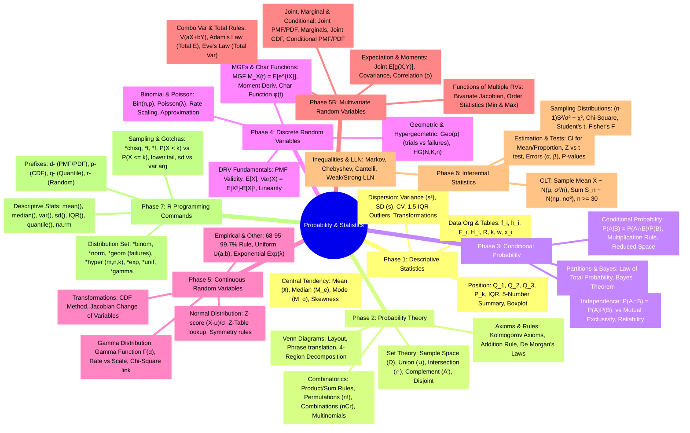

# Probability & Statistics Study Notes Mindmap

This document presents a condensed, grouped mindmap of the terms, formulas, distributions, R commands, and gotchas across the curriculum.

## Grouped Mindmap Diagram

## Summary Index of Phase Material

### Phase 1: Descriptive Statistics

* Data Org & Tables: frequency ($f_i$), relative frequency ($h_i$), cumulative absolute frequency ($F_i$), cumulative relative frequency ($H_i$), range ($R$), number of classes ($k$), class width ($w$), data points ($x_i$).
* Central Tendency: Arithmetic mean ($\bar{x}$), median ($M_e$), mode ($M_o$), skewness.
* Position: Quartiles ($Q_1, Q_2, Q_3$), percentiles ($P_k$), Interquartile Range (IQR), 5-number summary, boxplot construction.
* Dispersion: Variance ($s^2$), standard deviation ($s$), coefficient of variation (CV), 1.5 IQR rule for outliers, data transformations.

### Phase 2: Probability Theory

* Set Theory: Sample space ($\Omega$), union ($\cup$), intersection ($\cap$), complement ($A'$), disjoint sets.
* Venn Diagrams: Layout, phrase translation, 4-region decomposition.
* Axioms & Rules: Kolmogorov axioms, addition rule, De Morgan’s laws.
* Combinatorics: Product/sum rules, permutations ($n!$), combinations ($nCr$), multinomial coefficients.

### Phase 3: Conditional Probability

* Conditional Probability: $P(A|B) = P(A \cap B) / P(B)$, multiplication rule, reduced sample space.
* Independence: $P(A \cap B) = P(A)P(B)$, distinction from mutual exclusivity, system reliability.
* Partitions & Bayes: Law of total probability, Bayes' theorem.

### Phase 4: Discrete Random Variables

* DRV Fundamentals: Probability Mass Function (PMF) validity, expected value $E[X]$, variance $Var(X) = E[X^2] - E[X]^2$, linearity of expectation.
* Binomial & Poisson: Binomial distribution $Bin(n,p)$, Poisson distribution $Poisson(\lambda)$, rate scaling, approximation methods.
* Geometric & Hypergeometric: Geometric distribution $Geo(p)$ (trials vs. failures), Hypergeometric distribution $HG(N,K,n)$.
* MGFs & Char Functions: Moment Generating Functions $M_X(t) = E[e^{tX}]$, moment derivation, characteristic functions $\phi(t)$.

### Phase 5: Continuous Random Variables

* Normal Distribution: Z-score transformation $(X-\mu)/\sigma$, Z-table lookup, symmetry properties.
* Empirical & Other: 68-95-99.7% rule, Uniform distribution $U(a,b)$, Exponential distribution $Exp(\lambda)$.
* Gamma Distribution: Gamma function $\Gamma(\alpha)$, rate vs. scale parameterization, Chi-square relationship.
* CRV Transformations: CDF method, Jacobian change of variables.

### Phase 5B: Multivariate Random Variables

* Joint, Marginal & Conditional: Joint PMF/PDF, marginal distributions, joint CDF, conditional PMF/PDF.
* Expectation & Moments: Joint expectation $E[g(X,Y)]$, covariance, correlation coefficient ($\rho$).
* Combo Var & Total Rules: Variance of linear combinations $V(aX+bY)$, Adam’s Law (law of total expectation), Eve’s Law (law of total variance).
* Functions of Multiple RVs: Bivariate Jacobian, order statistics (minimum and maximum).

### Phase 6: Inferential Statistics

* CLT: Central Limit Theorem for sample mean $\bar{X} \sim N(\mu, \sigma^2/n)$, sum $S_n \sim N(n\mu, n\sigma^2)$, requirements ($n \geq 30$).
* Estimation & Tests: Confidence intervals (CI) for mean/proportion, Z-test vs. t-test, Type I ($\alpha$) and Type II ($\beta$) errors, P-values.
* Sampling Distributions: $(n-1)S^2/\sigma^2 \sim \chi^2$, Chi-square distribution, Student’s t-distribution, Fisher’s F-distribution.
* Inequalities & LLN: Markov’s inequality, Chebyshev’s inequality, Cantelli’s inequality, Weak/Strong Law of Large Numbers (LLN).

### Phase 7: R Programming Commands

* Descriptive Stats: `mean()`, `median()`, `var()`, `sd()`, `IQR()`, `quantile()`, handling `na.rm`.
* Dist Prefixes: `d-` (PMF/PDF), `p-` (CDF), `q-` (Quantiles), `r-` (Random sampling).
* Distribution Set: `*binom`, `*norm`, `*geom` (based on failures), `*hyper` (m,n,k), `*exp`, `*unif`, `*gamma`.
* Sampling & Gotchas: `*chisq`, `*t`, `*f`, interpretation of $P(X < k)$ vs $P(X \le k)$, `lower.tail` argument, distinguishing `sd` vs `var` inputs.