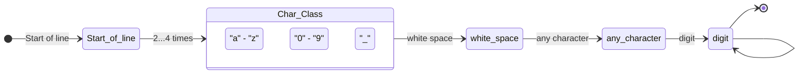

# ΑΡΧΕΣ ΓΛΩΣΣΩΝ ΠΡΟΓΡΑΜΜΑΤΙΣΜΟΥ
## ΕΠΑΝΑΛΗΠΤΙΚΗ ΕΞΕΤΑΣΗ ΣΕΠΤΕΜΒΡΙΟΥ 16/9/2024
**Τμήμα Πληροφορικής και Τηλεπικοινωνιών**  
**Πανεπιστήμιο Ιωαννίνων**  
**A**

---

### Θέμα 1 [A=1 μονάδα, B=2 μονάδες]

**Α.** Δίνεται η γραμματική G με τους ακόλουθους κανόνες παραγωγής:
```
S -> A | B
A -> aA | a
B -> aB | a
```
όπου το αλφάβητο αποτελείται μόνο από το σύμβολο `a`. Να ελέγξετε αν η παραπάνω γραμματική είναι ασαφής.

**Β.** Δίνεται ο ακόλουθος κώδικας:
```c
#include <stdio.h>
void fun(int a, int b[]) {
    a = 1;
    b[0] = 1;
}
int main(void) {
    int a = 0;
    int b[1] = {0};
    fun(a, b);
    printf("%d %d\n", a, b[0]);
}
```
Τι πρόκειται να εμφανίσει κατά την εκτέλεσή του; Εξηγήστε αν παραβιάζεται η ορθογωνικότητα και γιατί;

---

### Θέμα 2 [A=1 μονάδα, B=1 μονάδα]

**Α.** Έστω ο ακόλουθος κώδικας σε μια υποθετική γλώσσα προγραμματισμού:
```javascript
var x = 5;
function A() {
    var x = 10;
    return B();
}
function B() {
    return x;
}
print(A());
```
Υποθέτοντας ότι η γλώσσα χρησιμοποιεί είτε α) στατική εμβέλεια (static scoping) είτε β) δυναμική εμβέλεια (dynamic scoping), ποια θα είναι η έξοδος του προγράμματος σε κάθε περίπτωση και γιατί; Ποιος από τους δύο τρόπους εμβέλειας έχει επικρατήσει στις σύγχρονες γλώσσες προγραμματισμού;

**Β.** Τι θα εμφανίσει ο ακόλουθος κώδικας στη γλώσσα C κατά την εκτέλεση;
```c
#include <stdio.h>
void foo(int a) {
    static int b = 0;
    int c = 0;
    a++; b++; c++;
    printf("%d %d %d\n", a, b, c);
}
int main() {
    for (int x = 1; x <= 3; x++) {foo(x);}
}
```

---

### Θέμα 3 [A=1 μονάδα, B=1 μονάδα]

**Α.** Δίνεται ο ακόλουθος C++ κώδικας:
```cpp
#include <iostream>
using namespace std;
class Base {
public:
    virtual void show() { cout << "Arta" << endl; }
};
class Derived : public Base {
public:
    void show() override { cout << "Ioannina" << endl; }
};
int main() {
    Derived obj;
    Base *ptr = &obj;
    ptr->show();
}
```
Τι θα εμφανίσει το πρόγραμμα όταν εκτελείται; Ποιος είναι ο ρόλος της λέξης κλειδί `virtual` στον κώδικα; Τι θα συμβεί αν αφαιρεθεί η λέξη `virtual` από τη δήλωση της συνάρτησης `show` στη κλάση `Base`;

**Β.** Γράψτε την κανονική έκφραση που αντιστοιχεί στο ακόλουθο διάγραμμα:



Γράψε 1 λεκτικό που θα εντόπιζε η συγκεκριμένη κανονική έκφραση.

Δίνεται ότι:
* `^`    έναρξη γραμμής
* `.`    οποιοσδήποτε χαρακτήρας
* `\d`   ψηφίο
* `\s`   «λευκός» χαρακτήρας (π.χ. διάστημα, tab)

---

### Θέμα 4 [A=1 μονάδα, B=2 μονάδες]

**Α.** Δίνεται η ακόλουθη συνάρτηση σε Haskell:
```haskell
fun :: Integer -> Integer
fun x
    | x > 1 = x * fun (x-1)
    | otherwise 1
```
1. Τι σημαίνει η πρώτη γραμμή της συνάρτησης;
2. Τι θα επιστρέψει η κλήση της ως εξής: `fun 5`

**Β.** Δίνεται ο ακόλουθος ορισμός για το κατηγόρημα `foo/2` στη Prolog:
```prolog
foo([], 0).
foo([_ | T], L) :-
    foo(T, TL),
    L is TL + 1.
```
3. Περιγράψτε τη λειτουργία του κατηγορήματος `foo/2`.
4. Δώστε 2 παραδείγματα όπου η χρήση του `foo/2` μπορεί να γίνει με διαφορετικό τρόπο.
5. Εξηγήστε την υλοποίηση του `foo/2`, αναλύοντας τις 2 προτάσεις από τις οποίες αποτελείται.
