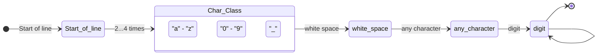

# ΑΡΧΕΣ ΓΛΩΣΣΩΝ ΠΡΟΓΡΑΜΜΑΤΙΣΜΟΥ
## ΕΠΑΝΑΛΗΠΤΙΚΗ ΕΞΕΤΑΣΗ ΣΕΠΤΕΜΒΡΙΟΥ 16/9/2024
**Τμήμα Πληροφορικής και Τηλεπικοινωνιών**  
**Πανεπιστήμιο Ιωαννίνων**  
**A**

---

### Θέμα 1 - Α [1 μονάδα]

**Α.** Δίνεται η γραμματική G με τους ακόλουθους κανόνες παραγωγής:
```
S -> A | B
A -> aA | a
B -> aB | a
```
όπου το αλφάβητο αποτελείται μόνο από το σύμβολο `a`. Να ελέγξετε αν η παραπάνω γραμματική είναι ασαφής.

***

**Λύση:**

Μια γραμματική είναι ασαφής εάν υπάρχει τουλάχιστον μία συμβολοσειρά στη γλώσσα της που μπορεί να παραχθεί με δύο διαφορετικές leftmost παραγωγές (ή συντακτικά δέντρα).

Έστω η συμβολοσειρά `a`.

**1η leftmost παραγωγή:**
1. `S` => `A` (χρησιμοποιώντας τον κανόνα `S -> A`)
2. `A` => `a` (χρησιμοποιώντας τον κανόνα `A -> a`)

**2η leftmost παραγωγή:**
1. `S` => `B` (χρησιμοποιώντας τον κανόνα `S -> B`)
2. `B` => `a` (χρησιμοποιώντας τον κανόνα `B -> a`)

Εφόσον η συμβολοσειρά `a` έχει δύο διακριτές leftmost παραγωγές (και συνεπώς δύο διακριτά συντακτικά δέντρα), η γραμματική είναι ασαφής.

***

### Θέμα 1 - Β [2 μονάδες]

**Β.** Δίνεται ο ακόλουθος κώδικας:
```c
#include <stdio.h>
void fun(int a, int b[]) {
    a = 1;
    b[0] = 1;
}
int main(void) {
    int a = 0;
    int b[1] = {0};
    fun(a, b);
    printf("%d %d\n", a, b[0]);
}
```
Τι πρόκειται να εμφανίσει κατά την εκτέλεσή του; Εξηγήστε αν παραβιάζεται η ορθογωνικότητα και γιατί;

***

**Λύση:**

**Έξοδος του προγράμματος:**
Κατά την εκτέλεση του προγράμματος θα εμφανιστεί:
```
0 1
```

**Εξήγηση:**
- Στη γλώσσα C, όλες οι παράμετροι μεταβιβάζονται με τιμή (**pass-by-value**).
- Η μεταβλητή `a` είναι ένας απλός ακέραιος. Μεταβιβάζεται η τιμή της (`0`) στη συνάρτηση `fun`. Η ανάθεση `a = 1` μέσα στη συνάρτηση τροποποιεί την τοπική παράμετρο της συνάρτησης και δεν επηρεάζει την αρχική μεταβλητή `a` στη `main`. Συνεπώς, εκτυπώνεται `0`.
- Ο πίνακας `b`, όταν μεταβιβάζεται σε συνάρτηση, υποβαθμίζεται αυτόματα σε δείκτη στο πρώτο του στοιχείο (**array-to-pointer decay**). Έτσι, η `fun` λαμβάνει τη διεύθυνση μνήμης του πίνακα. Η εντολή `b[0] = 1` τροποποιεί άμεσα τα δεδομένα στη συγκεκριμένη διεύθυνση μνήμης, επηρεάζοντας το στοιχείο του πίνακα στη `main`. Συνεπώς, εκτυπώνεται `1`.

**Παραβίαση της ορθογωνικότητας:**
Ναι, παραβιάζεται η ορθογωνικότητα. Στη C, ενώ ο κανόνας είναι ότι η μεταβίβαση των ορισμάτων γίνεται με τιμή (pass-by-value), οι πίνακες αποτελούν εξαίρεση καθώς μεταβιβάζονται ως δείκτες (pass-by-pointer/reference) λόγω της αυτόματης υποβάθμισής τους. Αυτή η ασυνέπεια στη συμπεριφορά της μεταβίβασης παραμέτρων ανάλογα με τον τύπο δεδομένων (άλλος κανόνας για απλούς τύπους/δομές και άλλος για πίνακες) συνιστά παραβίαση της ορθογωνικότητας.

---

### Θέμα 2 - Α [1 μονάδα]

**Α.** Έστω ο ακόλουθος κώδικας σε μια υποθετική γλώσσα προγραμματισμού:
```javascript
var x = 5;
function A() {
    var x = 10;
    return B();
}
function B() {
    return x;
}
print(A());
```
Υποθέτοντας ότι η γλώσσα χρησιμοποιεί είτε α) στατική εμβέλεια (static scoping) είτε β) δυναμική εμβέλεια (dynamic scoping), ποια θα είναι η έξοδος του προγράμματος σε κάθε περίπτωση και γιατί; Ποιος από τους δύο τρόπους εμβέλειας έχει επικρατήσει στις σύγχρονες γλώσσες προγραμματισμού;

***

**Λύση:**

* **α) Στατική εμβέλεια (Static scoping / Lexical scoping):**
  Η επίλυση των ονομάτων βασίζεται στη δομή του πηγαίου κώδικα κατά το compile-time. Ο lexical parent της συνάρτησης `B` είναι το καθολικό (global) περιβάλλον στο οποίο ορίζεται. 
  Όταν εκτελείται η `B()`, ψάχνει για τη μεταβλητή `x`. Καθώς δεν υπάρχει τοπικά στη `B`, ανατρέχει στον lexical parent της (το καθολικό περιβάλλον), όπου `x = 5`. Η τοπική δήλωση `var x = 10` εντός της `A` δεν επηρεάζει τη `B`.
  Έξοδος: **`5`**.

* **β) Δυναμική εμβέλεια (Dynamic scoping):**
  Η επίλυση των ονομάτων βασίζεται στη στοίβα κλήσεων (call stack) κατά το runtime.
  Η συνάρτηση `B` καλείται από τη συνάρτηση `A` (η οποία με τη σειρά της κλήθηκε στο καθολικό περιβάλλον). Όταν η `B` ψάχνει για το `x`, αναζητά στη συνάρτηση που την κάλεσε, δηλαδή στην `A`. Στην `A`, η τοπική μεταβλητή `x` έχει την τιμή `10`.
  Έξοδος: **`10`**.

* **Επικράτηση στις σύγχρονες γλώσσες:**
  Στις σύγχρονες γλώσσες προγραμματισμού έχει επικρατήσει σχεδόν καθολικά η **στατική εμβέλεια**. Αυτό συμβαίνει επειδή κάνει τον κώδικα πιο ευανάγνωστο και προβλέψιμο (ο προγραμματιστής μπορεί να προσδιορίσει την εμβέλεια των μεταβλητών κοιτάζοντας απλά τον κώδικα, χωρίς να χρειάζεται να γνωρίζει τη δυναμική ροή εκτέλεσης). Επιπλέον, διευκολύνει τον μεταγλωττιστή στον έλεγχο τύπων και στις βελτιστοποιήσεις διαχείρισης μνήμης.

---

### Θέμα 2 - Β [1 μονάδα]

**Β.** Τι θα εμφανίσει ο ακόλουθος κώδικας στη γλώσσα C κατά την εκτέλεση;
```c
#include <stdio.h>
void foo(int a) {
    static int b = 0;
    int c = 0;
    a++; b++; c++;
    printf("%d %d %d\n", a, b, c);
}
int main() {
    for (int x = 1; x <= 3; x++) {foo(x);}
}
```

***

**Λύση:**

**Έξοδος του προγράμματος:**
```
2 1 1
3 2 1
4 3 1
```

**Εξήγηση:**
- Η μεταβλητή `a` είναι τυπική παράμετρος. Σε κάθε κλήση λαμβάνει την τρέχουσα τιμή του `x` (`1`, `2`, `3`). Αυξάνεται κατά 1 με την `a++` και εκτυπώνεται, άρα παίρνει διαδοχικά τις τιμές `2`, `3`, `4`.
- Η μεταβλητή `b` είναι δηλωμένη ως `static`. Οι static τοπικές μεταβλητές στη C αρχικοποιούνται μόνο μία φορά (στην πρώτη κλήση της συνάρτησης) και διατηρούν την τιμή τους στη μνήμη μεταξύ των κλήσεων. Έτσι, η `b` αυξάνεται διαδοχικά: `0 -> 1` στην 1η κλήση, `1 -> 2` στη 2η κλήση, και `2 -> 3` στην 3η κλήση.
- Η μεταβλητή `c` είναι αυτόματη (τοπική) μεταβλητή. Αρχικοποιείται σε `0` σε κάθε κλήση, αυξάνεται κατά 1 (`c++`), εκτυπώνεται ως `1` και η μνήμη της αποδεσμεύεται με την έξοδο από τη συνάρτηση. Έτσι, εκτυπώνει πάντα `1`.

---

### Θέμα 3 - Α [1 μονάδα]

**Α.** Δίνεται ο ακόλουθος C++ κώδικας:
```cpp
#include <iostream>
using namespace std;
class Base {
public:
    virtual void show() { cout << "Arta" << endl; }
};
class Derived : public Base {
public:
    void show() override { cout << "Ioannina" << endl; }
};
int main() {
    Derived obj;
    Base *ptr = &obj;
    ptr->show();
}
```
Τι θα εμφανίσει το πρόγραμμα όταν εκτελείται; Ποιος είναι ο ρόλος της λέξης κλειδί `virtual` στον κώδικα; Τι θα συμβεί αν αφαιρεθεί η λέξη `virtual` από τη δήλωση της συνάρτησης `show` στη κλάση `Base`;

***

**Λύση:**

**Έξοδος του προγράμματος:**
Το πρόγραμμα θα εμφανίσει:
```
Ioannina
```

**Ρόλος της λέξης-κλειδί `virtual`:**
Η λέξη-κλειδί `virtual` ενεργοποιεί τον **δυναμικό δεσμό (dynamic/late binding)**. Όταν μια συνάρτηση είναι virtual, η κλήση της μέσω ενός δείκτη βασικής κλάσης (εδώ `Base *ptr`) επιλύεται κατά το runtime με βάση τον πραγματικό τύπο του αντικειμένου στο οποίο δείχνει ο δείκτης (εδώ, το αντικείμενο `obj` είναι τύπου `Derived`). Επομένως, εκτελείται η υπερκαλυμμένη μέθοδος της παράγωγης κλάσης.

**Αν αφαιρεθεί η λέξη-κλειδί `virtual`:**
Αν αφαιρεθεί η `virtual` από τη δήλωση της `show()` στη βασική κλάση `Base`, θα χρησιμοποιηθεί **στατικός δεσμός (static/early binding)** κατά το compile-time. Ο μεταγλωττιστής θα καθορίσει ποια συνάρτηση θα κληθεί με βάση τον τύπο του δείκτη `ptr` (που είναι `Base*`). Έτσι, θα κληθεί η `Base::show()` και το πρόγραμμα θα εκτυπώσει **`Arta`** αντί για `Ioannina`.

---

### Θέμα 3 - Β [1 μονάδα]

**Β.** Γράψτε την κανονική έκφραση που αντιστοιχεί στο ακόλουθο διάγραμμα:



Γράψε 1 λεκτικό που θα εντόπιζε η συγκεκριμένη κανονική έκφραση.

Δίνεται ότι:
* `^`    έναρξη γραμμής
* `.`    οποιοσδήποτε χαρακτήρας
* `\d`   ψηφίο
* `\s`   «λευκός» χαρακτήρας (π.χ. διάστημα, tab)

***

**Λύση:**

**Κανονική Έκφραση (Regular Expression):**
Ακολουθώντας τα βήματα του διαγράμματος κατάσταση-προς-κατάσταση:
1. `Start of line`: `^`
2. `Char_Class` (χαρακτήρες `a-z`, `0-9` ή `_`) 2 έως 4 φορές: `[a-z0-9_]{2,4}`
3. `white space`: `\s`
4. `any character`: `.`
5. `digit`: `\d`
6. `digit` αναδρομή (αυτο-σύνδεση 0 ή περισσότερες φορές): `\d*`

Συνδυάζοντας τα παραπάνω, η κανονική έκφραση είναι:
`^[a-z0-9_]{2,4}\s.\d+`

**Παράδειγμα λεκτικού που εντοπίζεται:**
Ένα έγκυρο λεκτικό (string) που ταιριάζει με αυτήν την έκφραση είναι το:
`ab x1`
*(Ανάλυση: `ab` ταιριάζει με το `[a-z0-9_]{2,4}`, ακολουθεί κενό διάστημα `\s`, οποιοσδήποτε χαρακτήρας `x` για το `.`, και το ψηφίο `1` για το `\d+`)*

---

### Θέμα 4 - Α [1 μονάδα]

**Α.** Δίνεται η ακόλουθη συνάρτηση σε Haskell:
```haskell
fun :: Integer -> Integer
fun x
    | x > 1 = x * fun (x-1)
    | otherwise 1
```
1. Τι σημαίνει η πρώτη γραμμή της συνάρτησης;
2. Τι θα επιστρέψει η κλήση της ως εξής: `fun 5`

***

**Λύση:**

1. **Σημασία της πρώτης γραμμής (`fun :: Integer -> Integer`):**
   Είναι η δήλωση τύπου (type signature) της συνάρτησης `fun`. Δηλώνει ότι η συνάρτηση δέχεται ως όρισμα μια τιμή τύπου `Integer` (ακέραιος αριθμός απεριόριστης ακρίβειας στη Haskell) και επιστρέφει μια τιμή επίσης τύπου `Integer`.
2. **Τι θα επιστρέψει η κλήση `fun 5`:**
   Η συνάρτηση υπολογίζει αναδρομικά το παραγοντικό του ορίσματος.
   `fun 5` = 5 * `fun 4` = 5 * 4 * `fun 3` = 5 * 4 * 3 * `fun 2` = 5 * 4 * 3 * 2 * 1 = **`120`**.

---

### Θέμα 4 - Β [2 μονάδες]

**Β.** Δίνεται ο ακόλουθος ορισμός για το κατηγόρημα `foo/2` στη Prolog:
```prolog
foo([], 0).
foo([_ | T], L) :-
    foo(T, TL),
    L is TL + 1.
```
3. Περιγράψτε τη λειτουργία του κατηγορήματος `foo/2`.
4. Δώστε 2 παραδείγματα όπου η χρήση του `foo/2` μπορεί να γίνει με διαφορετικό τρόπο.
5. Εξηγήστε την υλοποίηση του `foo/2`, αναλύοντας τις 2 προτάσεις από τις οποίες αποτελείται.

***

**Λύση:**

3. **Λειτουργία του κατηγορήματος `foo/2`:**
   Το κατηγόρημα `foo/2` υπολογίζει το μήκος (δηλαδή τον αριθμό των στοιχείων) μιας δοθείσας λίστας. Το πρώτο όρισμα είναι η λίστα και το δεύτερο όρισμα είναι το μήκος της.

4. **Δύο παραδείγματα με διαφορετική χρήση:**
   Λόγω της δηλωτικής φύσης της Prolog, το κατηγόρημα μπορεί να χρησιμοποιηθεί με διάφορους τρόπους ανάλογα με το ποιες μεταβλητές είναι ελεύθερες ή δεσμευμένες:
   - **Υπολογισμός μήκους (Εύρεση εξόδου):**
     `?- foo([a, b, c], L).`
     *Αποτέλεσμα:* `L = 3.` (υπολογίζει το μήκος της λίστας)
   - **Έλεγχος/Επαλήθευση ορθότητας:**
     `?- foo([a, b, c], 3).`
     *Αποτέλεσμα:* `true.` (επαληθεύει αν το μήκος της λίστας είναι πράγματι 3)
   - **Δημιουργία λίστας συγκεκριμένου μήκους:**
     `?- foo(L, 2).`
     *Αποτέλεσμα:* `L = [_, _].` (δημιουργεί μια λίστα 2 στοιχείων με ελεύθερες μεταβλητές)

5. **Ανάλυση των 2 προτάσεων της υλοποίησης:**
   - **Πρόταση 1 (`foo([], 0).`):**
     Αποτελεί τη βάση της αναδρομής (base case). Δηλώνει ότι η κενή λίστα `[]` έχει μήκος 0.
   - **Πρόταση 2 (`foo([_ | T], L) :- foo(T, TL), L is TL + 1.`):**
     Είναι ο αναδρομικός κανόνας. Για μια μη κενή λίστα που αποτελείται από μια κεφαλή (την οποία αγνοούμε με το σύμβολο `_`) και μια ουρά `T`:
     - Πρώτα καλείται αναδρομικά το `foo(T, TL)` για να υπολογιστεί το μήκος `TL` της ουράς της λίστας.
     - Στη συνέχεια, το συνολικό μήκος `L` υπολογίζεται προσθέτοντας `1` στο μήκος της ουράς (`L is TL + 1`).
