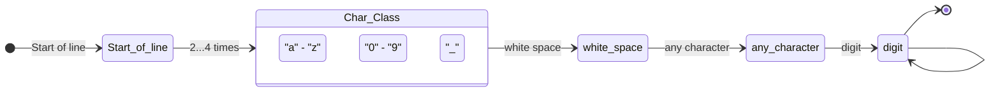

# PRINCIPLES OF PROGRAMMING LANGUAGES
## RESIT EXAMINATION SEPTEMBER 16/9/2024
**Department of Computer Science and Telecommunications**  
**University of Ioannina**  
**A**

---

### Topic 1 - A [1 point]

**A.** Given the grammar G with the following production rules:
```
S -> A | B
A -> aA | a
B -> aB | a
```
where the alphabet consists only of the symbol `a`. Check whether the above grammar is ambiguous.

***

**Solution:**

A grammar is ambiguous if there exists at least one string in its language that can be derived by two different leftmost derivations (or parse trees).

Consider the string `a`.

**1st leftmost derivation:**
1. `S` => `A` (using the rule `S -> A`)
2. `A` => `a` (using the rule `A -> a`)

**2nd leftmost derivation:**
1. `S` => `B` (using the rule `S -> B`)
2. `B` => `a` (using the rule `B -> a`)

Since the string `a` has two distinct leftmost derivations (and consequently two distinct parse trees), the grammar is ambiguous.

***

### Topic 1 - B [2 points]

**B.** Given the following code:
```c
#include <stdio.h>
void fun(int a, int b[]) {
    a = 1;
    b[0] = 1;
}
int main(void) {
    int a = 0;
    int b[1] = {0};
    fun(a, b);
    printf("%d %d\n", a, b[0]);
}
```
What will it display when executed? Explain whether orthogonality is violated and why.

***

**Solution:**

**Program output:**
When the program is executed, it will display:
```
0 1
```

**Explanation:**
- In the C language, all parameters are passed by value (**pass-by-value**).
- The variable `a` is a simple integer. Its value (`0`) is passed to the function `fun`. The assignment `a = 1` inside the function modifies the function's local parameter and does not affect the original variable `a` in `main`. Therefore, `0` is printed.
- The array `b`, when passed to a function, is automatically decayed into a pointer to its first element (**array-to-pointer decay**). Thus, `fun` receives the memory address of the array. The statement `b[0] = 1` directly modifies the data at that memory address, affecting the array element in `main`. Therefore, `1` is printed.

**Violation of orthogonality:**
Yes, orthogonality is violated. In C, although the rule is that arguments are passed by value (pass-by-value), arrays constitute an exception since they are passed as pointers (pass-by-pointer/reference) due to automatic decay. This inconsistency in parameter-passing behavior depending on the data type (one rule for simple types/structs and another for arrays) constitutes a violation of orthogonality.

---

### Topic 2 - A [1 point]

**A.** Consider the following code in a hypothetical programming language:
```javascript
var x = 5;
function A() {
    var x = 10;
    return B();
}
function B() {
    return x;
}
print(A());
```
Assuming the language uses either a) static scoping or b) dynamic scoping, what will be the output of the program in each case and why? Which of the two scoping mechanisms has prevailed in modern programming languages?

***

**Solution:**

* **a) Static scoping (Static scoping / Lexical scoping):**
  Name resolution is based on the structure of the source code at compile-time. The lexical parent of function `B` is the global environment in which it is defined.
  When `B()` executes, it searches for the variable `x`. Since it does not exist locally in `B`, it refers to its lexical parent (the global environment), where `x = 5`. The local declaration `var x = 10` inside `A` does not affect `B`.
  Output: **`5`**.

* **b) Dynamic scoping:**
  Name resolution is based on the call stack at runtime.
  Function `B` is called from function `A` (which in turn was called in the global environment). When `B` searches for `x`, it looks in the function that called it, namely `A`. In `A`, the local variable `x` has the value `10`.
  Output: **`10`**.

* **Prevalence in modern languages:**
  In modern programming languages, **static scoping** has almost universally prevailed. This is because it makes code more readable and predictable (the programmer can determine the scope of variables simply by looking at the code, without needing to know the dynamic execution flow). Furthermore, it facilitates the compiler's type checking and memory management optimizations.

---

### Topic 2 - B [1 point]

**B.** What will the following C code display when executed?
```c
#include <stdio.h>
void foo(int a) {
    static int b = 0;
    int c = 0;
    a++; b++; c++;
    printf("%d %d %d\n", a, b, c);
}
int main() {
    for (int x = 1; x <= 3; x++) {foo(x);}
}
```

***

**Solution:**

**Program output:**
```
2 1 1
3 2 1
4 3 1
```

**Explanation:**
- The variable `a` is a formal parameter. In each call it receives the current value of `x` (`1`, `2`, `3`). It is increased by 1 with `a++` and printed, thus taking the successive values `2`, `3`, `4`.
- The variable `b` is declared `static`. Static local variables in C are initialized only once (on the first call of the function) and retain their value in memory between calls. Thus, `b` increases successively: `0 -> 1` on the 1st call, `1 -> 2` on the 2nd call, and `2 -> 3` on the 3rd call.
- The variable `c` is an automatic (local) variable. It is initialized to `0` on each call, increased by 1 (`c++`), printed as `1`, and its memory is released upon exiting the function. Thus, it always prints `1`.

---

### Topic 3 - A [1 point]

**A.** Given the following C++ code:
```cpp
#include <iostream>
using namespace std;
class Base {
public:
    virtual void show() { cout << "Arta" << endl; }
};
class Derived : public Base {
public:
    void show() override { cout << "Ioannina" << endl; }
};
int main() {
    Derived obj;
    Base *ptr = &obj;
    ptr->show();
}
```
What will the program display when executed? What is the role of the `virtual` keyword in the code? What will happen if the `virtual` keyword is removed from the declaration of the `show` function in the `Base` class?

***

**Solution:**

**Program output:**
The program will display:
```
Ioannina
```

**Role of the `virtual` keyword:**
The `virtual` keyword enables **dynamic binding (late binding)**. When a function is virtual, calling it through a base class pointer (here `Base *ptr`) is resolved at runtime based on the actual type of the object the pointer points to (here, the object `obj` is of type `Derived`). Therefore, the overridden method of the derived class is executed.

**If the `virtual` keyword is removed:**
If `virtual` is removed from the declaration of `show()` in the base class `Base`, **static binding (early binding)** is used at compile-time. The compiler will determine which function to call based on the type of the pointer `ptr` (which is `Base*`). Thus, `Base::show()` will be called and the program will print **`Arta`** instead of `Ioannina`.

---

### Topic 3 - B [1 point]

**B.** Write the regular expression that corresponds to the following diagram:



Write 1 string (token) that would be matched by this regular expression.

Given that:
* `^`    start of line
* `.`    any character
* `\d`   digit
* `\s`   whitespace character (e.g., space, tab)

***

**Solution:**

**Regular Expression:**
Following the diagram state-by-state:
1. `Start of line`: `^`
2. `Char_Class` (characters `a-z`, `0-9` or `_`) 2 to 4 times: `[a-z0-9_]{2,4}`
3. `white space`: `\s`
4. `any character`: `.`
5. `digit`: `\d`
6. `digit` recursion (self-loop 0 or more times): `\d*`

Combining the above, the regular expression is:
`^[a-z0-9_]{2,4}\s.\d+`

**Example string that is matched:**
A valid string (token) that matches this expression is:
`ab x1`
*(Analysis: `ab` matches `[a-z0-9_]{2,4}`, followed by a space `\s`, any character `x` for `.`, and the digit `1` for `\d+`)*

---

### Topic 4 - A [1 point]

**A.** Given the following function in Haskell:
```haskell
fun :: Integer -> Integer
fun x
    | x > 1 = x * fun (x-1)
    | otherwise 1
```
1. What does the first line of the function mean?
2. What will the call `fun 5` return?

***

**Solution:**

1. **Meaning of the first line (`fun :: Integer -> Integer`):**
   It is the type signature of the function `fun`. It declares that the function accepts as an argument a value of type `Integer` (arbitrary-precision integer in Haskell) and returns a value also of type `Integer`.
2. **What the call `fun 5` will return:**
   The function recursively computes the factorial of its argument.
   `fun 5` = 5 * `fun 4` = 5 * 4 * `fun 3` = 5 * 4 * 3 * `fun 2` = 5 * 4 * 3 * 2 * 1 = **`120`**.

---

### Topic 4 - B [2 points]

**B.** Given the following definition for the `foo/2` predicate in Prolog:
```prolog
foo([], 0).
foo([_ | T], L) :-
    foo(T, TL),
    L is TL + 1.
```
3. Describe the operation of the `foo/2` predicate.
4. Give 2 examples where the use of `foo/2` can be done in a different way.
5. Explain the implementation of `foo/2`, analyzing the 2 clauses it consists of.

***

**Solution:**

3. **Operation of the `foo/2` predicate:**
   The `foo/2` predicate computes the length (i.e., the number of elements) of a given list. The first argument is the list and the second argument is its length.

4. **Two examples with different usage:**
   Due to Prolog's declarative nature, the predicate can be used in various ways depending on which variables are free or bound:
   - **Length computation (output finding):**
     `?- foo([a, b, c], L).`
     *Result:* `L = 3.` (computes the length of the list)
   - **Checking/verifying correctness:**
     `?- foo([a, b, c], 3).`
     *Result:* `true.` (verifies whether the length of the list is indeed 3)
   - **Generating a list of a specific length:**
     `?- foo(L, 2).`
     *Result:* `L = [_, _].` (creates a 2-element list with free variables)

5. **Analysis of the 2 clauses of the implementation:**
   - **Clause 1 (`foo([], 0).`):**
     It is the base case of the recursion. It declares that the empty list `[]` has length 0.
   - **Clause 2 (`foo([_ | T], L) :- foo(T, TL), L is TL + 1.`):**
     It is the recursive rule. For a non-empty list consisting of a head (which we ignore with the `_` symbol) and a tail `T`:
     - First, `foo(T, TL)` is called recursively to compute the length `TL` of the tail of the list.
     - Then, the total length `L` is computed by adding `1` to the length of the tail (`L is TL + 1`).
