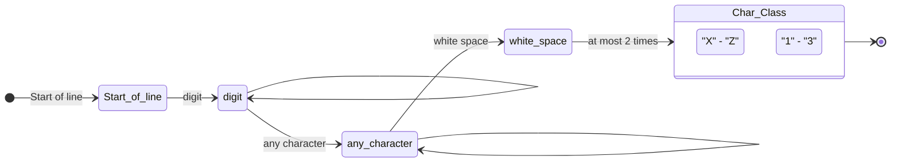

# ΑΡΧΕΣ ΓΛΩΣΣΩΝ ΠΡΟΓΡΑΜΜΑΤΙΣΜΟΥ
## ΕΠΑΝΑΛΗΠΤΙΚΗ ΕΞΕΤΑΣΗ ΙΟΥΝΙΟΥ 16/9/2024
**Τμήμα Πληροφορικής και Τηλεπικοινωνιών**  
**Πανεπιστήμιο Ιωαννίνων**  
**B**

---

### Θέμα 1 - Α [1 μονάδα]

**Α.** Δίνεται η ακόλουθη γραμματική:
```
E -> E + T | T
T -> T * F | F
F -> (E) | a | b
```
Καταγράψτε μια αριστερότερη παραγωγή που οδηγεί στην έκφραση `a * (a+b)`.

***

**Λύση:**

Η αριστερότερη παραγωγή (leftmost derivation) για την έκφραση `a * (a+b)` είναι η εξής:
1. `E` => `T` (μέσω του κανόνα `E -> T`)
2. `T` => `T * F` (μέσω του κανόνα `T -> T * F`)
3. `T` => `F * F` (μέσω του κανόνα `T -> F`)
4. `F` => `a * F` (μέσω του κανόνα `F -> a`)
5. `F` => `a * (E)` (μέσω του κανόνα `F -> (E)`)
6. `E` => `a * (E + T)` (μέσω του κανόνα `E -> E + T`)
7. `E` => `a * (T + T)` (μέσω του κανόνα `E -> T`)
8. `T` => `a * (F + T)` (μέσω του κανόνα `T -> F`)
9. `F` => `a * (a + T)` (μέσω του κανόνα `F -> a`)
10. `T` => `a * (a + F)` (μέσω του κανόνα `T -> F`)
11. `F` => `a * (a + b)` (μέσω του κανόνα `F -> b`)

---

### Θέμα 1 - Β [2 μονάδες]

**Β.** Γράψτε ένα πρόγραμμα στη γλώσσα C που να δημιουργεί δυναμικά έναν πίνακα 2 x 3 ακέραιων αριθμών, χρησιμοποιώντας δυναμική κατανομή μνήμης με τη `malloc`. Στη συνέχεια να ζητά από τον χρήστη να εισάγει τιμείς για όλα τα στοιχεία του πίνακα, να εκτυπώνει τον πίνακα στην οθόνη σε 2 γραμμές και 3 στήλες. Τέλος, να αποδεσμεύει τη μνήμη όταν δεν χρειάζεται πλέον.

***

**Λύση:**

Παρακάτω δίνεται ο κώδικας σε C, ακολουθώντας τους κανόνες ονοματοδοσίας (snake_case για μεταβλητές) και την τεκμηρίωση Google Style:

```c
#include <stdio.h>
#include <stdlib.h>

/**
 * Demonstrates dynamic allocation, reading, printing, and freeing of a 2x3 matrix.
 * Returns:
 *   int: Execution status (0 for success, 1 for allocation error).
 */
int main(void) {
    // Δυναμική δέσμευση μνήμης για πίνακα 2 γραμμών
    int **matrix_ptr = (int **)malloc(2 * sizeof(int *));
    if (matrix_ptr == NULL) {
        printf("Memory allocation failed.\n");
        return 1;
    }

    // Δέσμευση 3 στηλών για κάθε γραμμή
    for (int r_idx = 0; r_idx < 2; r_idx++) {
        matrix_ptr[r_idx] = (int *)malloc(3 * sizeof(int));
        if (matrix_ptr[r_idx] == NULL) {
            printf("Memory allocation failed.\n");
            // Αποδέσμευση προηγούμενης μνήμης σε περίπτωση αποτυχίας
            for (int j = 0; j < r_idx; j++) {
                free(matrix_ptr[j]);
            }
            free(matrix_ptr);
            return 1;
        }
    }

    // Εισαγωγή τιμών από το χρήστη
    for (int r_idx = 0; r_idx < 2; r_idx++) {
        for (int c_idx = 0; c_idx < 3; c_idx++) {
            printf("Enter value for element [%d][%d]: ", r_idx, c_idx);
            if (scanf("%d", &matrix_ptr[r_idx][c_idx]) != 1) {
                printf("Invalid input.\n");
                // Καθαρισμός και έξοδος
                for (int j = 0; j < 2; j++) {
                    free(matrix_ptr[j]);
                }
                free(matrix_ptr);
                return 1;
            }
        }
    }

    // Εκτύπωση πίνακα σε μορφή 2 γραμμών και 3 στηλών
    printf("\nThe matrix is:\n");
    for (int r_idx = 0; r_idx < 2; r_idx++) {
        for (int c_idx = 0; c_idx < 3; c_idx++) {
            printf("%d ", matrix_ptr[r_idx][c_idx]);
        }
        printf("\n");
    }

    // Αποδέσμευση δεσμευμένης μνήμης
    for (int r_idx = 0; r_idx < 2; r_idx++) {
        free(matrix_ptr[r_idx]);
    }
    free(matrix_ptr);

    return 0;
}
```

---

### Θέμα 2 [2 μονάδες]

Δίνεται ο ακόλουθος κώδικας σε Python:
```python
def calculate_average(numbers):
    total = 0
    count = 0
    for num in numbers:
        total += num
        count += 1
    return total / count if count > 0 else 0

grades = [85, 90, 78, 92, 88]
average = calculate_average(grades)
print(f"Ο μέσος όρος των βαθμών είναι: {average:.2f}")
```
Μετατρέψτε τον παραπάνω κώδικα σε C. Στη λύση σας, επισημάνετε πώς οι διαφορές στην πρόσδεση τύπων επηρεάζουν τη δομή και τη σύνταξη του κώδικα.

***

**Λύση:**

**Κώδικας σε C:**

```c
#include <stdio.h>

/**
 * Calculates the average value of elements in an integer array.
 * Args:
 *   numbers (const int[]): The array containing grade numbers.
 *   size (int): The number of elements in the array.
 * Returns:
 *   double: The average value of elements, or 0.0 if array is empty.
 */
double calculateAverage(const int numbers[], int size) {
    double total_val = 0.0;
    int count_val = 0;
    for (int i = 0; i < size; i++) {
        total_val += numbers[i];
        count_val++;
    }
    return (count_val > 0) ? (total_val / count_val) : 0.0;
}

/**
 * Main function that executes the C program.
 * Returns:
 *   int: Status code of execution.
 */
int main(void) {
    int grades_arr[] = {85, 90, 78, 92, 88};
    int arr_size = sizeof(grades_arr) / sizeof(grades_arr[0]);
    double avg_val = calculateAverage(grades_arr, arr_size);
    printf("Ο μέσος όρος των βαθμών είναι: %.2f\n", avg_val);
    return 0;
}
```

**Επίδραση της πρόσδεσης τύπων (Type Binding) στη δομή και τη σύνταξη:**

1. **Στατική vs Δυναμική Πρόσδεση Τύπων (Static vs Dynamic Type Binding):**
   - Στην **Python**, η πρόσδεση τύπων είναι δυναμική. Οι τύποι των μεταβλητών (όπως η παράμετρος `numbers`) προσδιορίζονται κατά το runtime. Έτσι η Python συνάρτηση μπορεί να δεχτεί οποιοδήποτε iterable (π.χ. λίστα με ακεραίους ή float) χωρίς αλλαγές στον κώδικα.
   - Στη **C**, η πρόσδεση είναι στατική (compile-time). Πρέπει να δηλώσουμε ρητά τον τύπο της παραμέτρου ως πίνακα ακεραίων `const int numbers[]` και τον τύπο επιστροφής ως `double`.
2. **Μέγεθος Πινάκων:**
   - Στην Python, τα αντικείμενα λίστας γνωρίζουν το μέγεθός τους (π.χ. μέσω της `len()`).
   - Στη C, οι πίνακες δεν φέρουν πληροφορίες για το μέγεθός τους όταν μεταβιβάζονται ως παράμετροι (decay to pointer). Επομένως, είμαστε υποχρεωμένοι να περάσουμε το μέγεθος του πίνακα ως ξεχωριστή παράμετρο `size` στη συνάρτηση.
3. **Διαίρεση και Δεκαδικό Αποτέλεσμα:**
   - Στην Python 3, ο τελεστής `/` επιστρέφει πάντα `float` (πραγματικό αριθμό) ακόμα και αν διαιρεί ακεραίους.
   - Στη C, ο τελεστής `/` μεταξύ ακεραίων εκτελεί ακέραια διαίρεση (αποκόπτοντας το δεκαδικό μέρος). Για να επιτύχουμε σωστό δεκαδικό αποτέλεσμα, η μεταβλητή αθροίσματος δηλώνεται ως `double total_val`, ώστε η διαίρεση `total_val / count_val` να πραγματοποιηθεί ως διαίρεση κινητής υποδιαστολής.

---

### Θέμα 3 - Α [1 μονάδα]

**Α.** Τι θα προκύψει ως αποτέλεσμα από τα ακόλουθα comprehensions της Python;
1. `[x**2 for x in [1,2,3,4]]`
2. `{w: len(w) for w in ['hello', 'world', 'python', 'comprehension']}`
3. `[element for row in [[1, 2], [3, 4], [5, 6]] for element in row]`
4. `[num for num in range(10) if num % 2 == 0]`

***

**Λύση:**

1. **`[1, 4, 9, 16]`**
   *(Υπολογίζει το τετράγωνο κάθε ακέραιου αριθμού στη λίστα `[1, 2, 3, 4]`)*
2. **`{'hello': 5, 'world': 5, 'python': 6, 'comprehension': 13}`**
   *(Δημιουργεί ένα λεξικό - dict comprehension - με κλειδιά τις λέξεις της λίστας και τιμές τα αντίστοιχα μήκη τους)*
3. **`[1, 2, 3, 4, 5, 6]`**
   *(Επιπεδοποιεί - flattens - τη λίστα από λίστες σε μια ενιαία μονοδιάστατη λίστα)*
4. **`[0, 2, 4, 6, 8]`**
   *(Φιλτράρει τους άρτιους αριθμούς από το εύρος τιμών `range(10)`, δηλαδή από το 0 έως και το 9)*

---

### Θέμα 3 - Β [1 μονάδα]

**Β.** Γράψτε την κανονική έκφραση που αντιστοιχεί στο ακόλουθο διάγραμμα:



Γράψε 1 λεκτικό που θα εντόπιζε η συγκεκριμένη κανονική έκφραση.

Δίνεται ότι:
* `^`    έναρξη γραμμής
* `.`    οποιοσδήποτε χαρακτήρας
* `\d`   ψηφίο
* `\s`   «λευκός» χαρακτήρας (π.χ. διάστημα, tab)

***

**Λύση:**

**Κανονική Έκφραση (Regular Expression):**
Αναλύοντας το διάγραμμα κατάσταση-προς-κατάσταση:
1. `Start of line`: `^`
2. `digit` ακολουθούμενο από αναδρομή `digit` (1 ή περισσότερες φορές): `\d+`
3. `any character` ακολουθούμενο από αναδρομή `any character` (1 ή περισσότερες φορές): `.+`
4. `white space`: `\s`
5. `Char_Class` (που αποτελείται από τους χαρακτήρες `X-Z` ή `1-3`, δηλαδή `[X-Z1-3]`) το πολύ 2 φορές: `[X-Z1-3]{0,2}`

Συνδυάζοντας τα παραπάνω, η κανονική έκφραση είναι:
`^\d+.+\s[X-Z1-3]{0,2}`

**Παράδειγμα λεκτικού που εντοπίζεται:**
Ένα έγκυρο λεκτικό (string) που ταιριάζει με αυτήν την έκφραση είναι το:
`123abcde X2`
*(Ανάλυση: `123` για το `\d+`, `abcde` για το `.+`, κενό διάστημα `\s`, και `X2` για το `[X-Z1-3]{0,2}`)*

---

### Θέμα 4 - Α [1 μονάδα]

**Α.** Στη Haskell, ποια θα είναι τα αποτελέσματα των ακόλουθων εντολών στο ghci;
1. `"Arta" !! 2`
2. `"Arta" ++ "Ioannina"`
3. `map (\x -> x * x) [1, 2, 3]`
4. `map (+1) [5, 10, 15]`
5. `take 5 [10..]`

***

**Λύση:**

1. **`'t'`**  
   *(Επιστρέφει το στοιχείο της συμβολοσειράς/λίστας στη θέση με δείκτη 2 - με αρίθμηση από το 0: 'A'=0, 'r'=1, 't'=2)*
2. **`"ArtaIoannina"`**  
   *(Συνενώνει τις δύο συμβολοσειρές/λίστες)*
3. **`[1, 4, 9]`**  
   *(Εφαρμόζει την ανώνυμη συνάρτηση τετραγώνου `\x -> x * x` σε κάθε στοιχείο της λίστας)*
4. **`[6, 11, 16]`**  
   *(Αυξάνει κάθε στοιχείο της λίστας κατά 1 μέσω μερικής εφαρμογής του τελεστή πρόσθεσης `(+1)`)*
5. **`[10, 11, 12, 13, 14]`**  
   *(Λαμβάνει τα πρώτα 5 στοιχεία της άπειρης λίστας `[10..]` που ξεκινάει από το 10)*

---

### Θέμα 4 - Β [2 μονάδες]

**Β.** Δίνεται ο ακόλουθος ορισμός για το κατηγόρημα `nth0/3` της Prolog:
```prolog
nth0(0, [Element|_], Element).
nth0(Index, [_|Tail], Element) :-
    Index > 0,
    NewIndex is Index - 1,
    nth0(NewIndex, Tail, Element).
```
* Περιγράψτε τη λειτουργία του κατηγορήματος `nth0/3`.
* Δώστε 2 παραδείγματα όπου η χρήση του `nth0/3` μπορεί να γίνει με διαφορετικό τρόπο.
* Εξηγήστε την υλοποίηση του `nth0/3`, αναλύοντας τις 2 προτάσεις από τις οποίες αποτελείται.

***

**Λύση:**

* **Λειτουργία του κατηγορήματος `nth0/3`:**
  Συσχετίζει ένα στοιχείο (`Element`) με τη θέση/δείκτη του (`Index`) μέσα σε μια λίστα, χρησιμοποιώντας αρίθμηση που ξεκινάει από το 0.

* **Δύο παραδείγματα με διαφορετική χρήση:**
  - **Εύρεση στοιχείου σε συγκεκριμένο δείκτη (Εύρεση εξόδου):**
    `?- nth0(2, [a, b, c, d], Element).`
    *Αποτέλεσμα:* `Element = c.` (βρίσκει ποιο στοιχείο είναι στη θέση 2)
  - **Εύρεση του δείκτη ενός στοιχείου (Αναζήτηση):**
    `?- nth0(Index, [a, b, c, d], c).`
    *Αποτέλεσμα:* `Index = 2.` (βρίσκει σε ποια θέση βρίσκεται το στοιχείο `c`)
  - **Έλεγχος/Επαλήθευση ορθότητας:**
    `?- nth0(1, [a, b, c], b).`
    *Αποτέλεσμα:* `true.` (επαληθεύει αν το στοιχείο στη θέση 1 είναι πράγματι το `b`)

* **Ανάλυση των 2 προτάσεων της υλοποίησης:**
  - **Πρόταση 1 (`nth0(0, [Element|_], Element).`):**
    Είναι η βάση της αναδρομής. Δηλώνει ότι στη θέση `0` της λίστας βρίσκεται η κεφαλή της λίστας (`Element`), ενώ η ουρά της λίστας αγνοείται.
  - **Πρόταση 2 (`nth0(Index, [_|Tail], Element) :- Index > 0, NewIndex is Index - 1, nth0(NewIndex, Tail, Element).`):**
    Είναι ο αναδρομικός κανόνας. Για να βρούμε το στοιχείο `Element` στη θέση `Index` (όπου `Index > 0`):
    - Αγνοούμε την κεφαλή της λίστας (χρησιμοποιώντας το `_`).
    - Μειώνουμε τον δείκτη κατά 1 (`NewIndex is Index - 1`).
    - Αναζητούμε αναδρομικά το στοιχείο `Element` στη νέα θέση `NewIndex` μέσα στην ουρά της λίστας (`Tail`).
