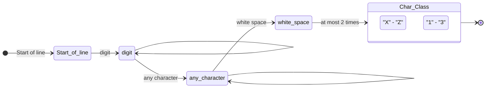

# ΑΡΧΕΣ ΓΛΩΣΣΩΝ ΠΡΟΓΡΑΜΜΑΤΙΣΜΟΥ
## ΕΠΑΝΑΛΗΠΤΙΚΗ ΕΞΕΤΑΣΗ ΙΟΥΝΙΟΥ 16/9/2024
**Τμήμα Πληροφορικής και Τηλεπικοινωνιών**  
**Πανεπιστήμιο Ιωαννίνων**  
**B**

---

### Θέμα 1 [A=1 μονάδα, B=2 μονάδες]

**Α.** Δίνεται η ακόλουθη γραμματική:
```
E -> E + T | T
T -> T * F | F
F -> (E) | a | b
```
Καταγράψτε μια αριστερότερη παραγωγή που οδηγεί στην έκφραση `a * (a+b)`.

**Β.** Γράψτε ένα πρόγραμμα στη γλώσσα C που να δημιουργεί δυναμικά έναν πίνακα 2 x 3 ακέραιων αριθμών, χρησιμοποιώντας δυναμική κατανομή μνήμης με τη `malloc`. Στη συνέχεια να ζητά από τον χρήστη να εισάγει τιμές για όλα τα στοιχεία του πίνακα, να εκτυπώνει τον πίνακα στην οθόνη σε 2 γραμμές και 3 στήλες. Τέλος, να αποδεσμεύει τη μνήμη όταν δεν χρειάζεται πλέον.

---

### Θέμα 2 [2 μονάδες]

Δίνεται ο ακόλουθος κώδικας σε Python:
```python
def calculate_average(numbers):
    total = 0
    count = 0
    for num in numbers:
        total += num
        count += 1
    return total / count if count > 0 else 0

grades = [85, 90, 78, 92, 88]
average = calculate_average(grades)
print(f"Ο μέσος όρος των βαθμών είναι: {average:.2f}")
```
Μετατρέψτε τον παραπάνω κώδικα σε C. Στη λύση σας, επισημάνετε πώς οι διαφορές στην πρόσδεση τύπων επηρεάζουν τη δομή και τη σύνταξη του κώδικα.

---

### Θέμα 3 [A=1 μονάδα, B=1 μονάδα]

**Α.** Τι θα προκύψει ως αποτέλεσμα από τα ακόλουθα comprehensions της Python;
1. `[x**2 for x in [1,2,3,4]]`
2. `{w: len(w) for w in ['hello', 'world', 'python', 'comprehension']}`
3. `[element for row in [[1, 2], [3, 4], [5, 6]] for element in row]`
4. `[num for num in range(10) if num % 2 == 0]`

**Β.** Γράψτε την κανονική έκφραση που αντιστοιχεί στο ακόλουθο διάγραμμα:



Γράψε 1 λεκτικό που θα εντόπιζε η συγκεκριμένη κανονική έκφραση.

Δίνεται ότι:
* `^`    έναρξη γραμμής
* `.`    οποιοσδήποτε χαρακτήρας
* `\d`   ψηφίο
* `\s`   «λευκός» χαρακτήρας (π.χ. διάστημα, tab)

---

### Θέμα 4 [A=1 μονάδα, B=2 μονάδες]

**Α.** Στη Haskell, ποια θα είναι τα αποτελέσματα των ακόλουθων εντολών στο ghci;
1. `"Arta" !! 2`
2. `"Arta" ++ "Ioannina"`
3. `map (\x -> x * x) [1, 2, 3]`
4. `map (+1) [5, 10, 15]`
5. `take 5 [10..]`

**Β.** Δίνεται ο ακόλουθος ορισμός για το κατηγόρημα `nth0/3` της Prolog:
```prolog
nth0(0, [Element|_], Element).
nth0(Index, [_|Tail], Element) :-
    Index > 0,
    NewIndex is Index - 1,
    nth0(NewIndex, Tail, Element).
```
* Περιγράψτε τη λειτουργία του κατηγορήματος `nth0/3`.
* Δώστε 2 παραδείγματα όπου η χρήση του `nth0/3` μπορεί να γίνει με διαφορετικό τρόπο.
* Εξηγήστε την υλοποίηση του `nth0/3`, αναλύοντας τις 2 προτάσεις από τις οποίες αποτελείται.
