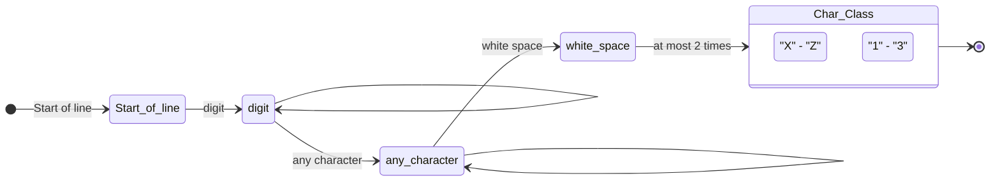

# PRINCIPLES OF PROGRAMMING LANGUAGES
## RESIT EXAMINATION JUNE 16/9/2024
**Department of Computer Science and Telecommunications**  
**University of Ioannina**  
**B**

---

### Topic 1 - A [1 point]

**A.** Given the following grammar:
```
E -> E + T | T
T -> T * F | F
F -> (E) | a | b
```
Record a leftmost derivation that leads to the expression `a * (a+b)`.

***

**Solution:**

The leftmost derivation for the expression `a * (a+b)` is as follows:
1. `E` => `T` (via the rule `E -> T`)
2. `T` => `T * F` (via the rule `T -> T * F`)
3. `T` => `F * F` (via the rule `T -> F`)
4. `F` => `a * F` (via the rule `F -> a`)
5. `F` => `a * (E)` (via the rule `F -> (E)`)
6. `E` => `a * (E + T)` (via the rule `E -> E + T`)
7. `E` => `a * (T + T)` (via the rule `E -> T`)
8. `T` => `a * (F + T)` (via the rule `T -> F`)
9. `F` => `a * (a + T)` (via the rule `F -> a`)
10. `T` => `a * (a + F)` (via the rule `T -> F`)
11. `F` => `a * (a + b)` (via the rule `F -> b`)

---

### Topic 1 - B [2 points]

**B.** Write a program in the C language that dynamically creates a 2 x 3 integer array, using dynamic memory allocation with `malloc`. Then it should ask the user to enter values for all elements of the array, and print the array on the screen in 2 rows and 3 columns. Finally, it should free the memory when it is no longer needed.

***

**Solution:**

The C code is given below, following the naming conventions (snake_case for variables) and Google Style documentation:

```c
#include <stdio.h>
#include <stdlib.h>

/**
 * Demonstrates dynamic allocation, reading, printing, and freeing of a 2x3 matrix.
 * Returns:
 *   int: Execution status (0 for success, 1 for allocation error).
 */
int main(void) {
    // Dynamic memory allocation for a 2-row array
    int **matrix_ptr = (int **)malloc(2 * sizeof(int *));
    if (matrix_ptr == NULL) {
        printf("Memory allocation failed.\n");
        return 1;
    }

    // Allocate 3 columns for each row
    for (int r_idx = 0; r_idx < 2; r_idx++) {
        matrix_ptr[r_idx] = (int *)malloc(3 * sizeof(int));
        if (matrix_ptr[r_idx] == NULL) {
            printf("Memory allocation failed.\n");
            // Free previously allocated memory in case of failure
            for (int j = 0; j < r_idx; j++) {
                free(matrix_ptr[j]);
            }
            free(matrix_ptr);
            return 1;
        }
    }

    // Read values from the user
    for (int r_idx = 0; r_idx < 2; r_idx++) {
        for (int c_idx = 0; c_idx < 3; c_idx++) {
            printf("Enter value for element [%d][%d]: ", r_idx, c_idx);
            if (scanf("%d", &matrix_ptr[r_idx][c_idx]) != 1) {
                printf("Invalid input.\n");
                // Clean up and exit
                for (int j = 0; j < 2; j++) {
                    free(matrix_ptr[j]);
                }
                free(matrix_ptr);
                return 1;
            }
        }
    }

    // Print the array in 2 rows and 3 columns format
    printf("\nThe matrix is:\n");
    for (int r_idx = 0; r_idx < 2; r_idx++) {
        for (int c_idx = 0; c_idx < 3; c_idx++) {
            printf("%d ", matrix_ptr[r_idx][c_idx]);
        }
        printf("\n");
    }

    // Free the allocated memory
    for (int r_idx = 0; r_idx < 2; r_idx++) {
        free(matrix_ptr[r_idx]);
    }
    free(matrix_ptr);

    return 0;
}
```

---

### Topic 2 [2 points]

Given the following code in Python:
```python
def calculate_average(numbers):
    total = 0
    count = 0
    for num in numbers:
        total += num
        count += 1
    return total / count if count > 0 else 0

grades = [85, 90, 78, 92, 88]
average = calculate_average(grades)
print(f"The average of the grades is: {average:.2f}")
```
Convert the above code to C. In your solution, point out how the differences in type binding affect the structure and syntax of the code.

***

**Solution:**

**Code in C:**

```c
#include <stdio.h>

/**
 * Calculates the average value of elements in an integer array.
 * Args:
 *   numbers (const int[]): The array containing grade numbers.
 *   size (int): The number of elements in the array.
 * Returns:
 *   double: The average value of elements, or 0.0 if array is empty.
 */
double calculateAverage(const int numbers[], int size) {
    double total_val = 0.0;
    int count_val = 0;
    for (int i = 0; i < size; i++) {
        total_val += numbers[i];
        count_val++;
    }
    return (count_val > 0) ? (total_val / count_val) : 0.0;
}

/**
 * Main function that executes the C program.
 * Returns:
 *   int: Status code of execution.
 */
int main(void) {
    int grades_arr[] = {85, 90, 78, 92, 88};
    int arr_size = sizeof(grades_arr) / sizeof(grades_arr[0]);
    double avg_val = calculateAverage(grades_arr, arr_size);
    printf("The average of the grades is: %.2f\n", avg_val);
    return 0;
}
```

**Impact of Type Binding on structure and syntax:**

1. **Static vs Dynamic Type Binding:**
   - In **Python**, type binding is dynamic. The types of variables (such as the `numbers` parameter) are determined at runtime. Thus the Python function can accept any iterable (e.g., a list of integers or floats) without changes to the code.
   - In **C**, binding is static (compile-time). We must explicitly declare the parameter type as an integer array `const int numbers[]` and the return type as `double`.
2. **Array Size:**
   - In Python, list objects know their size (e.g., via `len()`).
   - In C, arrays do not carry size information when passed as parameters (decay to pointer). Therefore, we are forced to pass the array size as a separate `size` parameter to the function.
3. **Division and Decimal Result:**
   - In Python 3, the `/` operator always returns a `float` (real number) even when dividing integers.
   - In C, the `/` operator between integers performs integer division (truncating the decimal part). To achieve a correct decimal result, the sum variable is declared as `double total_val`, so that the division `total_val / count_val` is performed as floating-point division.

---

### Topic 3 - A [1 point]

**A.** What will be the result of the following Python comprehensions?
1. `[x**2 for x in [1,2,3,4]]`
2. `{w: len(w) for w in ['hello', 'world', 'python', 'comprehension']}`
3. `[element for row in [[1, 2], [3, 4], [5, 6]] for element in row]`
4. `[num for num in range(10) if num % 2 == 0]`

***

**Solution:**

1. **`[1, 4, 9, 16]`**
   *(Computes the square of each integer in the list `[1, 2, 3, 4]`)*
2. **`{'hello': 5, 'world': 5, 'python': 6, 'comprehension': 13}`**
   *(Creates a dictionary - dict comprehension - with the list words as keys and their corresponding lengths as values)*
3. **`[1, 2, 3, 4, 5, 6]`**
   *(Flattens the list of lists into a single one-dimensional list)*
4. **`[0, 2, 4, 6, 8]`**
   *(Filters the even numbers from the range `range(10)`, i.e., from 0 up to and including 9)*

---

### Topic 3 - B [1 point]

**B.** Write the regular expression that corresponds to the following diagram:



Write 1 string (token) that would be matched by this regular expression.

Given that:
* `^`    start of line
* `.`    any character
* `\d`   digit
* `\s`   whitespace character (e.g., space, tab)

***

**Solution:**

**Regular Expression:**
Analyzing the diagram state-by-state:
1. `Start of line`: `^`
2. `digit` followed by `digit` recursion (1 or more times): `\d+`
3. `any character` followed by `any character` recursion (1 or more times): `.+`
4. `white space`: `\s`
5. `Char_Class` (consisting of characters `X-Z` or `1-3`, i.e., `[X-Z1-3]`) at most 2 times: `[X-Z1-3]{0,2}`

Combining the above, the regular expression is:
`^\d+.+\s[X-Z1-3]{0,2}`

**Example string that is matched:**
A valid string (token) that matches this expression is:
`123abcde X2`
*(Analysis: `123` for `\d+`, `abcde` for `.+`, a space `\s`, and `X2` for `[X-Z1-3]{0,2}`)*

---

### Topic 4 - A [1 point]

**A.** In Haskell, what will be the results of the following commands in ghci?
1. `"Arta" !! 2`
2. `"Arta" ++ "Ioannina"`
3. `map (\x -> x * x) [1, 2, 3]`
4. `map (+1) [5, 10, 15]`
5. `take 5 [10..]`

***

**Solution:**

1. **`'t'`**  
   *(Returns the element of the string/list at index 2 - zero-based: 'A'=0, 'r'=1, 't'=2)*
2. **`"ArtaIoannina"`**  
   *(Concatenates the two strings/lists)*
3. **`[1, 4, 9]`**  
   *(Applies the square anonymous function `\x -> x * x` to each element of the list)*
4. **`[6, 11, 16]`**  
   *(Increases each element of the list by 1 via partial application of the addition operator `(+1)`)*
5. **`[10, 11, 12, 13, 14]`**  
   *(Takes the first 5 elements of the infinite list `[10..]` starting at 10)*

---

### Topic 4 - B [2 points]

**B.** Given the following definition for the `nth0/3` predicate in Prolog:
```prolog
nth0(0, [Element|_], Element).
nth0(Index, [_|Tail], Element) :-
    Index > 0,
    NewIndex is Index - 1,
    nth0(NewIndex, Tail, Element).
```
* Describe the operation of the `nth0/3` predicate.
* Give 2 examples where the use of `nth0/3` can be done in a different way.
* Explain the implementation of `nth0/3`, analyzing the 2 clauses it consists of.

***

**Solution:**

* **Operation of the `nth0/3` predicate:**
  Relates an element (`Element`) to its position/index (`Index`) inside a list, using zero-based numbering.

* **Two examples with different usage:**
  - **Finding an element at a specific index (output finding):**
    `?- nth0(2, [a, b, c, d], Element).`
    *Result:* `Element = c.` (finds which element is at position 2)
  - **Finding the index of an element (search):**
    `?- nth0(Index, [a, b, c, d], c).`
    *Result:* `Index = 2.` (finds at which position the element `c` is)
  - **Checking/verifying correctness:**
    `?- nth0(1, [a, b, c], b).`
    *Result:* `true.` (verifies whether the element at position 1 is indeed `b`)

* **Analysis of the 2 clauses of the implementation:**
  - **Clause 1 (`nth0(0, [Element|_], Element).`):**
    It is the base case of the recursion. It declares that at position `0` of the list is the head of the list (`Element`), while the tail of the list is ignored.
  - **Clause 2 (`nth0(Index, [_|Tail], Element) :- Index > 0, NewIndex is Index - 1, nth0(NewIndex, Tail, Element).`):**
    It is the recursive rule. To find the element `Element` at position `Index` (where `Index > 0`):
    - We ignore the head of the list (using `_`).
    - We decrease the index by 1 (`NewIndex is Index - 1`).
    - We recursively search for the element `Element` at the new position `NewIndex` inside the tail of the list (`Tail`).
